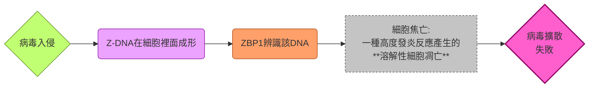
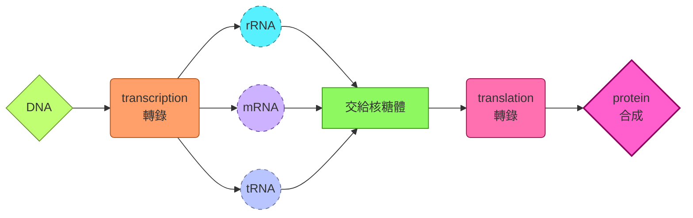
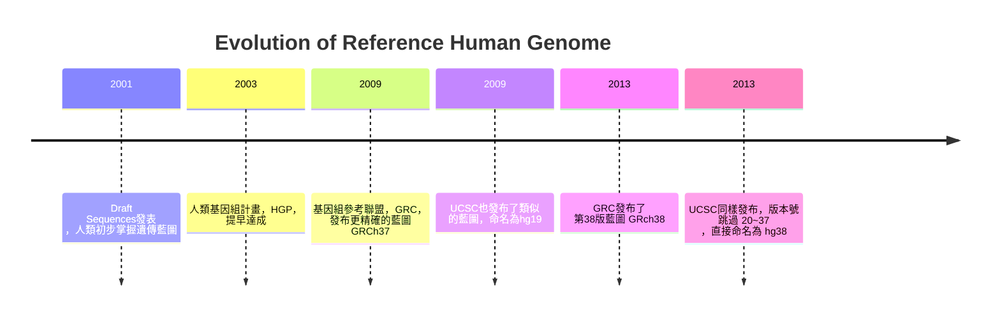
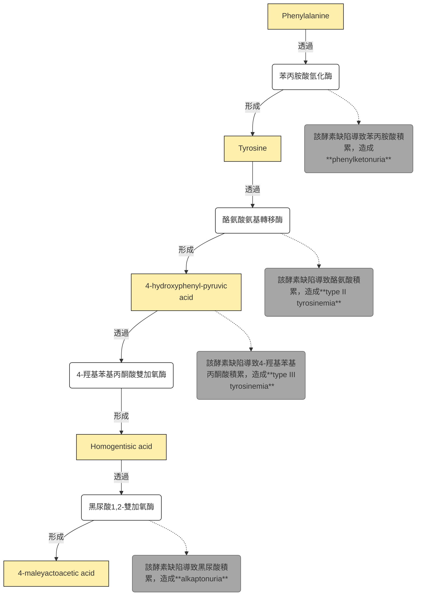
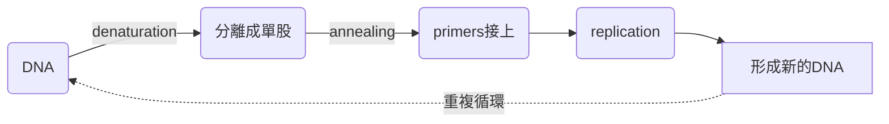
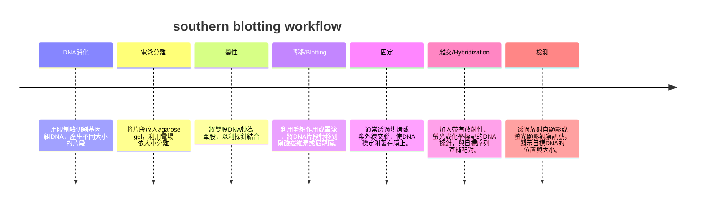

# Genetic
## chapter 1 and 2
### Genes, Genetics, Genomes, and Genomics
- gene = 遺傳基本單位
- genetics = 研究gene的學問
- genome = 一個生物的全部遺傳信息: 基因體
- genomic = 研究基因體的學問

#### 特點
- 基因的資訊被包含在其序列 (base sequence) 裡面 
- DNA的基因密碼: 三個bases代表一個amino acid
- 可以被複製跟傳遞 (一代傳一代)
#### codon 
- 一共有64個密碼子，其中三個維終止密碼子，其餘61個對應20種胺基酸
- 由於退化性，核甘酸的突變不一定會導致胺基酸序列改變 (silent mutation)

|特徵|解釋|
|---|---|
|degeneracy/redundancy 退化性|多個密碼子對應同一種胺基酸|
|unambiguous 不模糊性|特定一種密碼子只對應一種胺基酸|
|universal 廣泛性|所有生物共用同一套遺傳密碼，雖然偶有差異|

#### Codon Usage Bias
- 雖然有degeneracy，但是特定生物體中，某個codon比較被偏好
  - 不同的tRNA含量有差，使用對應的tRNA比較多的codon，轉譯比較快
  - 高表達量的基因比較偏好那些轉譯不容易錯誤的密碼子
  - 不同動物有不同的密碼子偏好
- 如果你想要大量製造某一個蛋白質，將密碼子修改成E.coli偏好的，就能夠提升表現

#### genotype and phenotype
- 基因型決定表現型
- 基因突變不容易發生，但是可以遺傳，導致基因多樣性

### properties of DNA
- 雙股螺旋，A配T，G配C，anti-parallel
- 正常的DNA (B form)，10對鹼基一圈，上一圈跟下一圈差36度
- 穩定DNA的力量有兩個，第一個是氫鍵 (AT、CG)，第二個是鹼基十個堆疊為一圈的凡德瓦力
- 分成不同種形式的DNA

|DNA型態|B-form|A-form|z-form|
|------|----|---|---|
|旋性|右手螺旋|右手螺旋|左手螺旋|
|一圈多少鹼基對|10.4 bp/turn|11 bp/turn|12 bp/turn|
|一圈有多高|3.4 nm/turn|<3.4 nm/form|4.5 nm/form|
|groove|明顯的 major and minor|有major and minor，但不明顯|只有一個groove|
|直徑|1.9 nm|2.3 nm (較寬)|1.8 nm (較扁)|
|屬於|標準型，predominant form|脫水型，鹼基相對於中心軸傾斜，結構較緊湊|形成zig-zag的型態，通常出現在GCGCGC等重複序列裡面|

- RNA聚合酶工作時，DNA往往會變得supercoil，這時DNA可能會變成Z-form
- Z-DNA常常在promoter出現，可以開啟或是關閉特定基因的轉錄活性
- Z-binding protein (ZBP)，例如ADAR1或是ZBP-1，可以專門辨識Z-form的DNA or RNA
  - 這包含一些抗病毒機制，如果ADAR1失調，可能會導致自體免疫疾病 (讓細胞誤以為病毒存在，例如Aidardi-Goutières Syndrome)

- 共有四個Bases: **Adenine, Guanine, Thymine, Cytosine**
- 一個核甘酸包含含氮鹼基 (ATCG)，去氧核糖 (二號碳上面接的是H)，磷酸基

#### 遺傳物質的破壞

- **RNA對鹼性環境敏感**， $-OH$ group會攻擊ribose上的2'-OH，使其跟磷酸基產生連結，進而破壞磷酸基跟核糖之間的連接，導致RNA斷裂

- **DNA對酸性環境比較敏感**， $H^{+}$ 會攻擊purine的N，導致purine從DNA上面脫離，脫離後的空位在酸性環境下會促進磷酸二酯鍵的斷裂

#### 多核甘酸鏈
- polynucleotide有5'-phosphate跟3'-OH，AT之間兩個氫鍵，CG之間三個氫鍵，形成antiparallel，例如可以是如下:

$$
\begin{align}
5'-P & -TGCATG-OH-3'\\
3-'OH & -ACGTAC-P-5'
\end{align}
$$

### The central dogma

- 例外包含:
  - 逆轉錄病毒 retrovorus
 
$$RNA\overset{\text{逆轉錄}}{\rightarrow}DNA\rightarrow RNA\rightarrow Protein$$

  - RNA複製病毒

$$RNA\overset{RdRp}{\rightarrow}RNA\rightarrow Protein$$

  - prion、RNA編輯等等

#### 搖擺假說
- 多數細胞並不是61種tRNA全部存在。事實上，他們大多數只有45種tRNA。一些tRNA可以辨識多個密碼子
- 實際上，mRNA的第三個鹼基通常不一定要A-U，G-C配對，而是可以跟其他的核甘酸配對，被稱為Wobble Effect
- 例如，我們以tRNA的第一個反密碼子鹼基，可以配對的mRNA的第一個密碼子鹼基來看看:

|tRNA的第一個反密碼子鹼基|配對的mRNA的第一個密碼子鹼基|
|--------------------|------------------------|
|G|C或是U|
|U|A或是G|
|I (次黃嘌呤, Inosine))|A、U 或是 C|

#### 補充: 序列介紹
- 可以分為三種: palindrome sequence、direct repeat sequence、invert repeat sequence

|序列|定義|特點|功能|
|---|---|---|---|
|Palindromic sequence 回文序列|在DNA或RNA中，回文序列指的是一段核苷酸序列，其正向與反向互補序列相同。如 5’-GAATTC-3’ 3’-CTTAAG-5’|常見於限制酶的識別位點，如 EcoRI 就識別 GAATTC|回文結構容易形成二級結構 (如hairpin)，在基因調控與 DNA 修飾中扮演重要角色|
|Direct repeat sequence 直接重複序列|同一段序列在基因組中以相同方向重複出現。如 5’-ATCGATCG-ATCGATCG-3’|這種序列常見於轉座子、微衛星 DNA 或某些調控區域|可能影響基因表達、染色質結構，或在基因組演化中提供重組的基礎|
|Inverted repeat sequence 反轉重複序列|一段序列在基因組中以相反方向重複出現。如 5’-ATCG…CGAT-3’|容易形成二級結構，如hairpin或十字形結構|在基因調控、轉錄終止、以及某些病毒或質體的複製起點中扮演重要角色|

### 各種基因組計畫
- 長相差異非常巨大的個體，可能分子層級上基本差不多
- 各自的RNA和蛋白質合成也非常類似
#### 基本基因體組成
- Ploidy (套數): 雙套，diploid，來自父母
- Scale: 3 billion bp，兩萬個蛋白質編碼基因
- Exome: 全外顯子組，所有外顯子的組合，僅佔了genome的1.5%，佔了85%已知的致病突變

#### 人類基因組參考序列演進史

> [!Note]
> GRC命名染色體的格式為 1, 2, 3, X, Y
> UCSC命名染色體的格式為 chr1, chr2, chr3, chrX, chrY 🐱

#### T2T 聯盟計畫
- 前面幾個參考序列的定序法，往往會忽略一些重複序列區域，Sanger或是NGS都不一定能夠補全
- Telomere-to-telomere consortism 最新釋出的人類基因體序列 CHM13v1.1，彌補了GRCh38.p13所有的序列缺失，也校正了許多原本的組裝錯誤
- 完成史上第一個沒有任何gap、完整且連續的人類基因體序列
- 利用Hifi定序，有著提供長讀取數據的第三代定序優勢的同時，還兼具有比肩NGS的高精準度

#### why do we need the T2T-CHM13 Project? 
- 即使是 GRCh38，仍有約8%的區域是未知
- Sanger跟NGS屬於短序列定序，會把基因拆成小段，如果遇到高度重複的序列，就會算不出重復多少次
- 基因體裡有很多重複序列，就像那些純白色的拼圖片
  - ALU序列 (約300bp，在人類基因體裡重複了超過100萬次)
  - LINE序列 (約6000bp長) 
  - 還有微衛星DNA、端粒、著絲點
- 當你用Sanger/NGS這種短序列定序技術時：
   - 你拿到一段短序列 (比如150bp)
   - 這段序列剛好來自一個重複區域
   - 比對的時候，它會同時匹配到基因體的好幾個不同位置

> 結果就是: 
> 電腦不知道這段序列到底是從染色體1來的，還是從染色體X來的，還是從染色體7來的。🥲

- T2T-CHM13實現了 "從端粒到端粒" 的完整定序，大幅修正了過去參考基因組中的錯誤，提供了一個更連續、無斷點的模板

#### T2T的不足之處
- 來自於葡萄胎的同型合子基因組，46,XX (就是一個精子複製自己變成兩套 🙂)，而非一般正常胚胎，也無法定序Y染色體
- 研究後續轉向人類泛基因組 (pangenome)，並且嘗試補足Y染色體序列 (2013年已經完成)
- HPRC，又稱為國際人類泛基因組參考聯盟，已在2023年發表第一個草圖

> [詳細數據可以看看這裡唷 👀](https://www.blossombio.com/eNews/20210804/index.html)

#### The 1000 Genomes Project
- 千人基因組計畫著重於基因組變異的資料蒐集，包含:
  - SNPs (單核甘酸多態性)
  - Indels (小型的插入或是缺失)
  - Structural variation (大片段的消失、重復、倒位等等)
- 這些變異大多數屬於無害 (benign) 或是有益 (beneficial)，例如展現外貌變化，或是賦予抗寒的基因等等
- 有些屬於風險相關 (Risk associated) 變異，也就是讓你 "中獎機率可能比較高" 的變異 
- 有些屬於有害 (harmful) 或是致病變異 (pathogenic)，直接導致罕見遺傳疾病

### 進一步看看各個區域
#### 內含子跟非編碼區

|region|introns|non-coding regions, NCR|
|------|-------|-----------------------|
|位置|exons之間 (廢話)|位於轉錄單位兩端，或是在轉錄單位內部，或是本身也屬於轉錄單位|
|轉錄過程|被轉錄成hnRNA，然後被剪掉|可能會轉錄，也可能不會被轉錄|

- 反正就是: 
> [!Important]
> intron確實屬於NCR的一種，但NCR有一大堆，包含intron、promoter、enhancer、telomere、centromere、UTR (非轉譯區)、tRNA、rRNA、snRNA、miRNA、lncRNA等。但凡不是做蛋白質的區域，都是NCR !

- 如果外顯子組找不到突變，可以嘗試在調控區域或是intron找到答案

#### 變異類型跟規模
##### 小規模的序列變異
- 單核甘酸變異 (SNPs)，僅涉及單一鹼基替換
- 小規模插入跟缺失 (Indels)，大概50個鹼基對以下
- 小規模重復跟倒位

##### 重複序列變異
- microsatellites，也就是我們所知的STRs，一個重複單位通常2~10個鹼基對，做為親子鑑定常見
- trinucleotide repeats，三鹼基重複，會轉譯出重複的氨基酸鏈，發生過度擴張會導致神經退化性疾病，例如亨丁頓氏症的poly-Q

##### 大規模結構變異 (SV)
- 涉及長度大於50個鹼基對，或是數百萬個鹼基對的變異
- 例如複製數量變異 (SNV)，導致大片段的DNA增加或是減少，直接改變基因的數量
- 或著是重組，例如倒位、易位、插入等等

##### 染色體數異常
- 通常是非整倍體，例如唐氏症 (trisomy 21)，或著是透納症 (45, X)
- 如果是多倍體，通常會在發育時即出現問題，無法存活，例如Hydatidiform Mole (不完全的通常是三套染色體)

#### 深入介紹: SNP
- 人類基因組中大概有8470萬個SNP (根據千人基因組計畫)，例如:

$$
\begin{align}
& \text{sample A:}\\
& 5'\cdots AA\boxed{T}CGAATC\cdots 3'\\
& \text{sample B:}\\
& 5'\cdots AA\boxed{C}CGAATC\cdots 3'
\end{align}
$$

- SNP在非編碼區比較容易出現 (編碼區的SNP容易直接影響蛋白質功能，進而被淘汰)
- 門檻條件: 該變異在群體中的發生率高於1%
> [!Caution]
> - $\text{基因多型性}\ne\text{SNPs}\ne\text{基因突變}$ !!
> - 基因多型性通常是正常的遺傳多樣性，SNPs可能參與風險相關，基因突變屬於明確有害，直接導致疾病。
> - SNP不等於疾病，單一SNP可能無害，有些SNP可能跟疾病風險有相關性，但是多數只是讓你我 "與眾不同" 罷了 🙂

- SNP跟疾病的關聯性研究，很多都由GWAS (a genome-wide association study) 發現

#### Single nucleotide variations種類
- 靜默突變 (不影響轉譯):

$$GGG\rightarrow GG\boxed{T}\Rightarrow Gly$$

- 錯義突變 (導致轉譯胺基酸改變):

$$TGG\rightarrow TG\boxed{C}\Rightarrow Trp\rightarrow Cys$$

- 無義突變 (導致終止密碼子提前出現):

$$TGG\rightarrow TG\boxed{A}\Rightarrow Trp\rightarrow stop$$

- 框移突變 (插入跟缺失導致):

$$
\begin{align}
& GAGCC\boxed{T}GGTTGGAAG\cdots && \rightarrow Glu-Pro-Gly-Trp-Lys\cdots \\
\Rightarrow\quad & GAGCCGGTTGGAAG\cdots && \rightarrow Glu-Pro-Val-Gly\cdots
\end{align}
$$

- 如果是起始密碼子突變，那麼整個基因就無法轉錄跟轉譯:

$$
\begin{align}
& \boxed{T}ACAGGTGACGC\cdots \rightarrow CACAGGTGACGC\cdots\\
\Rightarrow\quad& \boxed{A}UGUCCACUGCG\cdots\rightarrow GUGUCCACUGCG\cdots\\
\Rightarrow\quad & Met-Ser-Thr-Ala\cdots\rightarrow \text{None}
\end{align}
$$

#### 舉例: 胺基酸轉換的代謝途徑

##### phenylketonuria, PKU
- 體染色體隱性遺傳
- PAH基因突變，Phe大量累積，對腦部跟中樞神經造成傷害 (智力發展遲緩)

##### alkaptonuria
- 體染色體隱性遺傳
- HGD基因突變，Tyr的副產物HGA累積，HGA沉積在結締組織裡面，導致褐黃症、骨關節炎

#### 深入介紹: SV跟辨認方法
- 可以從核型 (karyotype) 看出問題，使用Giemsa染劑對染色體進行染色，形成所謂的G-條帶 (AT多的地方是深色，CG多的地方是淺色)，觀察插入、重複、缺失的狀態
- 舉例，如下為一條染色體在插入、重複、缺失、倒位的情形:

$$
\begin{align}
\text{原本狀態}& \rightarrow AB-CDEF\\
\text{insersion}& \rightarrow AB-CDEFG\\
\text{duplication}& \rightarrow AB-CDDEF\\
\text{deletion}& \rightarrow AB-CEF\\
\text{inversion}& \rightarrow AB-DCEF\\
\end{align}
$$

- 最有名的就是trisomy 21 (Down syndrome)，當然還有trisomy 13、trisomy 18、47, XXY (Klinefelter syndrome)、45, X (Turner syndrome)

#### 深入介紹: 串聯重複序列 (Tandem Repeats)
- 這些重複序列直接相鄰串在一起
- 不同個體重複次數不同，又稱為VNTR
- 可以是tri-nucleotide、penta-nucleotide、hexa-nucleotide等等
- 這些重複序列在世世代代傳遞過程中，可能會重複序列增加，當增加到一定的數量時就會發病
- 通常這些併會影響到神經系統居多

##### poly-Q
- 外顯子區重複出現的CAG序列
- CAG編碼為麩醯胺酸，glutamine，也就是Q，因此又被稱為poly-Q
- 代表疾病就是Huntington's disease, HD，*HTT* 基因
- 咱們再舉幾個栗子 🌰

|類型|對應基因|通常的poly-Q數量|發病的poly-Q數量|
|----|-----|---------------|--------------|
|亨丁頓氏症 (HD)|HTT|6~35|36~120|
|脊髓延髓性肌肉萎縮症 (SBMA)，aka甘迺迪症|X染色體上的睪固酮受體|9~36|38~62|
|齒狀核紅核蒼白球路易氏體萎縮症 (DRPLA)|DRPLA或是ATN1|6~35|49~88|
|脊髓小腦萎縮症 (SCA) 家族|ATXN1、ATXN2、ATXN3、ATXN7、TBP等等|6~40個左右|50~120左右|

#### From Monogenic to Polygenic Traits
- 單基因性狀導致的疾病包含sickle cell disease (血紅蛋白基因突變)、phenyleketonuria (PAH基因突變)、HD (HTT基因突變)
- 多基因性狀導致的疾病包含一大堆複雜疾病，例如hypertension、type II diabete、cancer、dementia (晚發型)

##### 備註: Alzheimer's disease種類
- early-onset AD屬於單基因即可發病的失智症，家族遺傳傾向強烈。致病基因包含APP (類澱粉斑塊前驅物蛋白)、PSEN1、PSEN2 (presenilin，早老蛋白
- late-onset AD屬於多基因遺傳控制 (主要是風險基因影響，例如APOE基因)

##### 罕見突變的概念
- 會著重在次要等位基因頻率 (MAF)，也就是非主要等位基因的那一個，只要MAF的頻率低於1%，它就屬於罕見突變

### DNA的分離跟分析方法
#### PCR
- in vitro情況下大量擴增DNA的技術，由Kary Mullis (1983)發明，並因此獲得諾獎
- 核心步驟為: 變性 (DNA分開)、黏合 (primers結合)、延伸 (聚合酶額合成DNA)
- 試管內必須包含: 模板股、primers、*Taq* polymerase、dNTPs、buffer and ions (ex: $Mg^+$ )

- 產生大量DNA後拿去跑凝膠電泳，可以從條帶的數量去分析，例如，如果兩個個體一個是homozygous，一個是heterozygous，前者電泳跑出一個條帶，後者出現兩個條帶

#### restriction enzyme
- 通常辨識palindromic sequences
- 命名規則是根據其分離來源的生物體命名的，例如EcoRI代表的就是:
  - **E**: genus，也就是Escherichia
  - **co**: species，也就是coli
  - **R**: strain，來自RY13菌株
  - **I**: 代表發現順序，在該菌株裡面發現的第一個限制酶
- 切割的末端可以是sticky end或是blunt end
  - sticky ends可分為5' overhangs跟 3'overhangs，容易進行配對，方便DNA重組
  - blunt ends無突出單股，連接效率較低，但不具序列專一性

|類型|定義|特徵|舉例|
|---|---|---|---|
|5′ overhang|在 DNA 的 5′ 端留下單股突出序列|突出端帶有磷酸基，容易與互補序列配對|EcoRI等限制酶切割|	
|3′ overhang|在 DNA 的 3′ 端留下單股突出序列|突出端帶有羥基 (-OH)|KpnI等限制酶切割|

##### restriction modification system, R-M system
- 細菌的先天免疫系統，區分自我跟外來DNA
- 細菌的限制酶發現外來的病毒DNA，就會把其切斷。然而，為了避免自己的基因被切掉，細菌會把自己的DNA甲基化 (methylation，利用methyltransferase)
- 有些病毒因此有些進化出了甲基化的機制，躲避限制酶攻擊

#### Electrophoresis
- DNA帶負電，我們會把DNA樣本置入瓊脂 (agarose) 板上的槽 (slot) 裡面，並且將其泡入buffer (記得slots的位置要接進負極)
- 通電後DNA就會開始往正極泳動，短鏈DNA跑得快，長鏈DNA跑得慢

#### restriction fracment length polymorphism, RFLP
- 如果你的SNPs使原本限制酶的切位點增加、消失或是位置改變，例如:

$$
5'-GAATTC-3'\quad\Rightarrow\quad 5'-GAA\boxed{C}TC-3'
$$

- 這個時候切出來的DNA長度就會有所變化，條帶分布就會有個體間的差異，因此呈現了**多態性 (polymorphism)**
- 例如sickle cell disease中，GAG變成GTG，突變剛好破壞了一個限制酶，導致原本的DNA無法被切成兩段
- 因此，如果在負極處多了一條槓，形成三條槓，那就是異型合子 ( $\beta^A/\beta^S$ )，如果只有兩條槓，就是正常同型合子 ( $\beta^A/\beta^A$ )，如果只有一條槓，那就是病理同型合子 ( $\beta^S/\beta^S$ )

#### nucleic acid hybridization
- DNA變性後可以再結合，因此可以利用probe和其進行互補。例子包含Southern blotting或是fluorescence in sidu hybridization (FISH)

##### Southern blotting

- 如果我有一個probe可以跟tandem repeat的核心序列結合，並且我用限制酶切下含有tandem repeat的片段，如果條帶位置越接進負極，重複的序列越多，越可能發病

