# Genetic
## chapter 1 and 2
### Genes, Genetics, Genomes, and Genomics
- gene = 遺傳基本單位
- genetics = 研究gene的學問
- genome = 一個生物的全部遺傳信息: 基因體
- genomic = 研究基因體的學問

#### 特點
- 基因的資訊被包含在其序列 (base sequence) 裡面 
- DNA的基因密碼: 三個bases代表一個amino acid
- 可以被複製跟傳遞 (一代傳一代)
#### codon 
- 一共有64個密碼子，其中三個維終止密碼子，其餘61個對應20種胺基酸
- 由於退化性，核甘酸的突變不一定會導致胺基酸序列改變 (silent mutation)

|特徵|解釋|
|---|---|
|degeneracy/redundancy 退化性|多個密碼子對應同一種胺基酸|
|unambiguous 不模糊性|特定一種密碼子只對應一種胺基酸|
|universal 廣泛性|所有生物共用同一套遺傳密碼，雖然偶有差異|

#### Codon Usage Bias
- 雖然有degeneracy，但是特定生物體中，某個codon比較被偏好
  - 不同的tRNA含量有差，使用對應的tRNA比較多的codon，轉譯比較快
  - 高表達量的基因比較偏好那些轉譯不容易錯誤的密碼子
  - 不同動物有不同的密碼子偏好
- 如果你想要大量製造某一個蛋白質，將密碼子修改成E.coli偏好的，就能夠提升表現

#### genotype and phenotype
- 基因型決定表現型
- 基因突變不容易發生，但是可以遺傳，導致基因多樣性

### properties of DNA
- 雙股螺旋，A配T，G配C，anti-parallel
- 正常的DNA (B form)，10對鹼基一圈，上一圈跟下一圈差36度
- 穩定DNA的力量有兩個，第一個是氫鍵 (AT、CG)，第二個是鹼基十個堆疊為一圈的凡德瓦力
- 分成不同種形式的DNA

|DNA型態|B-form|A-form|z-form|
|------|----|---|---|
|旋性|右手螺旋|右手螺旋|左手螺旋|
|一圈多少鹼基對|10.4 bp/turn|11 bp/turn|12 bp/turn|
|一圈有多高|3.4 nm/turn|<3.4 nm/form|4.5 nm/form|
|groove|明顯的 major and minor|有major and minor，但不明顯|只有一個groove|
|直徑|1.9 nm|2.3 nm (較寬)|1.8 nm (較扁)|
|屬於|標準型，predominant form|脫水型，鹼基相對於中心軸傾斜，結構較緊湊|形成zig-zag的型態，通常出現在GCGCGC等重複序列裡面|

- RNA聚合酶工作時，DNA往往會變得supercoil，這時DNA可能會變成Z-form
- Z-DNA常常在promoter出現，可以開啟或是關閉特定基因的轉錄活性
- Z-binding protein (ZBP)，例如ADAR1或是ZBP-1，可以專門辨識Z-form的DNA or RNA
  - 這包含一些抗病毒機制，如果ADAR1失調，可能會導致自體免疫疾病 (讓細胞誤以為病毒存在，例如Aidardi-Goutières Syndrome)
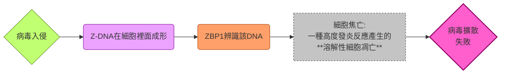

- 共有四個Bases: **Adenine, Guanine, Thymine, Cytosine**
- 一個核甘酸包含含氮鹼基 (ATCG)，去氧核糖 (二號碳上面接的是H)，磷酸基

#### 遺傳物質的破壞

- **RNA對鹼性環境敏感**， $-OH$ group會攻擊ribose上的2'-OH，使其跟磷酸基產生連結，進而破壞磷酸基跟核糖之間的連接，導致RNA斷裂

- **DNA對酸性環境比較敏感**， $H^{+}$ 會攻擊purine的N，導致purine從DNA上面脫離，脫離後的空位在酸性環境下會促進磷酸二酯鍵的斷裂

#### 多核甘酸鏈
- polynucleotide有5'-phosphate跟3'-OH，AT之間兩個氫鍵，CG之間三個氫鍵，形成antiparallel，例如可以是如下:

$$
\begin{align}
5'-P & -TGCATG-OH-3'\\
3-'OH & -ACGTAC-P-5'
\end{align}
$$

### The central dogma
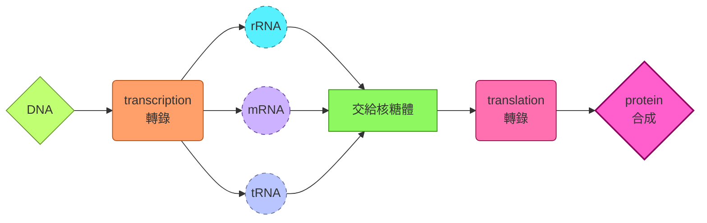
- 例外包含:
  - 逆轉錄病毒 retrovorus
 
$$RNA\overset{\text{逆轉錄}}{\rightarrow}DNA\rightarrow RNA\rightarrow Protein$$

  - RNA複製病毒

$$RNA\overset{RdRp}{\rightarrow}RNA\rightarrow Protein$$

  - prion、RNA編輯等等

#### 搖擺假說
- 多數細胞並不是61種tRNA全部存在。事實上，他們大多數只有45種tRNA。一些tRNA可以辨識多個密碼子
- 實際上，mRNA的第三個鹼基通常不一定要A-U，G-C配對，而是可以跟其他的核甘酸配對，被稱為Wobble Effect
- 例如，我們以tRNA的第一個反密碼子鹼基，可以配對的mRNA的第一個密碼子鹼基來看看:

|tRNA的第一個反密碼子鹼基|配對的mRNA的第一個密碼子鹼基|
|--------------------|------------------------|
|G|C或是U|
|U|A或是G|
|I (次黃嘌呤, Inosine))|A、U 或是 C|

#### 補充: 序列介紹
- 可以分為三種: palindrome sequence、direct repeat sequence、invert repeat sequence

|序列|定義|特點|功能|
|---|---|---|---|
|Palindromic sequence 回文序列|在DNA或RNA中，回文序列指的是一段核苷酸序列，其正向與反向互補序列相同。如 5’-GAATTC-3’ 3’-CTTAAG-5’|常見於限制酶的識別位點，如 EcoRI 就識別 GAATTC|回文結構容易形成二級結構 (如hairpin)，在基因調控與 DNA 修飾中扮演重要角色|
|Direct repeat sequence 直接重複序列|同一段序列在基因組中以相同方向重複出現。如 5’-ATCGATCG-ATCGATCG-3’|這種序列常見於轉座子、微衛星 DNA 或某些調控區域|可能影響基因表達、染色質結構，或在基因組演化中提供重組的基礎|
|Inverted repeat sequence 反轉重複序列|一段序列在基因組中以相反方向重複出現。如 5’-ATCG…CGAT-3’|容易形成二級結構，如hairpin或十字形結構|在基因調控、轉錄終止、以及某些病毒或質體的複製起點中扮演重要角色|

### 各種基因組計畫
- 長相差異非常巨大的個體，可能分子層級上基本差不多
- 各自的RNA和蛋白質合成也非常類似
#### 基本基因體組成
- Ploidy (套數): 雙套，diploid，來自父母
- Scale: 3 billion bp，兩萬個蛋白質編碼基因
- Exome: 全外顯子組，所有外顯子的組合，僅佔了genome的1.5%，佔了85%已知的致病突變

#### 人類基因組參考序列演進史

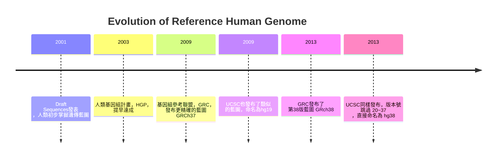
> [!Note]
> GRC命名染色體的格式為 1, 2, 3, X, Y
> UCSC命名染色體的格式為 chr1, chr2, chr3, chrX, chrY 🐱

#### T2T 聯盟計畫
- 前面幾個參考序列的定序法，往往會忽略一些重複序列區域，Sanger或是NGS都不一定能夠補全
- Telomere-to-telomere consortism 最新釋出的人類基因體序列 CHM13v1.1，彌補了GRCh38.p13所有的序列缺失，也校正了許多原本的組裝錯誤
- 完成史上第一個沒有任何gap、完整且連續的人類基因體序列
- 利用Hifi定序，有著提供長讀取數據的第三代定序優勢的同時，還兼具有比肩NGS的高精準度

#### why do we need the T2T-CHM13 Project? 
- 即使是 GRCh38，仍有約8%的區域是未知
- Sanger跟NGS屬於短序列定序，會把基因拆成小段，如果遇到高度重複的序列，就會算不出重復多少次
- 基因體裡有很多重複序列，就像那些純白色的拼圖片
  - ALU序列 (約300bp，在人類基因體裡重複了超過100萬次)
  - LINE序列 (約6000bp長) 
  - 還有微衛星DNA、端粒、著絲點
- 當你用Sanger/NGS這種短序列定序技術時：
   - 你拿到一段短序列 (比如150bp)
   - 這段序列剛好來自一個重複區域
   - 比對的時候，它會同時匹配到基因體的好幾個不同位置

> 結果就是: 
> 電腦不知道這段序列到底是從染色體1來的，還是從染色體X來的，還是從染色體7來的。🥲

- T2T-CHM13實現了 "從端粒到端粒" 的完整定序，大幅修正了過去參考基因組中的錯誤，提供了一個更連續、無斷點的模板

#### T2T的不足之處
- 來自於葡萄胎的同型合子基因組，46,XX (就是一個精子複製自己變成兩套 🙂)，而非一般正常胚胎，也無法定序Y染色體
- 研究後續轉向人類泛基因組 (pangenome)，並且嘗試補足Y染色體序列 (2013年已經完成)
- HPRC，又稱為國際人類泛基因組參考聯盟，已在2023年發表第一個草圖

> [詳細數據可以看看這裡唷 👀](https://www.blossombio.com/eNews/20210804/index.html)

#### The 1000 Genomes Project
- 千人基因組計畫著重於基因組變異的資料蒐集，包含:
  - SNPs (單核甘酸多態性)
  - Indels (小型的插入或是缺失)
  - Structural variation (大片段的消失、重復、倒位等等)
- 這些變異大多數屬於無害 (benign) 或是有益 (beneficial)，例如展現外貌變化，或是賦予抗寒的基因等等
- 有些屬於風險相關 (Risk associated) 變異，也就是讓你 "中獎機率可能比較高" 的變異 
- 有些屬於有害 (harmful) 或是致病變異 (pathogenic)，直接導致罕見遺傳疾病

### 進一步看看各個區域
#### 內含子跟非編碼區

|region|introns|non-coding regions, NCR|
|------|-------|-----------------------|
|位置|exons之間 (廢話)|位於轉錄單位兩端，或是在轉錄單位內部，或是本身也屬於轉錄單位|
|轉錄過程|被轉錄成hnRNA，然後被剪掉|可能會轉錄，也可能不會被轉錄|

- 反正就是: 
> [!Important]
> intron確實屬於NCR的一種，但NCR有一大堆，包含intron、promoter、enhancer、telomere、centromere、UTR (非轉譯區)、tRNA、rRNA、snRNA、miRNA、lncRNA等。但凡不是做蛋白質的區域，都是NCR !

- 如果外顯子組找不到突變，可以嘗試在調控區域或是intron找到答案

#### 變異類型跟規模
##### 小規模的序列變異
- 單核甘酸變異 (SNPs)，僅涉及單一鹼基替換
- 小規模插入跟缺失 (Indels)，大概50個鹼基對以下
- 小規模重復跟倒位

##### 重複序列變異
- microsatellites，也就是我們所知的STRs，一個重複單位通常2~10個鹼基對，做為親子鑑定常見
- trinucleotide repeats，三鹼基重複，會轉譯出重複的氨基酸鏈，發生過度擴張會導致神經退化性疾病，例如亨丁頓氏症的poly-Q

##### 大規模結構變異 (SV)
- 涉及長度大於50個鹼基對，或是數百萬個鹼基對的變異
- 例如複製數量變異 (SNV)，導致大片段的DNA增加或是減少，直接改變基因的數量
- 或著是重組，例如倒位、易位、插入等等

##### 染色體數異常
- 通常是非整倍體
- 如果是多倍體，通常會在發育時即出現問題，無法存活，例如Hydatidiform Mole (不完全的通常是三套染色體)
- 最有名的就是trisomy 21 (Down syndrome)，當然還有trisomy 13、trisomy 18 (Edwards syndrome)、47, XXY (Klinefelter syndrome)、45, X (Turner syndrome)

#### 深入介紹: SNP
- 人類基因組中大概有8470萬個SNP (根據千人基因組計畫)，例如:

$$
\begin{align}
& \text{sample A:}\\
& 5'\cdots AA\boxed{T}CGAATC\cdots 3'\\
& \text{sample B:}\\
& 5'\cdots AA\boxed{C}CGAATC\cdots 3'
\end{align}
$$

- SNP在非編碼區比較容易出現 (編碼區的SNP容易直接影響蛋白質功能，進而被淘汰)
- 門檻條件: 該變異在群體中的發生率高於1%
> [!Caution]
> - $\text{基因多型性}\ne\text{SNPs}\ne\text{基因突變}$ !!
> - 基因多型性通常是正常的遺傳多樣性，SNPs可能參與風險相關，基因突變屬於明確有害，直接導致疾病。
> - SNP不等於疾病，單一SNP可能無害，有些SNP可能跟疾病風險有相關性，但是多數只是讓你我 "與眾不同" 罷了 🙂

- SNP跟疾病的關聯性研究，很多都由GWAS (a genome-wide association study) 發現

#### Single nucleotide variations種類
- 靜默突變 (不影響轉譯):

$$GGG\rightarrow GG\boxed{T}\Rightarrow Gly$$

- 錯義突變 (導致轉譯胺基酸改變):

$$TGG\rightarrow TG\boxed{C}\Rightarrow Trp\rightarrow Cys$$

- 無義突變 (導致終止密碼子提前出現):

$$TGG\rightarrow TG\boxed{A}\Rightarrow Trp\rightarrow stop$$

- 框移突變 (插入跟缺失導致):

$$
\begin{align}
& GAGCC\boxed{T}GGTTGGAAG\cdots && \rightarrow Glu-Pro-Gly-Trp-Lys\cdots \\
\Rightarrow\quad & GAGCCGGTTGGAAG\cdots && \rightarrow Glu-Pro-Val-Gly\cdots
\end{align}
$$

- 如果是起始密碼子突變，那麼整個基因就無法轉錄跟轉譯:

$$
\begin{align}
& \boxed{T}ACAGGTGACGC\cdots \rightarrow CACAGGTGACGC\cdots\\
\Rightarrow\quad& \boxed{A}UGUCCACUGCG\cdots\rightarrow GUGUCCACUGCG\cdots\\
\Rightarrow\quad & Met-Ser-Thr-Ala\cdots\rightarrow \text{None}
\end{align}
$$

#### 舉例: 胺基酸轉換的代謝途徑
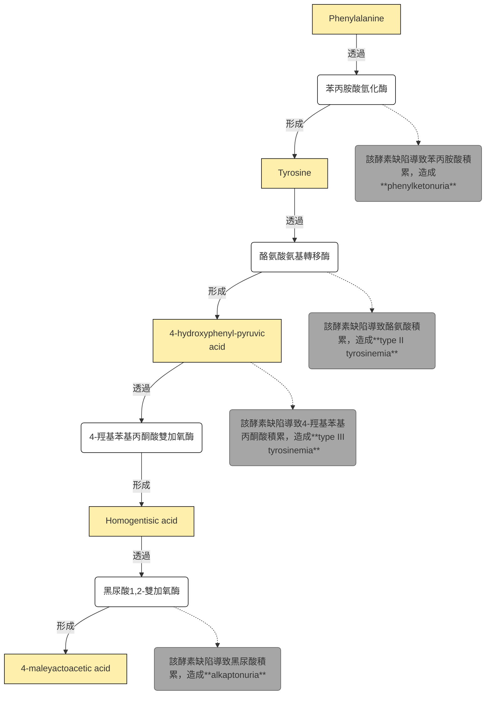

##### phenylketonuria, PKU
- 體染色體隱性遺傳
- PAH基因突變，Phe大量累積，對腦部跟中樞神經造成傷害 (智力發展遲緩)

##### alkaptonuria
- 體染色體隱性遺傳
- HGD基因突變，Tyr的副產物HGA累積，HGA沉積在結締組織裡面，導致褐黃症、骨關節炎

#### 深入介紹: SV跟辨認方法
- 可以從核型 (karyotype) 看出問題，使用Giemsa染劑對染色體進行染色，形成所謂的G-條帶 (AT多的地方是深色，CG多的地方是淺色)，觀察插入、重複、缺失的狀態
- 舉例，如下為一條染色體在插入、重複、缺失、倒位的情形:

$$
\begin{align}
\text{原本狀態}& \rightarrow AB-CDEF\\
\text{insersion}& \rightarrow AB-CDEFG\\
\text{duplication}& \rightarrow AB-CDDEF\\
\text{deletion}& \rightarrow AB-CEF\\
\text{inversion}& \rightarrow AB-DCEF\\
\end{align}
$$

|SV類型|代表疾病|
|---|---|
|缺失 (Deletion)|DiGeorge syndrome (22q11.2 deletion)：心臟畸形、免疫缺陷、顱顏異常|
|重複 (Duplication)|Charcot–Marie–Tooth disease type 1A：PMP22 基因重複，造成周邊神經病變|
|倒位 (Inversion)|血友病 A：F8 基因倒位導致凝血因子缺陷|
|易位 (Translocation)|慢性骨髓性白血病 (CML)：費城染色體 t(9;22)，形成 BCR-ABL 融合基因|

#### 深入介紹: 串聯重複序列 (Tandem Repeats)
- 這些重複序列直接相鄰串在一起
- 不同個體重複次數不同，又稱為VNTR
- 可以是tri-nucleotide、penta-nucleotide、hexa-nucleotide等等
- 根據重複單位長度，可以分成:
  - Microsatellite / STR ：重複單位 2–6 bp
  - Minisatellite：重複單位 10–60 bp
  - Satellite DNA：更長的重複單位，常見於著絲粒或端粒 
- 這些重複序列在世世代代傳遞過程中，可能會重複序列增加
- 有些repeat增加到一定的數量時就會發病
- 通常這些病會影響到神經系統居多

##### poly-Q
- 外顯子區重複出現的CAG序列
- CAG編碼為麩醯胺酸，glutamine，也就是Q，因此又被稱為poly-Q
- 代表疾病就是Huntington's disease, HD，*HTT* 基因
- 咱們再舉幾個栗子 🌰

|類型|對應基因|通常的poly-Q數量|發病的poly-Q數量|
|----|-----|---------------|--------------|
|亨丁頓氏症 (HD)|HTT|6~35|36~120|
|脊髓延髓性肌肉萎縮症 (SBMA)，aka甘迺迪症|X染色體上的睪固酮受體|9~36|38~62|
|齒狀核紅核蒼白球路易氏體萎縮症 (DRPLA)|DRPLA或是ATN1|6~35|49~88|
|脊髓小腦萎縮症 (SCA) 家族|ATXN1、ATXN2、ATXN3、ATXN7、TBP等等|6~40個左右|50~120左右|

#### From Monogenic to Polygenic Traits
- 單基因性狀導致的疾病包含sickle cell disease (血紅蛋白基因突變)、phenyleketonuria (PAH基因突變)、HD (HTT基因突變)
- 多基因性狀導致的疾病包含一大堆複雜疾病，例如hypertension、type II diabete、cancer、dementia (晚發型)

##### 備註: Alzheimer's disease種類
- early-onset AD屬於單基因即可發病的失智症，家族遺傳傾向強烈。致病基因包含APP (類澱粉斑塊前驅物蛋白)、PSEN1、PSEN2 (presenilin，早老蛋白
- late-onset AD屬於多基因遺傳控制 (主要是風險基因影響，例如APOE基因)

##### 罕見突變的概念
- 會著重在次要等位基因頻率 (MAF)，也就是非主要等位基因的那一個，只要MAF的頻率低於1%，它就屬於罕見突變

### DNA的分離跟分析方法
#### PCR
- in vitro情況下大量擴增DNA的技術，由Kary Mullis (1983)發明，並因此獲得諾獎
- 核心步驟為: 變性 (DNA分開)、黏合 (primers結合)、延伸 (聚合酶額合成DNA)
- 試管內必須包含: 模板股、primers、*Taq* polymerase、dNTPs、buffer and ions (ex: $Mg^+$ )

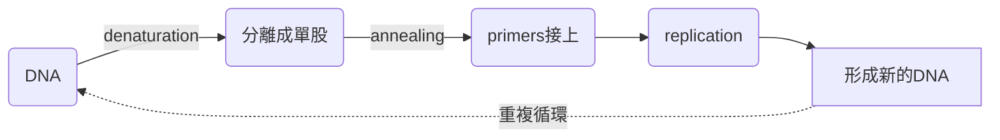
- 產生大量DNA後拿去跑凝膠電泳，可以從條帶的數量去分析，例如，如果兩個個體一個是homozygous，一個是heterozygous，前者電泳跑出一個條帶，後者出現兩個條帶

#### restriction enzyme
- 通常辨識palindromic sequences
- 命名規則是根據其分離來源的生物體命名的，例如EcoRI代表的就是:
  - **E**: genus，也就是Escherichia
  - **co**: species，也就是coli
  - **R**: strain，來自RY13菌株
  - **I**: 代表發現順序，在該菌株裡面發現的第一個限制酶
- 切割的末端可以是sticky end或是blunt end
  - sticky ends可分為5' overhangs跟 3'overhangs，容易進行配對，方便DNA重組
  - blunt ends無突出單股，連接效率較低，但不具序列專一性

|類型|定義|特徵|舉例|
|---|---|---|---|
|5′ overhang|在 DNA 的 5′ 端留下單股突出序列|突出端帶有磷酸基，容易與互補序列配對|EcoRI等限制酶切割|	
|3′ overhang|在 DNA 的 3′ 端留下單股突出序列|突出端帶有羥基 (-OH)|KpnI等限制酶切割|

##### restriction modification system, R-M system
- 細菌的先天免疫系統，區分自我跟外來DNA
- 細菌的限制酶發現外來的病毒DNA，就會把其切斷。然而，為了避免自己的基因被切掉，細菌會把自己的DNA甲基化 (methylation，利用methyltransferase)
- 有些病毒因此有些進化出了甲基化的機制，躲避限制酶攻擊

#### Electrophoresis
- DNA帶負電，我們會把DNA樣本置入瓊脂 (agarose) 板上的槽 (slot) 裡面，並且將其泡入buffer (記得slots的位置要接進負極)
- 通電後DNA就會開始往正極泳動，短鏈DNA跑得快，長鏈DNA跑得慢

#### restriction fracment length polymorphism, RFLP
- 如果你的SNPs使原本限制酶的切位點增加、消失或是位置改變，例如:

$$
5'-GAATTC-3'\quad\Rightarrow\quad 5'-GAA\boxed{C}TC-3'
$$

- 這個時候切出來的DNA長度就會有所變化，條帶分布就會有個體間的差異，因此呈現了**多態性 (polymorphism)**
- 例如sickle cell disease中，GAG變成GTG，突變剛好破壞了一個限制酶，導致原本的DNA無法被切成兩段
- 因此，如果在負極處多了一條槓，形成三條槓，那就是異型合子 ( $\beta^A/\beta^S$ )，如果只有兩條槓，就是正常同型合子 ( $\beta^A/\beta^A$ )，如果只有一條槓，那就是病理同型合子 ( $\beta^S/\beta^S$ )

#### nucleic acid hybridization
- DNA變性後可以再結合，因此可以利用probe和其進行互補。例子包含Southern blotting或是fluorescence in sidu hybridization (FISH)

##### Southern blotting
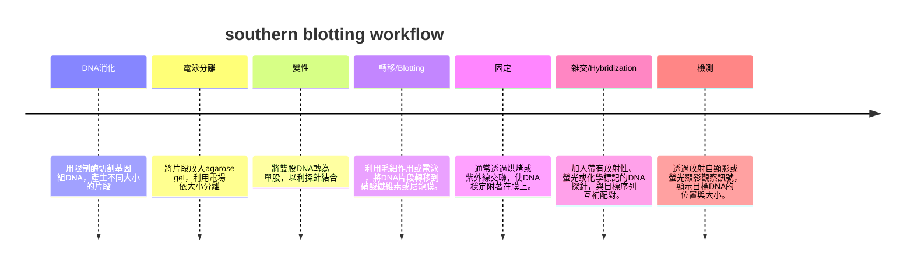
- 如果我有一個probe可以跟tandem repeat的核心序列結合，並且我用限制酶切下含有tandem repeat的片段，如果條帶位置越接進負極，重複的序列越多，越可能發病

##### FISH
- in situ (原位) = 直接在樣本上進行檢測
- 把有螢光的probe直接跟樣本的遺傳物質做鹼基配對
- 可以用來觀察細胞分裂的不同時期的細胞染色體樣態，或是用視覺化的方式確定基因在染色體的位置
- 也可以用來觀測基因組的結構變異 (缺失、重複、插入、倒位、易位等等)

> [!Note]
> 舉個栗子 🌰
> - 我可以把一個基因的probe放到已經複製凝聚的染色體上面。要是一對染色體發出螢光的位置不同，那就是發生了translocation
> - 要是一個染色體只出現一個螢光點 (按理來說複製了就該有兩個螢光點)，就說明發生了deletion

#### SNP chips and hybridization
- 假如說我有一個SNP，它有AT跟CG兩種形式，這個時候，我的SNP組合，由於染色體是雙套，就會是: $g^{AT}g^{AT}$ 、 $g^{AT}g^{CG}$ 、 $g^{CG}g^{CG}$
- 然後我針對DNA變性後的每一個單股片段都接上螢光標記
- 假如說我有不同的SNP probe，這些probe附著到beads (微珠) 上，當我的螢光DNA樣本倒入，跟這些beads上的probes雜交，我就會得到下列結果:

|基因型|對應A的探針|對應T的探針|對應C的探針|對應G的探針|
|-----|---------|---------|----------|---------|
| $g^{AT}g^{AT}$ |🟡|🟡|⚪|⚪|
| $g^{AT}g^{CG}$ |🟡|🟡|🟡|🟡|
| $g^{CG}g^{CG}$ |⚪|⚪|🟡|🟡|

#### 毛細管電泳偵測
- 讓PCR產物帶有螢光標記，放進細長的毛細管中，利用電場讓DNA片段依大小移動。跟凝膠電泳一樣，小片段跑得快，大片段跑得慢
- 儀器用雷射激發螢光，偵測片段通過的時間
- 結果呈現：電腦會畫出峰圖 (electropherogram)，每個峰代表一個片段的大小。具體來說，就是一個橫軸為片段大小，縱軸為螢光強度的圖
- 假如說，某STR位點出現兩個峰，表示此人有兩個不同長度的等位基因 (heterozygous)。如果只有一個波峰，那就是 homozygous

---

## chapter 3
### classical genetics
- 古典遺傳學OG孟德爾開創
- 發明hereditary factors (遺傳因子) 這詞，就是現在知道的gene
- OG酷愛豌豆的原因:
  - 性狀明顯看得出來
  - 好栽培，三個月就收成 (我的意思是... 生長週期短好做實驗 👀)
  - 自花授粉植物，品系穩定
  - 遺傳控制可以用異花人工授粉達成

##### 速帶過國中課本
- 在dominant跟recessive的同型合子 ( $WW\times ww$ ，此處代表圓形種子vs皺縮種子) 下，F1代指看出dominant表徵，F2中recessive表徵再次出現，比例大概是3:1
- 在異型合子裡面，只有dominant的遺傳因子顯現 → **顯隱律**
- test cross: 我不知道其中一個個體的基因型，所以我讓它跟另一個隱性的同型合子做雜交，如果後代沒有隱性，原個體基因型為 $WW$ ，如果顯性隱性都有，那原個體基因型為 $Ww$

> 好，進入正題，各位重新變成大學生 🙂

#### 種子到底為什麼皺縮
- 種子的形狀由SBEI (澱粉分支酶) 基因控制，該基因用來合成澱粉
- SBEI的基因突變 (轉座子插入基因導致功能下降)，導致澱粉合成異常
- 正常種子能把糖轉成澱粉，保持飽滿圓滑。突變型因為SBEI功能缺失，澱粉量減少、糖分累積，乾燥時水分流失不均，種子皺縮。

> [!Note]
> 在幫豌豆做PCR跑電泳時，可以看出 $WW$ 的基因，因為沒有insertion，形成一條跑得比較遠的條帶。 $Ww$ 形成一遠一近的條帶。 $ww$ 形成一條近的條帶

#### 單基因遺傳主要特徵
- 基因成對出現 (兩個alleles)，可以兩兩相同 (homozygous)，或是兩兩不同 (heterozygous)
- 一個配子形成時通常只攜帶一個allele，授精隨機發生，不同親代的allele重新配對
- 這叫做**the principle of segregation (分離率)**

#### dihybrid expetiment
- 可以用Punnett square (棋盤法) 來判斷基因型跟預測表現型，如果是dihybrid cross (兩性狀雜交，例如 $WW\ GG\times ww\ gg$ )，表現型在F2的比例將會是 **9:3:3:1**
- 也就是說，在兩個性狀的遺傳因子下，會形成4種基因型配子 ( $WG,\ Wg,\ wG,\ wg$ )
- 一個trait不會影響到另一個trait，這叫做**the principle of independent assortment (獨立分配率)**

#### 家族譜系 
- 可以用**Pedigree diagram**來分析，通常圖中會用不同的符號代表不同狀況 (一次讓你終生難忘 🙂)

##### autosomal dominant inheritance
- 例如Huntington's disease
- 體染色體顯性基因遺傳，男性跟女性受到的影響相同，由於是顯性，受影響個體在每一代都會有出現的可能
- 受影響的個體通常有一位受影響的父母
- 在圖上面基本上不會出現半滿的圖形 (因為發病基因並非隱性)，而且每一世代基本上都會有人中標

##### autosomal recessive inheritance
- 例如albinism (白化症)
- 異型合子個體 (半滿圖形) 不會發病 (被稱為carriers)，如果有發病的個體，其父母至少兩個皆為異型合子，或是其中一個是發病者，另一個是異型合子
- 體染色體隱性基因遺傳，男性跟女性受到的影響相同
- inbreeding (近親交配) 會大幅提升遺傳的可能性

### 遺傳定律的延伸跟拓展
#### codominance
- alleles所產生的性狀會同時且獨立的表現出來，而不是一個被遮蓋或是產生中間型態
- 可以從表現型上明確分析出到底是homozygous還是heterozygous

##### 舉例
- SSRs/STRs/microsatellite的短串聯重複序列 (異型合子的基因電泳檢測結果就是兩條size的STRs條帶，來自父親跟母親)
- ABO血型系統 (A型抗原或是B型抗原)
- sickle cell disease的紅血球特徵 (異型合子可以同時產生 $Hb^A$ 跟 $Hb^S$ )
- Roan color: 紅色的毛牛跟白色的毛牛會產生花斑毛牛 (Roan)

#### incomplete dominance
- 子代性狀表現的是中間型態，又稱為中間型遺傳，在表現型裡面，F2這一代就會形成1:2:1的比例
- 例如金魚草的顏色，紅花 ( $RR$ )跟白花 ( $Rr$ )的子代為粉紅花 ( $Rr$ )

#### multiple alleles
- 單一性狀有三個以上alleles，但是基因型只由其中兩種alleles決定
- 最熟悉的例子就是剛才共顯性提到的ABO血型系統 (基因分為 $I^A\ ,I^B\ ,i$ )
- 複習一下血型跟抗體抗原的關係

|blood types|A|B|AB|O|
|-----------|-|-|--|-|
|血漿中存在的相對應抗體|B antibody|A antibody|(none)|A and B antibodies|
|紅血球表面存在的抗原|A antigen|B antigen|A and B antigens|(none)|
|基因型|$I^A I^A$ or $I^A i$|$I^B I^B$ or $I^B i$|$I^A I^B$|$ii$|

#### epitasis 
- 有好幾個非等位基因 (loci不一樣) 同時控制一個性狀時，其中一對基因的表現會掩蓋或是改變另一對基因的表現
  - epitatic: 掩蓋別的基因的那對基因
  - hypotatic: 被掩蓋的那對基因

##### epitasis vs dominance

|特徵|dominance|epitasis|
|---|---------|--------|
|loci|發生在同一個基因座上的alleles之間，例如 $A$ 跟 $a$|發生在不同基因座上的非等位基因之間，例如 $A/a$ 跟 $B/b$|
|影響|顯性掩蓋隱性|一個基因的表現決定另一個基因是否有出場的機會|

##### 舉例
- "髮色" 的基因 (例如長金髮或是棕髮)，當遇上了 "是否禿頭" 的基因，禿頭的基因會掩蓋掉髮色的基因
- 拉不拉多有三種毛色: 黑色、棕色、黃色，是由一對控制色素產生的基因 ( $B/b$ ) ，跟一對控制色素是否沉著於毛髮的基因 ( $E/e$ ) 共同決定。如果後者的基因型為 $ee$ ，無論前者基因為何，都會呈現黃色的毛髮

|gamate|$BE$|$bE$|$Be$|$be$|
|------|----|----|----|----|
|$BE$|$BB\ EE$ ⚫|$Bb\ EE$ ⚫|$BB\ Ee$ ⚫|$Bb\ Ee$ ⚫|
|$bE$|$Bb\ EE$ ⚫|$bb\ EE$ 🟤|$Bb\ Ee$ ⚫|$bb\ Ee$ 🟤|
|$Be$|$BB\ Ee$ ⚫|$Bb\ Ee$ ⚫|$BB\ ee$ 🟡|$Bb\ ee$ 🟡|
|$be$|$Bb\ Ee$ ⚫|$bb\ Ee$ 🟤|$Bb\ ee$ 🟡|$bb\ ee$ 🟡|
### 當環境遇上基因
#### the penetrance
- 並不是說你有這個基因就一定會發病，有時你有該致病基因，不一定會表現出性狀。這個現象可以用**穿透率**來解釋
- 定義: 在攜帶特定致病基因的群體中實際表現出該疾病性狀的人數比例

$$\frac{\text{表現出性狀的人數}}{\text{攜帶致病基因的人數}}\times 100%\text{%}$$

- 如果是complete penetrance，那有突變基因就一定會發病 (存在一對一絕對關係)
- 如果是incomplete penetrance，那麼攜帶基因不一定會發病
- 例如某些遺傳性癌症 (如*BRCA1*基因突變) 雖然屬於顯性突變，但是個體可能也不會發病 
> [!Warning]
> 並不是所有的顯性疾病都能夠完全穿透 !! 

##### 影響穿透率的因素
> 為什麼有些人會生病，有些人不會?

- 環境因素: 不同的飲食或是生活習慣，或著是接觸的化學物質會影響
- epistasis: 其他基因可能掩蓋主效基因的作用
- epigenetics: DNA可能被甲基化
- age-dependency: 有些疾病需要年齡增長才會表現，又稱為延遲穿透

#### the expressivity
- 即使發病了，每個人的表現形嚴重程度也有所不同
- 即使在同一個家族，攜帶同一個突變位點的成員之間，病情的輕重程度也有所不同。這叫做表現度的多樣性 (variable expressivity)
- 例如Marfan syndrome (chr15的 *FBN1* 基因突變)，有些人可能只是表現出瘦長的身材，有些人會有嚴重的心血管併發症或是眼部問題

|概念|penetrance|expressivity|
|---|----------|------------|
|關鍵問題|是否發病|病得多嚴重|
|本質|all-or-none (要麼發病，要麼不發病)|spectrum (嚴重程度呈現連續分布)|
|definition|攜帶者中表現出症狀的比例|患者間臨床表現的一致性|

- 如同穿透率，表現度也受到其他修飾基因、環境、表觀遺傳的影響

#### 表現型、基因型跟環境
- 就算基因型相同，不同環境條件下也可能會有不同表現型:

$$phenotype=genotype + environmental\ factors$$

- 例如物種*Ranunculus aquatilis*，即使是同一株植物，水面下葉片 (絲狀) 跟水面上葉片 (掌狀) 就不一樣
- 喜瑪拉雅兔在體溫低的肢端長出黑毛，在體溫高的身體核心區域長出白毛 (因為調控黑色素的酵素tyrosinase只會在低溫下正常運作)

#### phenocopy
- 表現型模擬指的是**非基因突變造成的表型**，但其外觀或症狀卻與某個遺傳性疾病非常相似
- that is，環境因素或其他非遺傳原因 "模仿" 了某個基因突變的表現，因此不會傳給下一代 (non-hereditary)
>[!Tip] 
>舉最簡單的例子: 你吃太多phenylalanine也會中毒，看起來就跟患上PKU的人一樣 🙂

#### mtDNA transmission
- 粒線體主要存在於卵子的細胞質中，即使發生了paternal leakage (精子的粒線體不小心跑進卵子)，也往往會被細胞標記 (機制通常包含ubiquitination) 跟降解
- 由於粒線體基因僅來自母親，不涉及減數分裂中的染色體分配，因此不遵守孟德爾遺傳法則
> [!Note]
> 其實粒線體也可能會移傳自父親! 一個[發表在PNAS期刊上的研究](https://www.pnas.org/doi/full/10.1073/pnas.1810946115)發現一些患有粒線體疾病的病人 (症狀包含疲勞、肌張力低下、肌肉疼痛及眼瞼下垂等等)，它們有來自雙親的粒線體 😮

#### mosaicism
- 一個個體出現多個基因型: 同一個個體中，存在兩種或兩種以上具有不同基因型的細胞群
- 通常是因為胚胎發育過程中，單一細胞發生突變，且僅將該突變傳給自己的子細胞導致的現象
- 通常mosacism分成兩種: germline跟somatic類型

##### germline/gonadal mosaicism
- 突變只有在產生配子的細胞中出現，其他的體細胞完全沒問題。通常就是在發育的時候，生殖幹細胞的突變導致
- 父母沒事，孩子發病
- 如果一對健康的父母生下的孩子都有相同的顯性遺傳疾病，就可能是germline mosacism導致

##### somatic mosaicism
- 個體的體細胞具有超過一種基因型。通常就是胚胎發育時在有絲分裂中出現錯誤或是突變
- 不會傳給下一代，個體表現可能例如局部的皮膚顏色出現差異，或是局部神經系統異常

##### challenges
- 傳統抽血檢測 (檢驗白血球DNA) 可能測不出來
- NGS可能也測不出來 (偵測到的比例可能低於5%)

#### chimerism
- 一個單一生物體由兩個或是多個zygotes的細胞形成
- 非常非常非常罕見，遺傳表現可能包含:
  - 44, XX 加上 44, XY → 個體同時有兩套性器官
  - 組織異源性 (不同器官的DNA可能完全不一樣)
  - 當作親子鑑定發現DNA不符合時，可能孩子的父母為chimerism
- 當然，也有可能是後天性的 (acquired chimerism)，也就是透過器官移植得來的
  - 例如，做了骨髓移殖之後，受贈者的血型改變

|類型|mosacism|chimerism|
|---|--------|---------|
|來源|單一zygote|多個zygotes|
|發生時間|受精卵發育期間|受精卵早期榮的時候，或是後天移殖導致|
|example|somatic mosaicism、gonadal mosaicism|先天性 (融合胎兒) 或是後天性 (器官移植)|

---

## chapter 4
### relationship between genes and chromosomes
#### 再review一次
- 成雙成對
- segragation (分離率)
- independent assortment (獨立分配率，僅限於非連鎖的基因)

#### karyotype
- 每個物種都有一整套屬於其自己的染色體 (chromosome completment)
- 用視覺化的方式讓你看出某個體的一整套染色體，被稱為karyotype

#### assignment of chromosome numbers
- 通常會根據該染色體的物理特徵，給它一個特定的數字
- 通常是根據染色體大小，從大到小分成1~22，因此，尺寸最大的染色體就是chr1

### review: the cell cycle
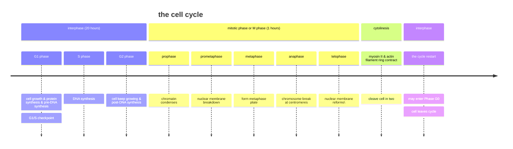
- 主要分為兩期: 間期 (interphase) 跟細胞分裂期 (mitotic, or M phase)

#### interphase
- 大概佔了9成的時間，分為G1 phase、S phase、G2 phase
  - G1: 著重在細胞生長跟胞器的複製
  - S: DNA的複製，確保每個染色體都複製成兩個姊妹染色分體 (sister chromatids)
  - G2: 合成未來細胞分裂所需的蛋白質 (例如tubulin或是紡錘體)
- G0 phase: 屬於非增殖狀態，細胞分裂停止
- 這些細胞進入G0期之後，可能等待時機再次進入細胞週期
- 或是開始分化，形成有功能的細胞 (例如神經元)，不再進行分裂。這就是為何神經元或是心肌細胞受損很難再生的原因之一\

#### mitotic phase
- 分成兩個重點: 細胞核分裂 (mitosis/karyokineses) 跟細胞質分裂 (cytokinesis)

##### stages of mitosis 

|phase|description|
|-----|-----------|
|prophase 前期|染色質凝聚成染色體|
|prometaphase 前中期|核膜開始消失，紡錘絲開始連結到著絲點上面|
|metaphase 中期|姊妹染色分體被牽引，排列到赤道板 (或是被稱為metaphase plate) 上面，這個時候最好觀察karyotype|
|anaphase 後期|姊妹染色分體分開，紡錘絲縮短|
|telophase 末期|染色體到達兩極，重新變成絲狀的染色質，核膜重新生成|

##### cytokinesis
- 由myosin跟微絲形成的環組成。微絲會慢慢收縮，在原先赤道板的區域形成分裂溝，形成兩個細胞

### ploidy

- 通常代表染色體套數
- haploid = 1套，diploid = 2套，以此類推。例如人單套為23條
- 一些生物本身即為單套染色體，例如drone。有些為多套 (polyploid)，例如植物

####  meiosis
- 一種特殊的細胞分裂，通常用來產生gametes用的 (sperm and egg cells)
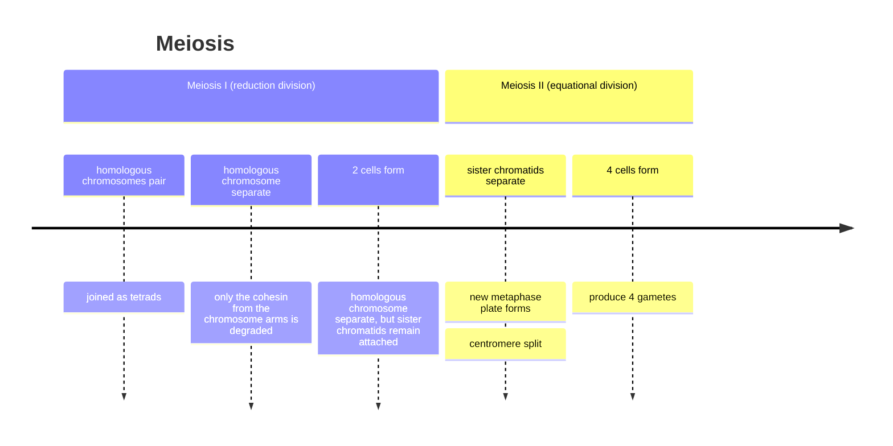

#### meiosis I
- 同源染色體在prophase可能會接在一起，交換基因，增加後代的適應性。這現象被稱為homologous recombination
- 同源染色體配對在一起的時候，被稱為染色體的聯會 (synapsis)
- 染色體的交叉處被稱為**chiasma**
- 這次發生的是**同源染色體的分離**

#### prophase I: a closer look
- 可以分為leptotene、zygotene、pachytene、diplotene跟diakinesis

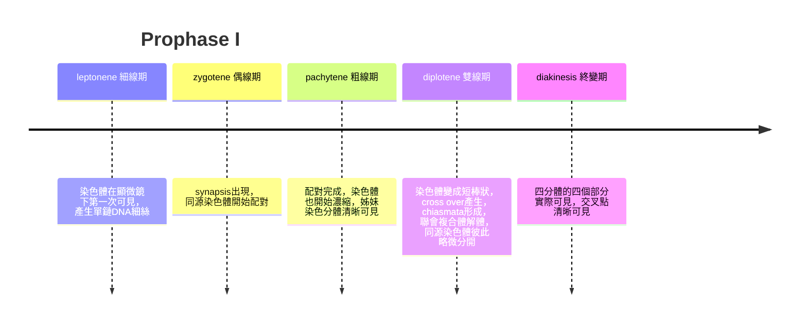

#### meiosis II
- 這次是換成**姊妹染色分體分開**
- 整個過程 (prophase、metaphase、anaphase、telophase) 都很像是有絲分裂，但是裡面只有正常染色體的一半數量
- 同時，剛才發生交叉互換的地方會被保留下來，增加了基因配子的多樣性

### 動物的生命周期
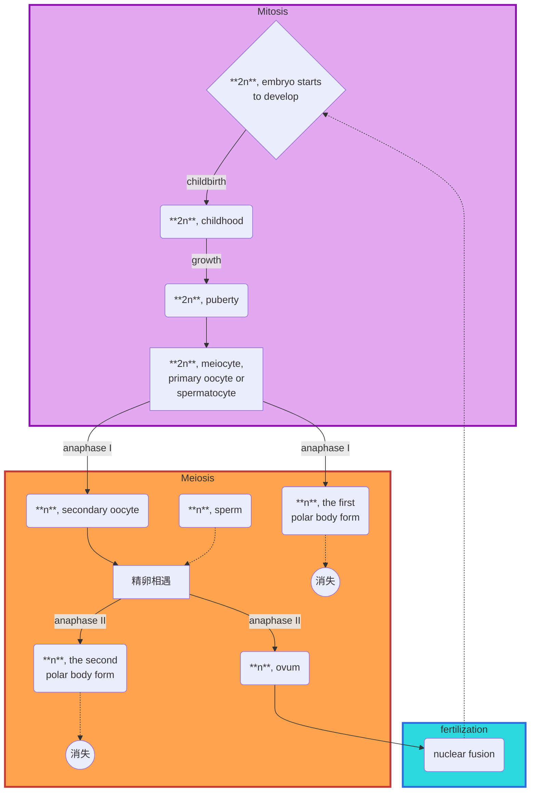

#### the fate of polar body
- 卵子形成 (oogenesis) 為高度的細胞質不對稱 (asymmetric cytokinesis)，大部分的細胞質都集中在一個子細胞上面
- 策略是把有限的營養集中在唯一的卵子身上，確保受精卵有足夠的能量進行卵裂 (cleavage)
- 人工授精時可以直接從極體去推測卵子是否以致命突變

#### nondisjunction
- 某些同源染色體或是姊妹染色體分離失敗造成的現象
- 可能會造成配子多了一個染色體 (trisomy) 或是少了一個染色體 (monosomy)
- 造成非整倍體現象 (aneuploidy)，如在人類身上為45或是47染色體，而非46條
- 大部分胚胎會因此自然流產，少數才能存活至出生。如trisomy 21 (Down syndrome) 或是 trisomy 18 (Edwards syndrome)
- 造成原因可能包含: 
  - 紡錘體連接失敗就分裂
  - Cohesion (固定姊妹染色分體) 出現異常
  - 高齡產婦效應

### sex-chromosome inheritance
- 果蠅有八條染色體，跟人類一樣，一對為性染色體 (X or Y)
- 果蠅眼睛通常為紅色，屬於顯性 (基因 $w^+$ )，白眼 (基因 $w$ ) 為隱性
- 影響果蠅眼睛顏色的染色體位於X染色體上面，因此，該基因屬於性聯遺傳

#### other X-linked recessive disorders
- 例如hemophilia (血友病)、色盲、Duchenne muscular dystrophy
- 基本上，男性患者的兒子都沒什麼問題 (因為只會傳遞Y染色體，有問題的基因不會傳下去)，女兒則是carriers (因為為隱性遺傳疾病)，直到他的女兒生的子女，就會發現兒子一半正常，一半發病

>[!Note]
> 八卦一下
> 維多利亞女王為hemophilia A (F8基因，位於Xq28) 的carrier，她生了9個孩子，這些孩子之後都變成了其他歐洲國家的王子公主，後代遍布，也非常 "幸運" 的把hemophilia A的基因傳遍各地。Nicholas II兒子的血友病就是這樣得到的 🤣

#### X-linked dominant disorders
- 要是男性為發病者，其女兒都會發病 (100%)，但不會傳給兒子 (0%)
- 要是女性為發病者 (heterozygous)，會友一半的基率傳給後代 (性別不影響)
- 例如X-linked hypophosphatemic rickets (*PHEX*基因突變)，或是Rett Syndrome (*MECP2*基因突變)

#### Y-linked inheritance
- 僅影響男性 (這不廢話嗎)
- 如果個體有發病，他爸爸通常也有病，有病的個體產生的男性後代基本都會發病 (這不廢話嗎 🤣)
- 例如先天性遺傳多毛症 (hypertrichosis)

#### Nondisjunction of X Chromosomes
- 最經典的例子就是Turner syndrome，45, X0，症狀包含蹼狀的頸部、低耳位、頸後髮際線較低、甲狀腺功能低下、不孕、糖尿病、骨質疏鬆等
- 還有一個例子是Klinefelter's syndrome，47, XXY，症狀包含肌肉虛弱、身高較高、外生殖器異常、缺乏性慾，嚴重的可能會有男性女乳症等症狀

#### mitochondrial inheritance
- 通常男性跟女性子代都會影響，基本上是屬於母性遺傳 (materal inheritance)，並且只有女性子代會把該遺傳帶給自己的下一代 (...這好像也是廢話? 🙂)
- 如果是屬於新生突變 (*de novo* mutation)，就另當別論
- 有獨立的基因組: 粒線體有自己的環狀DNA (mtDNA)，和細胞核的DNA是分開的
- 由於細胞的代謝不一，粒線體的密度在不同組織之間也不太一樣
> [!Note]
> 通常高代謝的器官會先遭殃，例如大腦、心肌、骨骼肌等

##### heteroplasmy and threshold effect
- heteroplasmy 就是突變的粒線體跟正常的粒線體共存的現象
- 通常，只有當突變的mtDNA比例超過一定的threshold，才會有症狀

##### nuclear DNA & mitochondrial function
- 很多粒線體裡面需要的蛋白質，其實都在細胞核的DNA裡面 (內共生事件發生後被嵌入進去的)
- 這個時候，這些類似粒線體疾病的症狀，就能夠符合標準的孟德爾模式，變成體染色體或是性染色體的遺傳，而不是母系遺傳

#### other animals examples
##### chicken: Z-W inheritance
- 公雞的性染色體是 $ZZ$ ，母雞的是 $ZW$ ，卵子決定後代性別
- 雞的 "條紋羽毛基因" (讓白毛雞變成條紋雞)，位於Z染色體
##### examples of Z-W organisms
- 除了雞之外，還包含:
  - 鳥類 (大多數)
  - 爬蟲 (部分的蛇or蜥蜴)
  - 兩棲 (部分青蛙)
  - 昆蟲 (鱗翅目)
  - 部分魚類

---

## chapter 5
### indepedent assortment
- 形成配子時，一對基因的分離，對另一個基因沒有影響
- 非對偶基因任意組合至同一個配子中

### 違反孟德爾遺傳的基因定率
#### genetic linkage
- 基因連鎖: 兩個基因基本上在同一個染色體上，且距離非常近
- 一條染色體上所有的基因組成一個連鎖群，並且不符合獨立分配率
- 理論上，連鎖基因是一起行動且不可以獨立分配的，但實際上可能發生基因重組 (gene recombination)

#### gene recombment
- 在prophase I，同源染色體之間會發生片段交換
- 如果兩個基因的距離很遠 (在同一條染色體的情況下)，發生重組的機率較高，使它們表現就像是獨立分配

#### Morgan and recombination
- 提出基因連鎖，交叉、互換等等的概念，讓他得到1933諾貝爾獎
- 交叉在prophase 1發生，同源染色體在一起產生聯會 (synapses)，形成交叉點處被稱為chiasmata

### 概念深入
#### parental vs recombinant types
- 親代型代表沒有發生互換的樣態。重組型代表有發生互換的樣態，通常，產生recombinant types 的機率比出現parental type的還要少
- 互換率: 發生互換的配子數，跟所有配子數的比例

$$recombination\ frequency=\frac{number\ of\ recombinant\ gamates}{total\ gamate}$$

- 基因的互換率，跟兩個基因的物理距離成正比
- 兩基因在染色體上的距離愈遠，中間發生互換的機率就愈大

假如說我有以下舉例:

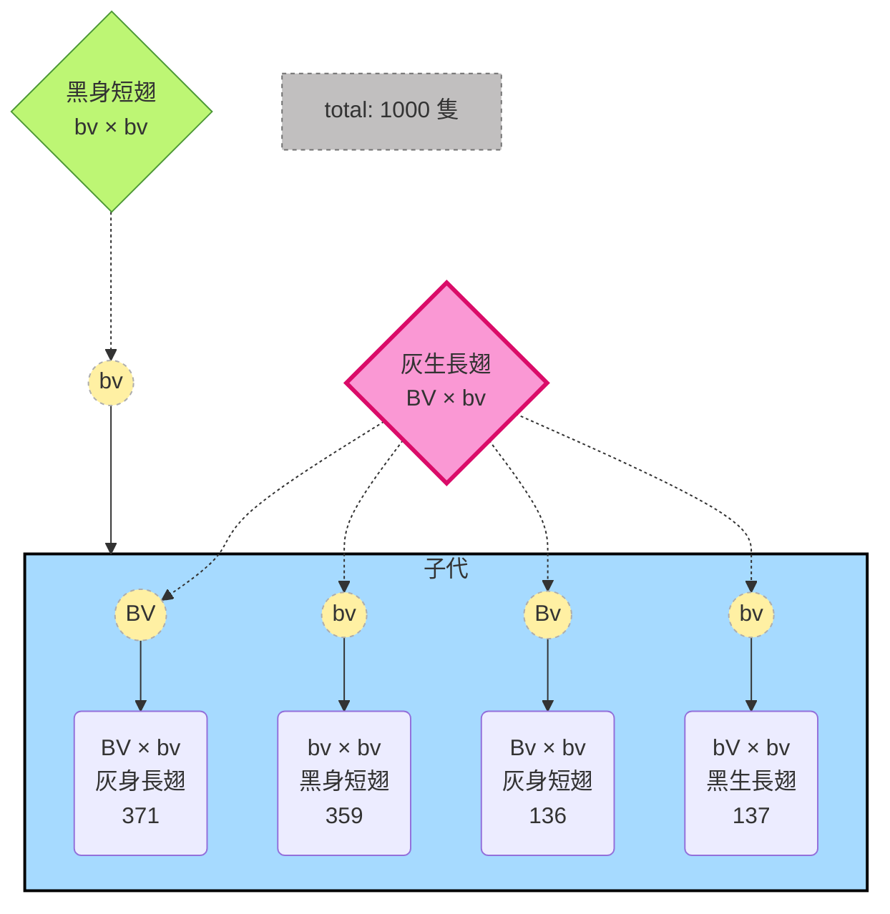
$$\text{互換率}=\frac{133+137}{371+359+133+137}=0.27$$

- 如果每一個配子母細胞在減數分裂時基因間都發失了互換 (例如一條染色體為AB，另一條染色體為XY)，那麼AB的比例會各佔有25%，互換率為50%
> [!Note] 
> 互換率最高就是50% 🐱

#### recombnation frequency
- 意旨兩個基因會互換的機率
- r通常在0跟0.5之間徘迴
   - 如果r=0，兩個基因基本上完全連鎖，這兩個loci基本上很近，不會有互換的機會發生，總是做為一個整體來傳承給他人
   - 如果r=0.5，這兩個基因並不連鎖，或是他們根本不是同一個染色體上面。如果兩個基因在同一個染色體但是距離很遠，它們的互換程度會高到像是獨立分配一樣。再記得一次:

$$r\le 0.5\quad\Rightarrow \text{loci are linked at r}$$

#### 舉個栗子 🌰
> 假設有兩個果蠅，一隻長翅灰身 ( $S^+S\ B^+b$ )，一隻短翅黑身 ( $ss\ bb$ )，理論如果是獨立分配率，我們應得到的結果如下:
> |gametes|$s^+b^+$|$s^+b$|$sb^+$|$sb$|
> |-------|--------|------|------|----|
> |$sb$|$s^+s\ b^+b$|$s^+s\ bb$|$ss\ b^+b$|$ss\ bb$|
> 
> 但實際結果是:
> - $s^+b^+$ :124
> - $ss\ b^+b$ : 23
> - $s^+s\ bb$ : 26
> - $ss\ bb$ : 124

- $ss\ b^+b$ 跟 $s^+s\ bb$ 的組合少，所以，其並非獨立分配率，但也沒有平均分開。因次推測這兩個組合為互換過後的組合，互換率為:

$$\text{互換率}=\frac{23+26}{127+23+26+124}=0.16\bar{3}$$

#### cis and trans
- 基因連鎖分為順式跟反式
- 要是兩個突變型 (隱性) 在同一條染色體上，野生型 (顯性) 在另一條染色體上面，那麼這就屬於順式 (cis)
- 要是兩個突變型在不同染色體，就被稱為trans
- 假如說野生型基因為 $Wm$ ，突變型基因為 $+$ ，那麼Cis就是:

$$
\begin{align}
\begin{pmatrix}  
  W & m \\  
  \text{+} & \text{+}  
\end{pmatrix} 
&& \Rightarrow\quad \text{cis configuation}
\end{align}
$$

- 要是trans，就是

$$\begin{align}
  \begin{pmatrix}  
  W & \text{+} \\  
  \text{+} & m  
\end{pmatrix} 
&& \Rightarrow\quad \text{trans configuation}
\end{align}$$

#### synteny vs linkage
- 共線基因 = 在同一個染色體上的基因
- 連鎖基因 = 共線基因位置足夠靠近，以至於它們傾向於一起遺傳，互換率明顯低於50%
> [!Note]
> - 要是兩個基因的 $r=0.5\rightarrow$ 基因物理上共線，但是不連鎖
> - **連鎖基因一定是共線基因，但是共線基因不一定連鎖 !!**

#### locus and genetic mapping
- locus (loci) = 基因在染色體上面的住址。相對應的基因座會攜帶相同或是不同的alleles
- genetic map用來表示基因在染色體上相對位置的 "地圖"，它不是顯微鏡下直接看到的物理圖像，而是根據基因連鎖與重組率推算出來的。
- 以前會用分摩根 (cM) 或是mu這種東西來定義
> [!Note]
> 1mu = 1cM = 1% 互換機率

- 現在基本不用cM，基因之間的距離直接用鹼基對來描述

|特徵|遺傳圖譜 (genetic map)|物理圖譜 (physical map)|
|--|-----------------------|--------------------|
|測量單位|分摩根，cM|鹼基對，bp|
|判定依據|重組的頻率，recombination|DNA序列長度|
|特點|相對位置，受重組熱點影響|絕對位置，不隨互換率改變|

> [!Caution]
> 1. 兩個基因的互換率如果為10%，那這兩個基因的距離為10 mp，或是10 cM
> 2. 如果距離單位大於50，那是不可能的，這代表這兩個基因並不連鎖

##### 備註: 甚麼樣的情況下，基因互換會被低估?
- cross over處根本沒有在兩個基因之間
- 在兩個基因之間出現兩次的cross over

- 舉以下的栗子 🌰
  - 果蠅的染色體為 $XY$ 或是 $XX$
  - 假如說我在 $XX$ 果蠅的染色體上面動手腳，變成 $X^Y\ X^B$
  - $X^B$ 代表末端片段缺失，並標記了 "棒眼" 的基因
  - $X^Y$ 代表接了一小段Y染色體片段，並標記了 "康乃馨色眼" 的基因
  - 猜猜看子代發生甚麼變化? 
  - 子代中出現了 $XX$ 、 $XY$ 、 $X^{YB}\ X$ 、 $X^{YB}\ Y$ 的組合
  - 也就是說， $X^Y\ X^B$ 的B缺失區域可以互換 !

#### attached-X
- 一般的果蠅為XX性染色體，不過偶爾兩個X染色體會在著絲點處黏在一起，被稱為attached-X ( $\bar{XX}$ )
- attached-X母果蠅除了擁有一對融合的X染色體，通常還XX帶有一條Y染色體，遺傳上會呈現2n+1的狀態，但生理表現為雌性
- 基因上面就會類似:

||$\bar{XX}$|$Y$|
|-|---|---|
|$X$|$\bar{XX}\ X$|$YX$|
|$Y$|$\bar{XX}\ Y$|$YY$|

- 此時， $\bar{XX}\ Y$ 為雌性，繼承了母親的attached-X染色體和父親的Y染色體，而 $XY$ 為雄性，繼承了父親的X染色體跟母親的Y染色體
- 這種情況跟一般果蠅相反: 兒子的X來自於父親，Y來自於母親

>[!Important]
> 剛剛的例子裡面有 $\bar{XX}\ X$ 跟 $YY$ 的可能組合，但是通常這兩種基因組合的胚胎都會死掉 🙂

#### 到底如何從attached-X知道染色體的間差是在什麼時發生?
- 首先我們知道，attached-X是不會有所謂的二次減數分裂的，因為它們同源染色體本來就是兩兩不分離的存在
- 因此，問題就是，到底交叉是在染色體複製前，還是複製後發生?
> 讓我們來思想實驗一下... 🐱

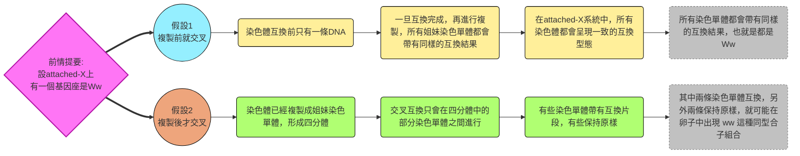

- 由於最後在實驗中發現了ww (homozygous recessive allele)，因此確定**cross over是在染色體複製之後發生的**

#### two‑point testcross 
- 兩點試交是一種遺傳分析方法，用來測量兩個基因座之間的重組率，進而推算它們在染色體上的相對距離
- 做法基本上就是將一個雙雜合子 (heterozygote) 與一個雙隱性同型合子 (tester, recessive homozygote) 交配，觀察後代的表型比例
##### 舉個例子 🌰
- 如果雙雜合子基因型為AaBb，試交者基因型為aabb，如果兩個基因是獨立分配 → 後代會呈現 $AaBb:aaBb:Aabb:aabb = 1:1:1:1$ 的四種組合。
- 如果兩個基因有連鎖 → 後代的比例會偏向親代型 (parental types) 多於重組型 (recombinant types)
- 透過計算重組型的比例，就能估算基因間的距離

##### 兩點試交的限制
- 如果兩個基因時在距離太遠，幾乎都會發生互換 (互換率接近50%)，且可能多次互換，會使重組型看起來跟親代型差不多，導致測量不準確
- 這時可能就需要三對基因之間的試交來達成 (three-point testcross)

#### cross over 不只一次時
- 互換有分成好幾種，如下:

|類型|a single crossover|2 strand  double exchange|3 strand  double exchange|4 strand  double exchange|
|---|---|---|---|---|
|說明|四分體的 其中兩個染色分體，發生一次交叉|四分體的 其中兩個染色分體，發生兩次交叉|四分體中的 三條染色分體，互相交叉，產生兩條重組型|涉及四條染色分體 全部交叉，產生四條重組型|

- 好，我們用以上這張圖來說明這種狀況:
  - 一種是雙重互換，但重組後四條染色體跟親代一樣 (機率25%)
  - 一種是雙重互換，在四條染色體中做出了兩條重組基因 (機率50%)
  - 一種是四條都發生互換，四條染色體基因都重組 (機率25%)
- 咱們來計算一下:

$$(\frac{1}{4}\cdot 0)+(\frac{1}{2}\cdot 2)+(\frac{1}{4}\cdot 4)=2$$

- 又因為:

$$\text{重組頻率}=2\div 4=0.5 (\text{已經是最大值})$$

>[!Important]
>在多次互換的情況下，**其遺傳表現就跟獨立分配率幾乎無異了** 😮

##### 染色分體干擾
- 如果第一次互換影響到了第二次互換選擇染色分體的對象，這就叫做**染色分體干擾**，也就出現所謂的 "非隨機性"
- 這會導致實際測得的重組率並非理想中的50%

#### three‑point testcross 
- Morgan為了更有效的對基因對跟定序，他跟學生發明了三點試交，涉及到三個連鎖的基因
- 三點測交中，研究者同時追蹤三個基因座，例如，可以同時得到三組距離：A–B、B–C、A–C
- 透過分析雙互換的後代型態，可以判斷基因的正確排列順序。
>[!Note] 
>例如: 如果 A–C 的距離 ≈ A–B + B–C，就能確定 B 在 A 和 C 之間。

##### 舉個栗子 🌰
> 假如說我有三種基因: $rb$ 、 $y$ 、 $cv$ ，發現它們的基因距離分別為 $y-rb=7.5\ cM$ 、 $rb-cv=6.2\ cM$ 請問它們的相對頻率是多少?

    
點我看解答 👀

    
1. 由於 $y-rb=7.5\ cM$ ，為長距離，我們可以推測 $cv$ 基因可能在 $y$ 跟 $rb$ 之間。也就是: 

$$y\cdots 1.3\ cM\cdots cv\cdots 6.2\ cM\cdots rb\quad \text{整體長度7.5cM}$$

2. 當然，也有可能這兩段距離屬於串聯關係，這時 $rb$ 就會在 $y-cv$ 中間，也就是:
    
$$y\cdots 7.5\ cM\cdots rb\cdots 6.2\ cM\cdots cv\quad \text{整體長度13.7cM}$$
    
**因此答案有兩個可能解** 🐱
    

#### 如何做三點試交
- 假如說我們有三對基因，父母分別為:

$$ABC/abc\quad \text{and}\quad abc/abc$$

- 沒有交換的話，就是 $ABC$ 或是 $abc$
- 發生一次交換的話，有兩種情況:
  - 發生在AB之間: $Abc$ 跟 $aBC$
  - 發生在BC之間: $ABc$ 跟 $abC$
- 發生兩次交換的話，那就是 $AbC$ 跟 $aBc$
- 同時我們知道，沒有互換的wild type占最多，互換一次的占比其次，互換兩次的占比最低
- 因此我們可以得出以下結論:

$$
\begin{align}
& \text{wild type:} && ABC/abc,\ abc/abc\quad \text{占最多}\\
& \text{single crossover:} && Abc/abc,\ aBC/abc,\ ABc/abc,\ abC/abc\quad\text{次之}\\
& \text{double crossover:} && AbC/abc,\  aBc/abc\quad \text{最少}
\end{align}
$$

- 由數量的計算就可以知道三個基因之間的遺傳圖譜
> 直接進行計算看看吧~

##### 栗子時間 🌰
- 假如說我的基因型分別數量如下:

|基因型|數量|屬於|
|---|---|---|
|ABC/abc|286|parental type|
|aBC/abc|33|single crossover|
|ABc/abc|59|single crossover|
|AbC/abc|4|double crossover|
|aBc/abc|2|double crossover|
|abC/abc|44|single crossover|
|Abc/abc|40|single crossover|
|abc/abc|272|parental type|

##### 1. 首先，我們先確定誰是雙重交叉，誰是親本型:
- 親本型 (Parental types)
  - ABC/abc = 286
  - abc/abc = 272
  - → 出現最多，確定是親本型
- 雙重交叉型 (Double crossover types)
  - AbC/abc = 4
  - aBc/abc = 2
  - → 出現最少，確定是雙重交叉型

##### 2. 確定順序
- 在雙交叉型裡，B的狀態改變，顯示B是中間基因。
- 因此，正確順序為:

$$A – B – C$$

##### 3. 計算A-B距離
- A–B 距離重組型包括：
  - aBC (33)
  - Abc (40)
  - 雙交叉 (4+2=6)
- 因此: 

$$\frac{33+40+6}{740}\times 100\approx 10.7\ cM$$

##### 4. 計算B-C距離
- B–C 距離重組型包括：
  - ABc (59)
  - abC (44)
  - 雙交叉 (4+2=6)
- 因此:

$$\frac{59+44+6}{740}\times 100\approx 14.7\ cM$$

> [!Tip]
> 記得在兩次測量時，雙互換的要重覆計算 🐱

##### 5. 做結論
- 將兩個答案都加起來，整個基因組就會像是:

$$\boxed{A}\cdots 10.7\ cM\cdots \boxed{B} \cdots\cdots 14.7\ cM \cdots\cdots\boxed{C}$$

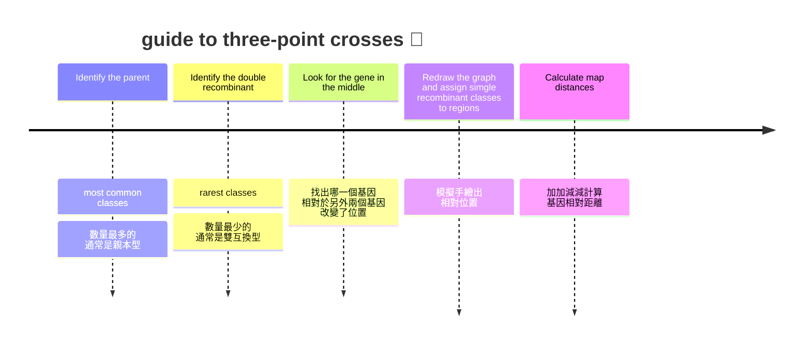

#### 從剛才的例子來看看 genetic interference
- 我們發現雙互換的情況 (double crossovers, DCO) 發生機率很低
- 根據剛才算出來的交換率，A-B的交換率是0.107，B-C的交換率是0.147
- 要是AB交換了，BC也交換了，假如它們的交換各自獨立，那麼DCO的發生機率應該就是:

$$
\begin{align}
& 0.107\times 0.147=0.0157\\
& \therefore 740\times 0.0157=11.6
\end{align}
$$

- 但是實際上DCO只有6個，比預期還少，為什麼? 🤔
> [!Note]
> 因為! 互換其實並非完全獨立! 一個地方發生互換，**會對鄰近區域產生 "物理上的排斥"** ，使得在附近同時發生第二次交換變得困難 !!

- 發生干涉的原因有很多種，可能是因為物理張力 (chiasma的剛性)、空間阻礙 (幫忙互換的蛋白質complex太大)
- 通常接近著絲點或是端粒的區域，容易出現干涉

#### 符合係數 coefficient of coincidence
- 公式如下:

$$\text{coefficient of coincidence}=\frac{reality\ DCO}{ideal\ DCO}$$

- 例如，以上述例子而言，符合係數就是 $6\div 11.6=0.51$ ，而干擾係數 (interference, i) 就是 $1-0.51=0.49$
- 根據干擾的程度，還可以分成四種情況: 

|狀態|符合係數|干擾係數|代表|備註|
|---|---|---|---|---|
|No interference|1|0|兩次互換完全獨立，互不影響。||
|Positive interference|0~1之間|0~1之間|正干涉，即第一次交換後，引起鄰近第二次交換的機會的**下降**|在生物界普遍存在|
|Negative interference|大於1|負數|某處發生crossover，會增加另一處crossover的發生|有時僅在微生物中出現|
|Complete interference|0|1|表示存在完全干涉，區域內絕對不會發生雙互換。||

#### 重組頻率跟遺傳距離的關係
- 可以化成一個函數圖形 (genetic map function)
- 遺傳距離為x，重組頻率為r
- 假如說是一般完全干擾的，那麼重組率基本上完全等於遺傳距離 (也就是，基因的互換最多只能發生一次，不會發生雙互換)
- 當干擾係數增加，產生多次互換的機率變高，重組率不一定等於遺傳距離
- 因此在圖形上，完全干涉 ( $i=1$ ) 的圖形是一條45度的直線，無干涉的圖形 ( $i=0$ ) 會產生一條無限接近 $r=0.5$ 的漸近線
- 多數生物的實際圖形長相是位於兩者之間 ( $0<i<1$ )
- 圖形上，無論 $i$ 等於多少，在短距離內 (通常是 $<15\ cM$ )，發生雙互換的機率極低，所以 $r\approx x$ 

### 當我開始想要找到你
#### physical and genetic map
- physical map通常就是對應到DNA的實際長度 (bp)
- 雖然物理上， "相隔越遠，互換率越高"，但是其實不是這樣的
- 在euchromatin上，重組活躍，遺傳距離跟物理距離較為一致
- 而在heterochromatin上，基因密度低，該區域發生重組的機率極低
- 例如以下這張圖，可以發現有些地方屬於重組多的區域，有些重組較稀少，就會有 "長度跟分摩根不一致" 的狀態出現

> [!Note]
> 例如，異染色質可能在物理距離上面占了25%的容量，但是互換率卻只有2.8% 🐱

#### genetic marker
- 這個時候就會用到基因標記，通常指標用的是SNP
- SNP有時會跟某個基因距離很近，導致高連鎖率，也就是所謂的 "共同隔離" (co-segregation) 概念
- 我們會用統計方法計算致病基因在哪些SNPs之間，就可以知道其在染色體上的位置

#### family-based linkage analysis methods and LOD
- 通常有三個特徵:
  - 需要多代的資料
  - 對於單基因、高穿透率的疾病最有效
  - 根據標記物位置尋找基因，事先並不知道基因具體的致病機制
> [!Tip]
> 連鎖分析的基本概念:
> 估計互換率並進行統計，擬定出一個特定值: **LOD (log of odds)**

##### 舉個栗子 🌰
- 假如說我們有一個例子如下:

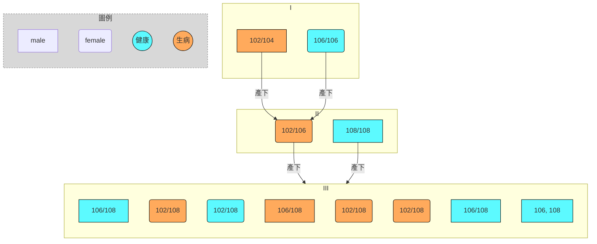
- 以上這些數字，都是在個體身上發現的標記物 (例如SSRP)，因此親代中父親102/104就屬於異型合子，母親106/106就屬於同型合子。我們發現:
- 如果我們懷疑標記102屬於 "顯性的致病基因標記物"，那麼我們在第三大的八個子女中，會發現:
  - 有三名病患遺傳102，三名健康者身上沒有102
  - 但是有一名男性沒有遺傳102卻發病，也有一名女性遺傳102卻身體健康
  - 因此重組率就是:

$$\frac{1+1}{1+1+3+3}=0.25$$

- 接下來，我們要搬出LOD的計算公式:

$$LOD(\theta) = \log_{10}\left(\frac{P(\text{觀察到的資料 | 連鎖假設，重組率 = }\theta)}{P(\text{觀察到的資料 | 無連鎖假設，重組率 = 0.5})}\right)$$

- 接下來我們比較兩個可能性，也就是該宮是的分子跟分母:
  - 分子: 假設I: 致病基因跟該標記連鎖，但是有 $r=0.25$ 的互換機率
  - 分母: 假設II: 它們不連鎖，獨立分配 (r=0.5)
- 然後就來算二項分配 (想哭 😭):
- 假設I的狀況如下:

$$P\text{{Pedigree | r=0.25}}=\frac{8!}{2!6!} (0.25)^2(0.75)^6=0.311$$

- 假設II的狀況如下:

$$P\text{{Pedigree | r=0.5}}=\frac{8!}{2!6!} (0.5)^2(0.5)^6=0.109$$

- 因此，我們得到的LOD分數就是:

$$LOD(\theta) = \log_{10}(\frac{0.311}{0.109})=\boxed{0.454}$$

- 我們可以發現單一家系算出來的LOD通常很小，因此，我們可以將不同家族針對同一對標記算出的LOD分數直接相加 (畢竟他是對數嘛)
- 通常當標記跟疾病之間的LOD超過3 (也就是，該標記跟疾病有連鎖的假設比沒有連鎖的假設可能性高**超過1000倍**)，我們就會接受假設I

##### 限制
- linkage analysis這種分析適合單基因遺傳疾病，而且需要龐大的家系提供統計強度
- 不適合複雜性、或是多基因遺傳疾病的致病基因，也不適合風險基因的偵測
- "解析度" 的限制: 染色分體之間發生交錯通常需要0.01 cM以上的距離，所以難以直接鎖定單一鹼基找出致病基因的實際位置，只能大致分析出可能的區間位置

#### GWAS (genome-wide association) 救場
- 透過分析兩群人 (病患跟控制組) 之間的基因多樣性差距 (例如找SNPs)，來從茫茫人海中找到可能的標記

##### 舉糖尿病的例子為例
- 透過GWAS，我們發現一型糖尿病患者帶有標記**HLA DR4**的機率高於正常者。我們分成發病組跟正常組來看:

|基因型|一型糖尿病患者組|控制組|總計|
|-----|-------------|-----|---|
|帶有HLA DR4|17|7|24|
|沒帶有HLA DR4|20|30|25|
|樣本組人數總計|37|37|74|

> [!Warning]
> 統計地獄來了大家準備好啊啊啊啊啊 😭

- 先來做假設:

$$
\begin{align}
& H_0\rightarrow \text{基因型與是否患有一型糖尿病沒有關聯}\\
& H_a\rightarrow \text{基因型與是否患有一型糖尿病有關聯}
\end{align}
$$

- 然後計算期望值:

$$E_{ij} = \dfrac{(\text{row total})(\text{column total})}{\text{grand total}}$$

- $E_{11} = \dfrac{24 \cdot 37}{74} = 12$ 
- $E_{12} = \dfrac{24 \cdot 37}{74} = 12$
- $E_{21} = \dfrac{50 \cdot 37}{74} = 25$
- $E_{22} = \dfrac{50 \cdot 37}{74} = 25$

- 然後搬出卡方統計量公式:

$$\chi^2 = \sum \dfrac{(O - E)^2}{E}$$

- 然後開始地獄計算...

$$
\begin{align}
\chi^2 & = \frac{(17-12)^2}{12} + \frac{(7-12)^2}{12} + \frac{(20-25)^2}{25} + \frac{(30-25)^2}{25}\\
& = 2.083 + 2.083 + 1 + 1 = \boxed{6.166}
\end{align}
$$

- 判斷顯著性: 在 $df=(2-1)(2-1)=1,\ \alpha=0.05$ 時， $\chi^2_{0.05,1} = 3.84$ 
> 由於 $6.166 > 3.84$ ，因此拒絕虛無假說，**帶有HLA DR4與一型糖尿病之間存在顯著關聯** 🐱

#### linkage disequilibrium, LD
- 在很久以前，致病的突變發生在特定的染色體上面，該染色體本來就有攜帶特定的SNP
- 代代相傳之後，儘管重組了很多遍，這個致病基因依然跟這個SNP連鎖在一起，因為這個基因跟SNP實在是靠太近了，互換率幾乎為0 (嗚嗚嗚好感動 🥹)
- 這又被稱為**連鎖不平衡，LD**
- 由於GWAS直接掃描整個基因組，不預設目標，對於多個基因共同影響的複雜疾病來說，GWAS就是最有效的工具

#### HapMap 計畫
- 2002年開始進行的大規模SNP圖譜構建
- 目標包含找出複雜疾病相關的DNA區域，以及了解遺傳變異如何影響個體對環境的反應差異

> [!Note]
> 第二期計畫就挖出了1000萬個SNPs，效率超快 !! 😮

##### 建立Haplotype跟tag SNPs
- 一條染色體上不是有很多SNPs嗎? 把這些SNPs連續串在一起，就是一條染色體的**Haplotype**。所以就會有Haplotype 1、Haplotype 2、Haplotype 3...
- 其中，有些SNP可以幫忙識別該haplotype (就像個名牌一樣)，這些SNPs又被稱為**tag SNPs**

##### 曼哈頓圖 Manhatten plot
- GWAS的研究成果通常都是這樣呈現的，包含X軸: 表示SNP在染色體上的物理位置，以及Y軸: 表示該SNP跟疾病關聯的p-value的負對數值 ( $-\log_{10}(P)$ )
- Y軸數值越高，代表P值越小，該位點跟疾病的關聯性就越顯著
- 通常圖上還有一個顯著性門檻，點越過此線就代表他可能為候選的致病位點

> [!Note]
> 拿最簡單的[Nature雜誌發表對於阿茲海默症的研究](https://www.nature.com/articles/s41598-021-99352-3.pdf)，APOE位點一直都是跟高AD發病率相關。大家有興趣可以點擊連結看看喔~ 👀

- 其他相關的GWAS研究包含但不限於: 

|疾病名稱|區域位點or相關的染色體|
|------|-------|
|type I diabetes|HLA region, chr6|
|coronary artery disease|chr9|
|rheumatoid arthritis|chr6|
|Chohn's disease|chr5, chr16, NOD2|

##### GWAS的限制
- 需要很多樣本，統計的power基本就取決於你的樣本有多少
- 使用SNP chips容易產生type I error
- 你的樣本選擇可能並不完全符合母體的比例
- GWAS只呈現相關性，但是**相關不等於因果 !!**
- 罕見的SNP難以用chips偵測

##### spectrum of disease allele effect
- 在遺傳學中，我們會用變異在人群中的普及程度，以及其對疾病的貢獻程度，來進行分類。通常分成三種:

|種類|圖表位於|特性|舉例|例子的相關位點|
|---|-------|---|----|-----------|
|rare disease, rare variant|左上角|極為罕見 (<0.001)，高穿透率，效應值極大|Huntington’s disease|HTT基因|
|common disease, common variant|右下角|非常普遍 (>0.05)，但是單一變異貢獻極小，效應值大概在1.1~1.5之間|prostate cancer|LMTK2位點|
|less common variant|圖表中央|中等程度效應值，頻率在0.005~0.05之間|Crohn's disease|NOD2|

---

## chapter 7
### gene, enviroment and trait
- 表徵通常可以被描述成單基因型 (monogenetic，由單一基因控制) 或是多基因型 (polygenetic，由多個基因控制)
- 這兩種都能因為基因-環境交互作用，而產生影響
- 具體來說，人的特性可以畫成一個三角形，三個腳分別為單基因、多基因、環境
- 基本上，多數特性都是落在三角形的中間處，很少特性是僅受到單一的角影響的

#### 質量性狀跟數量性狀 (qualitative and quantitative trait)
- 質量性狀通常是由單一基因影響，產生的表徵往往呈現出 "全有全無率"，這些表現型通常呈現離散的樣貌，呈現基因型跟表現型之間 "一對一" 的關係
- 數量性狀是由許多基因共同作用引起，表現型往往呈現連續的常態分布，表現型是在數量上呈現出不同，類型不變，而且受到多個基因和環境交互作用的影響很大

|trait|qualitative|quantitative|
|-----|-----------|------------|
|基因|通常是單基因|通常是多基因|
|特性|全有全無率，離散數據|常態分佈，連續數據|
|關係|基因跟表徵，一對一|受環境跟基因的多因素影響|
|舉例|孟德爾的豌豆花色|身高、膚色、體重、智力|

- 在任何單一基因上面，確實表現出了孟德爾的定律，但是因為他們會共同作用，導致表現型往往很複雜，一些特點包含: 
  - codominant: 每個等位基因對表現型的貢獻是一樣的
  - minor gene: 每個基因的貢獻量都非常小
  - additive effect: 基因的累積會決定最終的性狀樣貌
- 還有一些進階的特性，例如:
  - non-identical input: 各種基因對一種性狀的貢獻權重不一樣 
  - epistasis: 上位基因會掩蓋掉其他基因的作用
  - synergistic effect: 某些基因組合有偕同放大的作用 (1+1>2)

#### 透過圖表感受基因的類型
- 假如說某種性狀僅由一種基因控制 (例如豌豆種子的含油量)，並且將豌豆高度呈現於X軸，Y軸為個體數量: 
  - 親代會呈現出兩個分佈的峰 ( $SS\times ss$ )
  - 第一子代呈現出單峰 (皆為 $Ss$ )
  - 第二子代呈現出三峰，1:2:1的比例分佈 ( $SS$ 、 $Ss$ 、 $ss$ )
  - 整體皆呈現不連續 (discrete) 的樣貌
- 當基因數量增加時，子代的分佈會出現變化
  - 1 gene, 2 allele: 呈現三個峰
  - 2 genes, each with 2 alleles: 呈現五個峰
  - 3 genes, each with 2 alleles: 呈現七個峰，以此類推

#### 複習: 常態分佈的特性
> 對我們又回來複習統計了，驚喜吧 🙂

- 在計算的時候，總體平均數是根據總體樣本平均數估計得出，而樣本變異數要記得自由度為 $N-1$ :

$$
\begin{align}
& \bar{x}=\frac{\sum f_i x_i}{N} && s^2=\frac{\sum f_i(x_i-\bar{x})^2}{N-1}
\end{align}
$$

- 在分佈中，曲線下的特定區域面積，代表群體中具有該表型範圍各地比例，變異數 $\sigma^2$ 能夠衡量該分佈的離散程度，通常:
   - $\mu\pm \sigma$ : 68%
   - $\mu\pm 2\sigma$ : 95%
   - $\mu\pm 3\sigma$ : 99.7%
- $\sigma^2$ 小，整體分佈高瘦，反之

#### 多基因性狀中的 "不連續表型"
- 有些疾病看似是不連續，好像是單基因的疾病 (也就是要麼有病要麼沒病)，但是其根本原因其實是多基因跟多種因素影響 (無論是基因還是環境)
- 這就跟所謂的threshold/liability model (易患型門檻模型) 有關係
- 我們將影響該疾病發生的所有因素 (無論是基因還是環境) 統稱為liability (易患性)，liability代表著該個體罹患該疾病的風險
- 所有個體的liability集結成一個連續變異，橫軸為liability，縱軸為頻率
- 曲線的右側有一個門檻值，超過這個門檻，也就是liability高到一定程度的個體，才會患病
- 不同族群的分布 (例如不同地區的族群) 會有所不同，但是門檻值都是一樣的
- 如果是在一般的人群中，超過門檻值的比例被稱為population incident，如果是在家族中，就被稱為familial incident
- 通常familial incident > population incident (所以家族的整體曲線分佈相對於一般人群，會更往右偏移) 

