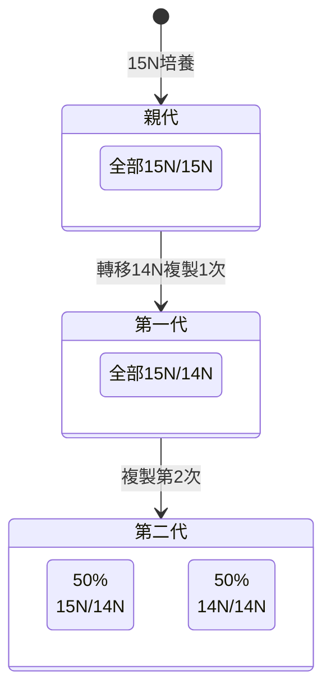
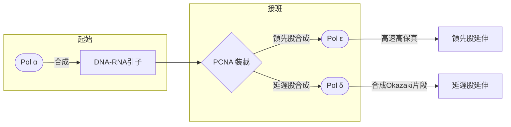
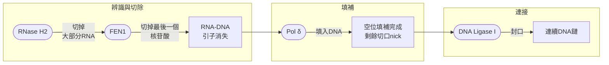

---

title: Genetic_1142_2nd_midterm

---

# Genetic note
## CH9: molecular organization of chromosome
### genome型態
#### C-value paradox
- 不同生物的基因組大小差異極大 (也就是C-value)，但這個大小卻**不一定與生物的複雜度相關**
- genome裡面有大量重複序列、轉座子、偽基因等，並不直接編碼蛋白質
- 同時，複雜度更多來自基因調控網絡，而非基因數量。這種基因組大小跟生物複雜度不對齊的狀態，被稱為C值悖論

### DNA的超螺旋性
#### 細菌的染色體
- 細菌染色體通常是環狀 DNA，在細胞中呈現負超螺旋狀態，超螺旋能讓長達數百萬鹼基的染色體壓縮到細胞內，並且跟包裝蛋白相互作用，形成nucleoid
- 超螺旋程度會影響啟動子區域的可及性，進而調控轉錄。同時，細菌能透過改變超螺旋程度來回應壓力、溫度或宿主環境
- 超螺旋被視為一種**古老的基因調控機制**，在病原菌與宿主互動中尤其重要

#### 細菌的transposons
- 根據種類可以分為三種: 
##### Insertion Sequences (IS 元件)
- 能隨機插入到基因組不同位置，可能打斷基因或影響調控
- 屬於最簡單的轉座子，只包含轉座酶基因

##### 複合型轉座子 (Composite transposons)
- 由兩個 IS 元件夾住中間的基因 (常是抗生素抗性基因)
- 能把整段基因一起搬移，促進抗藥性在細菌間傳播

##### 非複合型轉座子 (Non-composite transposons)
- 沒有 IS 元件，但有轉座酶與其他基因
- 同樣能攜帶抗藥性或代謝基因

#### 質體
- 獨立於染色體的一個小型環狀DNA，根據其傳播性可以分成兩種: 
##### Conjugative plasmids
- 帶有 tra 基因（transfer genes），能編碼形成性菌毛(sex pilus) 的蛋白質
- 可以主動進行接合，把質體複製並傳送到另一個細菌
- 例如F plasmid (fertility plasmid)

##### non-conjugative plasmids
- 缺乏 tra 基因，不能自行進行接合，只能在細胞分裂時隨染色體一起分配，或依靠其他 conjugative plasmid 的幫助
- 如果兩種質體整合在一起，可以形成co-integrate，促進他們在細胞跟細胞之間的傳播

#### Type II Topoisomerase 的作用步驟
- 酶先抓住一段 DNA，這段被稱為 G 段 (Gate segment)
- 在 G 段上，酶同時切斷兩股 DNA，形成一個雙股斷口 (這是它和 Type I 的最大差異)
- 另一段要穿過的DNA（稱為 T 段，Transported segment) 被引導通過這個斷口
- 酶重新把 G 段的雙股 DNA 封合起來，恢復完整性
- 整個過程需要 ATP 水解，提供能量讓酶進行構象變化，完成 DNA 的通過與封合

### chromosome 濃縮
#### histone
- H2A、H2B、H3、H4 各兩個，組成一個八聚體
> [!Note]
> 可以想像成一個「圓球狀的蛋白質核心」，表面帶正電。正電荷能吸引帶負電的 DNA 磷酸骨架 🐱

#### nucleosome
- 大約146個鹼基對的DNA會繞在組蛋白八聚體上，形成2.5圈
- DNA + 組蛋白八聚體的結構就是核小體，是染色質的基本單位

#### Linear looping
- 在更高階層，核小體會進一步折疊成30 nm的染色質纖維
- 這些纖維會形成一個個環狀結構 (loop domains)，像是把長線折成一圈圈
> [!Tip]
> 這一步主要是把 DNA 從「珍珠項鍊」壓縮成「環狀串珠」

#### Axial compression
- 這些環狀結構會沿著一個鷹架蛋白質（scaffold）排列，像是把一堆圈圈套在一根軸上
- 結果形成更粗的，大約300 nm的纖維，DNA 開始有 "棒狀" 的外觀

#### Lateral compression
- 最後，這些纖維再進一步橫向擠壓、折疊，形成大約700 nm的高度壓縮結構
- 這就是我們在顯微鏡下看到的中期染色體 (metaphase chromosome)

#### polytene chromosomes
- 最經典的多線染色體例子就是**果蠅唾腺染色體**
- 通常是由於細胞進行多次DNA複製 (endoreplication)，但沒有真正分裂，導致染色體不斷加倍
- 許多同源染色體彼此緊密排列並平行對齊，看起來像 "粗大的多線纖維"
- 在顯微鏡下能看到明顯深淺相間的條紋 (bands)，這些條紋對應不同的DNA區域
- 比一般染色體大得多，容易觀察，齊染色體結構可以用來建構細胞學圖譜

### renaturation
- 當 DNA 在高溫下被「熔解」成單股後，隨著時間推進，單股 DNA 會逐漸重新配對，回到雙股結構。這個過程可以透過吸光值的變化來追蹤

#### 吸光光譜
- **相對吸收值 (Relative absorption)**:  在紫外光下，單股DNA的吸收比雙股DNA高。隨著DNA重新配對，吸收值會下降
- $t_{1/2}$ : 半數回復時間，代表有一半的DNA已經重新形成雙股。這是用來比較不同DNA樣本或濃度的再複性速度

#### 濃度影響
- 圖A展示在同樣是T7病毒DNA的情況下，renature的速度
- 當DNA濃度高時（30 μg/ml），分子更容易找到互補股，因而再複性速度快
- 當濃度低時（10 μg/ml），分子彼此碰到的機率低，速度就慢

#### DNA種類影響
- 不同病毒DNA因為基因組大小與序列複雜度不同，回復速度也不同
- 較小或序列重複度高的基因組，通常再複性速度快

#### 二階反應
- 計算回復速率時，可以得到以下公式

$$
\begin{align}
& \frac{C}{C_0}=\frac{1}{1+k_2C_0t}
& t_{1/2}=\frac{1}{k_2\cdot C_0}
\end{align}
$$

- 其中:
  - $C$ : 單股DNA目前的濃度
  - $k_2$ : 二階速率常數，取決於溫度、鹽濃度、DNA 的複雜度
  - $t$ : 時間
  - $C_0$ : 初始DNA濃度

- Cot curve把 "DNA 濃度 × 時間" 作為橫軸，來比較不同 DNA 樣本的再複性動力學，橫軸為 $C_0t$ 值，代表在某一時間點，DNA分子彼此碰撞並重新配對的機率。通常:
- 小基因組或重複序列多 → 容易找到互補股 → 曲線左移 (再複性快)
- 大基因組或序列複雜 → 難找到互補股 → 曲線右移 (再複性慢)

- 在複雜基因組（如哺乳動物 DNA）的 C₀t 曲線上，常可分成三段: 
   - 快速再複性區: 重複序列
   - 中速區: 中度重複序列
   - 慢速區: 單拷貝序列

- 快速再複性區通常常見於異染色質 (例如端粒或是著絲粒)，它們基本上不轉錄，而且在prophase時比真染色質濃縮
- 而中速區的DNA大部分就是轉座子
### 真核生物染色體其他構造
#### CDEs, Centromere Determining Elements
- 在酵母的着絲粒 (centromere) 上，CDEs是三個特定的 DNA 區段 (CDEI、CDEII、CDEIII)，共同決定着絲粒的功能與動態

##### CDEI
- 保守序列，約 8–10 bp (RTCACRTG)，能與特定 DNA 結合蛋白 (如 Cbf1) 結合，幫助建立着絲粒結構

##### CDEII
- 約 80–90 bp 的 AT-rich 區域
- 核心組蛋白 Cse4 (酵母的 centromere-specific histone H3 variant) 的沉積位置
- 提供核小體結合平台，形成特殊的 "着絲粒核小體"

##### CDEIII
- 保守序列，約 25 bp，與 CBF3 複合體結合，這是酵母着絲粒最關鍵的蛋白複合體
- CBF3 的結合能定位 Cse4 核小體到 CDEII，確保着絲粒正確組裝

##### CDEIV
- 屬於可變區，約 100~135 bp

#### transposome
- 人類的染色體裡面有50%屬於轉座子，儘管它們大部分已經不會轉作了，釘死在那邊 🫠
- 真核生物的轉座子分成兩種:

##### Class I (Retrotransposons)
- 先把 DNA 轉錄成 RNA，再由反轉錄酶 (reverse transcriptase) 把 RNA 轉回 DNA，插入新的位置
- 會增加基因組大小
- 例如LINEs、SINEs、LTR retrotransposons

> [!Tip]
> 屬於**copy-and-paste**機制 🐱

##### Class II (DNA transposons)
- 由轉座酶 (transposase) 直接切下一段 DNA 片段，搬到新的位置
- 不一定增加基因組大小，可能造成插入突變
- 例如P 元件 (Drosophila 🪰)、Ac/Ds 元件 (Maize 🌽)

> [!Tip]
> 屬於**cut-and-paste**機制 🐱

#### telomere and telomerase
- 端粒由單股末端的短重複序列組成，對染色體的穩定性至關重要
- 這些單股末端常常隨著DNA的複製而降解，端粒酶能夠延長端粒
- 端粒長度短到一定程度，會導致細胞週期停滯
##### 1. RNA 模板
- 端粒酶本身是一個 核糖核蛋白 (RNP)，內含一段 RNA 模板
- 這段 RNA 提供序列 (例如在人類是**TTAGGG**的重複單元)

##### 2. 延伸 3′ 端
- 端粒酶利用 RNA 模板，在染色體的 3′ 端加上新的端粒重複序列 (因為DNA複製過後就是在3'的地方留下缺口)
- 這是一種反轉錄作用 (**RNA → DNA**)

##### 3. 移位與重複
- 當一個重複單元合成完成後，端粒酶會 "滑動" 到新合成的末端，再次利用 RNA 模板延伸
- 這樣就能不斷增加端粒長度

##### 4. 填補缺口
- 延長後的 3′ 端會形成突出單股
- DNA 聚合酶 $\alpha$ (primase) 再利用這個延長的模板合成對股，填補缺口

##### G-Quadruplex（G-四聯體）
- 四個鳥嘌呤形成的平面環狀結構，中心通常要金屬離子 (例如K⁺)
- 常見於端粒，或是癌基因啟動子

---

## Ch10: DNA replication and recombination
### some aspect of DNA repilcation
- DNA複製基於鹼基配對的特異性，每一股都可以幫成下一代DNA的模板，A配T，C配G
- DNA pol需要RNA primer的幫忙，然後從生長的那一股的3'開始加
- 一股連續合成，一股不連續合成 (leading and lagging strand)

> [!Tip]
> 所以具體合成方向是**生成股的5'到3'** 🐱

- 透過Meselsom-Stahl實驗，可以驗證半保留複製 (semiconservative replication)

- 也可以透過在具有BUdR (5-溴去氧尿苷) 的環境下，讓染色體在裡面複製
- BUdR可以在DNA複製時取代其中的胸腺嘧啶。因此，第一代的DNA都是含有一股有標記，一股沒有標記；而第二代可能有兩股都標記，或是只有其中一股有標記

> [!Note]
> 完全標記的染色體，螢光會減弱 (quench)，因此半標記的染色體才有螢光 🐱

### 宏觀看細菌環狀DNA複製 👀
#### $\theta$ 型複製
- 複製時會形成兩個複製叉 (replication fork)，同時複製期間DNA排列方式看起來像是 $\theta$ 型
- 複製的時候，尚未複製的親代DNA依然保持連結，只有在聚合酶要到達該處的時候才會分開

- 環狀 DNA 的複製可以分成單方向 (unidirectional) 和雙方向 (bidirectional) 兩種模式，這取決於起始點的設計與複製機制: 

##### 🧬 單方向複製 (Unidirectional replication)
- 從一個複製起始點 (origin) 開始，只往一個方向延伸
- 形成一個 "移動的複製叉"

##### 🧬 雙方向複製 (Bidirectional replication)
- 從一個複製起始點開始，但同時往兩個方向延伸，形成兩個複製叉
#### 滾環複製法
- 常見於複製時會形成**串聯體 (concatemers)** 的病毒 (例如嗜菌體)
- 一條環狀DNA在某個位點被切開，形成一個自由的 3′ 端。這個 3′ 端作為延伸模板，DNA 聚合酶開始合成
- DNA 聚合酶沿著環狀模板不斷合成新股。原來的另一股 DNA 被 "推出來"，形成長長的單股尾巴
- 隨著複製持續，推出來的單股尾巴會被補成雙股。最終形成多個基因組串聯在一起的 DNA concatemer
- 嗜菌體會利用特定酶把 concatemer 切割成一段段完整基因組，然後包裝進病毒顆粒

### 宏觀看真核生物DNA複製 👀
- 一條DNA上有多個ori，每一個ori形成一個複製泡，一個複製泡有兩個複製叉，複製泡不斷擴大，最後跟其他複製泡融合

### 微觀看細菌環狀DNA複製 🤔
#### 使用大腸桿菌的原因 
- *E. coli* 的倍增時間大約20分鐘，能在短時間內產生大量細胞，適合做分子生物學實驗。
- 它的基因組已被完整解析，並且有大量工具 (plasmid、vector、CRISPR 系統) 可以用來插入或刪除基因。
- 常用來生產重組蛋白（例如胰島素、酵素），因為它能快速大量表達外來基因
- 在分子生物學、遺傳學、代謝工程中，E. coli 是最經典的研究對象，許多基本原理 (如 DNA 複製、轉錄、翻譯) 都是在它身上首次被揭示
- 常用的實驗室株 (如 *E. coli* K-12）是無害的，不會引起疾病，適合教學和研究

#### 細菌的DNA複製簡介
- polymerase的引子是由RNA組成
- **primase (引子酶)** 生成RNA primer
  - RNA primer的5'通常都還包含著一個**三磷酸的核甘酸**
- **helicase**是解旋酶
- 主要合成DNA的酵素叫做**DNA pol III**
  - 利用dNTP，並且在切除前先**切出焦磷酸鹽 (PPi)**，再接上合成股3'，中間由磷酸二酯鍵 (phosphodiester bond, O-P bond) 連接

  - 在轉錄的時候如果出錯，會用exocnulease修補回來。尤其是當合成股不小心接錯的時候，會用**3'→5' 外切酶活性**
  - 這種狀況被稱為校正機制 (proofreading mechanism)

- **topoiosomerase II** (幫助雙股解旋)
- **SSB protein** (單股結合蛋白) 是避免分開但尚未複製的單股DNA再次結合
- 合成酶是5' 到 3'合成 (但模板股是3'到5')
- **DNA pol I**把RNA引子變成DNA
  - 需要做的事情包含去除RNA引子，以及將RNA替換成DNA
  - DNA Pol I會同時做 "切除RNA引子" 以及 "合成DNA" 的手段。這切除RNA引子的為**5'→3'外切酶活性**

|polymerase|功能|5'-3' polymerase|3'-5' exonuclease|5'-3' exonuclease|
|----------|---|----------------|-----------------|------------------|
|pol I|去除RNA引子|有✅|有✅|有✅|
|pol III|合成DNA|有✅|有✅|無❎|

- **DNA ligase**為連接酶，負責將岡崎片段連接起來

#### DNA gyrase (拓撲異構酶 II 的一種)
- DNA在解旋的時候，前方的DNA會形成正超螺旋，而gyrase會在複製叉前方先提前在好幾處斷裂雙股，這會導致DNA在解旋之前會 "旋轉" (相當於引入了負超螺旋)
> [!Note]
> Adriamycin，(艾黴素)會抑制DNA gyrase，這會阻止 DNA 解旋與修復，造成 DNA 雙股斷裂，誘導癌細胞死亡

##### 來做個小比較
| 特徵 | Type I Topoisomerase | Type II Topoisomerase |
| --- | --- | --- |
| **切割方式** | 切斷 **單股 DNA** | 切斷 **雙股 DNA** |
| **能量需求** | 不需要 ATP (靠 DNA 自身張力驅動) | 需要 **ATP 水解** 提供能量 |
| **主要功能** | - 移除 **負超螺旋** - 放鬆 DNA 張力 | - 移除 **正超螺旋** - 引入 **負超螺旋** (如 DNA gyrase)  - 解開 DNA 打結或鏈環 |
| **作用機制** | **切斷一股** → 旋轉 → 再封合 | **切斷兩股** → 讓另一段 DNA 通過 → 再封合 |
| **代表酶** | Topoisomerase I | DNA gyrase、Topoisomerase IV |

> 想要看相關影片可以來看看喔~
>  

### 微觀看真核生物複製 🤔
#### DNA polymerase $\alpha$
- 功能: 在複製起始時合成短的RNA引子
- 特點: 沒有校正 (proofreading) 功能

> [!Tip]
> 這相當於細菌中合成引子的primase 🐱

#### DNA polymerase $\varepsilon$
- 功能：主要負責**領先股**（leading strand） 的延伸
- 特點：**3’→5’ 外切酶活性**，可進行校正

#### DNA polymerase $\delta$
- 功能：主要負責**延遲股** (lagging strand) 的延伸
- 特點：具有 **3’→5’ 外切酶活性**，可進行校正
- 而且 $\delta$ 也負責岡崎片段引子去除後的DNA填補

> [!Tip]
> 這兩個相當於細菌的DNA pol III 🐱

#### RNase H + Flap endonuclease 1
- 負責協同作用，切除RNA核甘酸

> [!Tip]
> 這組合加上DNA polymerase $\delta$ ，相當於細菌的DNA pol I 🐱

#### DNA polymerase $\beta$
- 功能: 參與DNA修復 (特別是基因組的 base excision repair)
- 特點: 不是主要的複製酶，而是**修補工具**

#### DNA polymerase $\gamma$
- 功能：專門負責**粒線體 DNA 的複製**
- 特點：對粒線體基因組的維持至關重要

#### 其他特殊聚合酶 (如 Pol η, Pol ι, Pol κ, Pol ζ)
- 功能：屬於 translesion synthesis polymerases，能在 DNA 損傷或模板有錯誤時繼續合成，避免複製停滯。
- 特點：雖然能 "容忍" 錯誤，但保真度較低

### 非複製DNA時發現的錯誤修復
#### DNA mismatch repair (MMR)
- 如果**DNA內部**有錯誤配對，先做錯誤配對的辨識、然後定位跟招募其他蛋白，並且切除一小段DNA (裡面包含錯配的核甘酸)
- 然後DNA pol III (細菌) 或是 DNA pol $\delta$ 會去填補空隙，生成一小段新的DNA

#### double-strand break (DSB) repair
- 如果是**整個DNA雙股斷裂**，通常會使用**同源重組 (HR)** 的方式，也就是以姊妹染色單體或是同源染色體作為模板
- 如果沒有模板，會使用**非同源末端連接 (NHEJ)**，速度快但是出錯機率高

#### 🔀 Crossover repair
- 在同源重組過程中，形成**雙Holliday junction**，最後解開時會導致染色體片段交換
- 產生**基因重組 (recombination)**，增加遺傳多樣性 (特別是在減數分裂時是基因重組的來源)

#### ➡️ Noncrossover repair
- 同樣透過同源重組，但解開 Holliday junction 的方式不同
- 不會產生染色體片段交換，只是精準修復斷裂

### DNA定序

#### Sanger
- 也被稱為雙去氧定序，利用雙去氧核甘酸 (ddNTP)，讓DNA停止複製，產生大大小小的片段
- 你知道停在哪裡，跑膠之後就會知道序列

- 現在如果要做Sanger，會用螢光去lable四種ddNTPs，並且改在毛細管中進行電泳分離

#### NGS
- 大規模並行定序
  - 傳統Sanger是一次讀一條 DNA。NGS 則是同時讀取成千上萬的 DNA片段。
- 片段化與接頭 (adapter)
  - DNA/RNA 先被打斷成小片段，再加上接頭序列，方便固定在平台上並進行擴增。
- 擴增與定序反應
  - 常見方法是橋式擴增 (bridge amplification)，在固相表面形 "定序叢集"
- 螢光偵測
  - 每次加入一個核苷酸，會發出特定顏色的螢光，機器逐步記錄序列。

#### shotgun sequencing
- DNA 隨機打碎
  - 將基因體 DNA 切成許多小片段 (幾百到幾千 bp)
- 片段定序
  - 對每個片段進行定序（早期用 Sanger，現在常用 NGS）
- 電腦拼接（assembly）
  - 利用片段間的重疊序列，電腦演算法把它們拼接成較長的"contigs"
  - 再進一步拼成 "scaffolds"，最後得到完整基因體

---

## CH11: mutation, repair, and recombination
### 突變的種類 

```mermaid
flowchart LR
    M{🧬 突變 Mutation}
    
    M --> S[突變來源<br>Source]
    M --> CT[突變細胞種類<br>Cell Type]
    M --> T[表達時機<br>Timing]
    M --> F[功能影響<br>Functional Effect]
    M --> ML[分子層級影響<br>Molecular Level]
    M --> TL[轉譯影響<br>Translation Effect]
    
    %% 1. 來源分支
    S --> SP[Spontaneous<br>自發性]
    S --> IN[Induced<br>誘發性]
    
    SP --> SP1[DNA複製錯誤]
    SP --> SP2[脫嘌呤/脫嘧啶]
    SP --> SP3[氧化損傷]
    SP --> SP4[去胺基作用<br>5-mC → T]
    
    IN --> IN1[物理性<br>UV、游離輻射]
    IN --> IN2[化學性<br>EMS、亞硝酸鹽]
    IN --> IN3[生物性<br>病毒插入]
    
    %% 2. 細胞種類分支
    CT --> SO[Somatic<br>體細胞]
    CT --> GL[Germ-line<br>生殖細胞]
    
    SO --> SO1[不遺傳後代]
    SO --> SO2[癌症相關]
    SO --> SO3[嵌合體 mosaic]
    
    GL --> GL1[可遺傳]
    GL --> GL2[所有細胞都有]
    GL --> GL3[遺傳疾病]
    
    %% 3. 表達時機分支
    T --> C[Conditional<br>條件性]
    T --> UC[Unconditional<br>非條件性]
    
    C --> C1[溫度敏感型<br>ts mutant]
    C --> C2[營養條件敏感]
    
    UC --> UC1[不論條件皆表現]
    
    %% 4. 功能影響分支
    F --> LOF[Loss-of-function<br>功能喪失]
    F --> HYPO[Hypomorphic<br>部分功能]
    F --> HYPER[Hypermorphic<br>功能過強]
    F --> GOF[Gain-of-function<br>新功能獲得]
    
    LOF --> LOF1[Amorph/null<br>完全失去]
    LOF --> LOF2[單倍不足<br>haploinsufficiency]
    
    HYPO --> HYPO1[部分功能降低<br>leaky mutation]
    
    HYPER --> HYPER1[功能增強<br>過度活躍]
    
    GOF --> GOF1[新功能<br>致癌基因]
    
    %% 5. 分子層級分支
    ML --> SUB[Nucleotide Substitution<br>核苷酸取代]
    ML --> INS[Insertion<br>插入]
    ML --> DEL[Deletion<br>缺失]
    
    SUB --> SUB1[Transition<br>嘌呤↔嘌呤 A↔G<br>嘧啶↔嘧啶 C↔T]
    SUB --> SUB2[Transversion<br>嘌呤↔嘧啶]
    
    INS --> INS1[1bp 插入]
    INS --> INS2[多bp 插入]
    
    DEL --> DEL1[1bp 缺失]
    DEL --> DEL2[多bp 缺失]
    
    %% 6. 轉譯影響分支
    TL --> SIL[Silent<br>同義]
    TL --> MIS[Missense<br>錯義]
    TL --> NONS[Nonsense<br>無義]
    TL --> FS[Frameshift<br>移碼]
    
    SIL --> SIL1[密碼子改變<br>胺基酸不變]
    
    MIS --> MIS1[保守性取代<br>性質相似]
    MIS --> MIS2[非保守性取代<br>性質不同<br>如 sickle cell]
    
    NONS --> NONS1[提早出現 stop]
    NONS --> NONS2[截短蛋白]
    
    FS --> FS1[插入/缺失<br>非3倍數bp]
    FS --> FS2[下游全部改變]
    FS --> FS3[常伴隨提早終止]
    
    %% 顏色定義 - 六大類各一種顏色，字體黑色
    classDef source fill:#FFB3BA,stroke:#333,stroke-width:2px,color:#000
    classDef cell fill:#B3D9FF,stroke:#333,stroke-width:2px,color:#000
    classDef timing fill:#B3FFB3,stroke:#333,stroke-width:2px,color:#000
    classDef func fill:#FFFFB3,stroke:#333,stroke-width:2px,color:#000
    classDef mole fill:#FFB3FF,stroke:#333,stroke-width:2px,color:#000
    classDef trans fill:#B3FFFF,stroke:#333,stroke-width:2px,color:#000
    
    %% 套用顏色
    class S,SP,IN,SP1,SP2,SP3,SP4,IN1,IN2,IN3 source
    class CT,SO,GL,SO1,SO2,SO3,GL1,GL2,GL3 cell
    class T,C,UC,C1,C2,UC1 timing
    class F,LOF,HYPO,HYPER,GOF,LOF1,LOF2,HYPO1,HYPER1,GOF1 func
    class ML,SUB,INS,DEL,SUB1,SUB2,INS1,INS2,DEL1,DEL2 mole
    class TL,SIL,MIS,NONS,FS,SIL1,MIS1,MIS2,NONS1,NONS2,FS1,FS2,FS3 trans
```

#### 細胞種類、條件突變跟功能影響
##### 體細胞跟生殖細胞
- 突變可以發生在體細胞跟生殖細胞，但只有發生在生殖細胞的突變可以遺傳
- 例如生殖細胞嵌合 (germline mosaicism) 就是一個例子: 父母本人不會表現疾病，但如果突變的生殖細胞參與受精，就可能產生帶有突變的後代
- 這種情況下，父母看起來 "沒事"，但後代可能反覆出現同樣的遺傳病

##### 有條件跟無條件
- 條件突變 (conditional) 代表突變的表型只會在特定條件下表現出來，而在其他條件下看起來是 "正常" 的
  - **temperature-sensitive mutation**: 就是溫度太高的話會變性啦，例如黑色素的表達
  - **auxotrophic mutation**: 在有特定營養補充時能表達，缺乏該營養時就無法生長
  - **drug-sensitive mutation**: 在沒有藥物時表現正常，在有藥物存在時顯現缺陷

##### 功能影響
- **null mutation/loss-of-function**: 基因產物完全失效
- **hypomorphic mutation**: 基因產物仍有部分功能，但效率降低、代謝變慢
- **hypermorphic mutation**: 基因產物功能比正常更強或表達量增加
- **gain-of-function mutation**: 基因產物獲得了原本沒有的新功能

#### 從微觀角度來看突變
##### 核甘酸取代
- **transition mutation**: purine跟purine換，pyrimidine跟pyrimidine換
- **transversion mutation**: 就是purine跟pyrimidine換
- sickle cell anemia就是屬於transversion mutation，A變成T，T變成A
- 原本 $\beta$ -hemoglobin 的Glu-6變成Val-6，Val-6的R group (異丙基) 嵌入到別的血紅蛋白的 $\alpha$ -hemoglobin，導致它們黏在一起

##### 插入跟缺失
- 無論是**insertion**還是**deletion**，都可能只是單一鹼基對消失，或是大片段的消失
- 如果是trinucleotide的重複擴增，往往會引發神經退化性疾病。HD是其中一種，其他例子包含fragile-X syndrome、myotonic dystrophy、Kennedy disease等等

#### 註解: fragile-X syndrome and replication slippage
##### X染色體易脆症簡介
-  位於 X 染色體上 FMR1 基因的 5′ 非轉譯區 (UTR) 出現 CGG 三核苷酸重複擴增
-  重複過多會導致基因甲基化沉默 → FMRP 蛋白缺失
-  FMRP 在神經元突觸中調控 mRNA 的轉譯，缺乏會影響神經發育與可塑性
-  男性症狀通常較嚴重，因為只有一條 X 染色體；女性可能症狀較輕

##### 滑脫複製
- 當 DNA 模板上有一段重複序列 (例如 CGG、CAG)，聚合酶在合成新股時容易 "滑動"
- 新合成股或模板股會形成一個小小的 "髮夾結構" (hairpin loop)
- 髮夾出現在**新合成股** → 會多出額外的重複序列 (擴增)
- 甚至可能髮夾區會出現G-quadruplex結構，導致更多滑脫發生

### 轉座子的影響
#### Ectopic exchange
- 指的是非同源位置之間的重組 (non-allelic homologous recombination)
- 基因組裡常有許多拷貝的轉座子序列，這些拷貝彼此相似，容易在 DNA 修復或重組時被 "誤認" 為同源序列，結果就把它們當成 allele 來互換 (神經病阿)
- 可能造成缺失、重複、倒位，甚至染色體易位
- 好在大部分人的轉座子還算是處於非活性狀態 🙂

### 隨機突變
#### Lüria-Delbruck test
> 細菌的抗性突變是隨機發生的，還是因為接觸外界的威脅才誘發的？🤔

- 科學家們選了一株害怕phage T4的大腸桿菌，讓他們在液體培養基中狂歡一夜後，分別把菌液塗在好幾個上面有phage T4的培養基上面，看看菌落生成情形...
  - 如果突變是 "因為噬菌體而誘發的"，每個培養管應該有差不多數量的抗性菌落
  - 如果突變是 "隨機的"，不同培養管的抗性菌落數量會有很大差異 (因為有些管早早突變，抗性菌就大量繁殖；有些管晚突變，抗性菌就很少)
- 最終他們觀察到抗性菌落數量差異非常大，符合 "隨機突變" 的預測

#### CIB method跟隨機突變率
- CIB 染色體屬於變異的X染色體，有三個重要特色: 倒位 (無法跟其他X染色體互換)、隱性致死突變 (攜帶這條染色體的雄蠅無法存活)、Bar eye (導致棒眼)
- 首先把雄蠅和帶有 CIB 染色體的雌蠅交配，然後觀察後代
- CIB 染色體本身帶有致死基因，通常來說，這會導致之後每一代的雄蠅都會有 "一半的機會" 得到CIB染色體而死，而另一半不會
- 而要是實際上原本健康的X染色體也出現異常，那麼帶有該mutant X染色體的雄蠅也會死

> [!Important]
> 有趣的是，這兩個基因會有相互作用，帶有mutant X跟CIB的雌蠅，兩個的致死基因會相互抵銷，所以不會影響雌蠅的死亡率 !!

- 如果觀察到死亡比例 比一半還要高，就代表有些 "正常 X" 其實帶了突變 
- 也就是說，這些雄蠅雖然沒拿到 CIB，但因為正常 X 上有致死突變，還是死掉
- 研究者就是透過 "超過預期死亡的雄蠅數量" 來估算 正常 X 染色體的突變率

### 化學性的誘發突變
#### deamination
- 其實就是把一個鹼基上的胺基拿掉，結果會讓它 "變身" 成另一種鹼基，進而改變配對方式
- **Cytosine → 脫氨 → Uracil**: U 會和 A 配對 → 原本的 C-G 對變成 T-A 對 
- **甲基化Cytosine → 脫氨 → Thymine**: 一樣導致原本的 C-G 對變成 T-A 對
- **Adenine → 脫氨 → 次黃嘌呤 (Hypoxanthine)**: Hypoxanthine 喜歡和 C 配對 → 原本的 A-T 對可能變成 G-C 對

#### depurination
- 嘌呤鹼基 (A or G)被移除，只留下糖-磷酸骨架上的 "空位"(**apurinic site, AP site**)。這是一種常見的自發性 DNA 損傷
- 通常是因為 **"水分子作亂"**，導致糖苷鍵 (也就是五碳糖跟含氮鹼基之間的連結) 斷裂，A 或 G 脫落，形成 AP site
- DNA 聚合酶遇到 AP site 會 "亂填"，常常插入隨機的鹼基，引發替換突變 (substitution)

#### 5-bromouracil
- 是一種鹼基類似物，結構和thymine很像，但它有不同的互變異構 (tautomeric forms)，會導致錯誤配對，進而造成突變
- 在**keto form**時，5-BU 的常態結構和 T 類似 → 可以和 A 配對
- 在**enol form**時，它會改和 G 配對，而不是 A
- 這就導致在 DNA 複製過程中，5-BU 可能一開始配對 A，但下一輪複製時卻和 G 配對，就會把原本的 A-T 對，變成 G-C 對 → 轉換型突變 (transition mutation)

#### alkylating agent
- 烷基化劑會在 DNA 鹼基上加上烷基基團，改變鹼基的化學性質，進而導致錯配
- **Guanine → 烷基化 → $O^6$ -alkylguanine**: $O^6$ -alkylguanine會錯誤地和 T 配對，導致G-C → A-T transition mutation
- **nitrogen mustard**是一種雙官能基烷基化劑 (bifunctional alkylating agent)，因此常常導致兩個 G 之間就會被 "橋接" 起來
- 導致 DNA 雙股無法正常分開，聚合酶卡住

#### acridine
- 三環的，平面芳香族分子，屬於一類插入性致突變劑 (intercalating mutagens)
- 當它插入 DNA 時，會把鹼基對之間的距離撐開，導致DNA聚合酶在複製時，因為空間被撐開，容易 "多加一個" 或 "少加一個" 核苷酸

### 物理性的誘發突變
#### UV light
- 導致兩個相鄰的T (thymine dimer) 形成共價鍵結，使DNA翹起來 (distortion)

#### X-ray
- 在很寬的X射線劑量範圍中，X射線誘發的突變跟輻射劑量成正比

### 怎麼修復?
#### 未複製時的兵來將擋
- **mismatch repair**: 切掉含有錯配檢基的序列，並且重新合成DNA進行替換
- **base excision repair**: 利用**N-glycosylase**去除該鹼基
- **AP repair**: 利用**AP endonuclease**去除空的去氧核醣，然後再進行替換

> [!Note]
> - 如果烷基化導致G變成OG ( $O^6$ -alkylguanine)，透過**Oxogranine glycolyase**可以將OG從DNA上面切下來，但是這會導致留下一個空的位點，產生apurinic site (簡稱為AP site)
> - 如果脫氨作用導致C變成U，**Uracil glycosylase**會把U的含氮鹼基從DNA上面切下來，但是這會導致留下一個空的位點，產生apyrimidinic site (也是簡稱為AP site) 🐱

- **大片段損傷或是扭曲**: 移除受損部分的一股後，再進行替代股合成
- **T-dimers**: 透過藍光活化蛋白去除嘧啶二聚體 (這過程被稱為photoreactivation)

#### 複製時啟用的修復機制
##### DNA bypass repair
- 像 Pol η、Pol ι、Pol κ、Pol ζ 等DNA polymerases，它們的特點是 "低精準度但能跨過損傷"
- 這些聚合酶會在受損位點隨便填入一個鹼基，或是乾脆跨過他們當作沒看到
- 未合成的缺口會 "先用另一股的親代股" 切下一段填補該缺口 (拆東牆補西牆)，之後再進行彌補 (再補東牆)

##### template direct gap repair
- 某一股要是在複製時斷裂，並且是3'末端，它會 "跑到另一股去"，以另一股當成模板來合成 (參考東牆補西牆)，等到完成之後再 "跑回來"，讓聚合酶可以重新連接

### reverse and suppressor mutations
#### 基因內抑制
- **intragenic suppression**: 在同一基因內，第二次突變可以 "壓抑" 第一次突變造成的缺陷，讓蛋白質部分或完全恢復功能
- 在大腸桿菌的研究中，A polypeptide 是 DNA 聚合酶 III 的一個重要亞基，如果這個 polypeptide 基因發生突變，可能會導致 DNA 複製缺陷
- 但有時候在同一基因內出現第二個突變，能夠修正蛋白質的結構，讓它重新具備部分功能

#### 基因間抑制
- **intergenic suppression**: 第二個突變發生在不同基因，但能間接補償原本突變造成的缺陷
- 例如，如果某個基因產生 "無義突變"，但是tRNA的基因反密碼子也出現突變，而他倆剛好對上，那就很 "幸運" 地轉錄可以繼續進行 (有這個運氣為什麼不去買彩票?)

#### Ames test 
- 是一個經典的致突變性檢測方法，用來測試化學物質是否會引起 DNA 突變

> [!Tip]
>它們認為... 如果某個化合物能讓細菌產生突變，那麼它可能具有致癌性 🤔

- 使用沙門氏菌 (*Salmonella typhimurium*)，這些菌株帶有組氨酸缺陷突變 ( $his^-$ )，在沒有組氨酸的培養基上不能生長
- 把待測化合物加入培養基，如果化合物能引起 DNA 突變，部分菌株會 "逆轉突變" (revert mutation)，恢復組氨酸合成能力，變回 $his^+$ (是在哈囉? 🙂)
- 在不含組氨酸的培養基上，如果出現菌落，表示化合物誘發了突變
- 菌落數量越多，代表突變率越高
> [!Caution]
> 不過，有些化合物需要經過肝臟代謝才會變成致突變物，所以實驗常加入大鼠肝臟酵素，來模擬體內代謝

