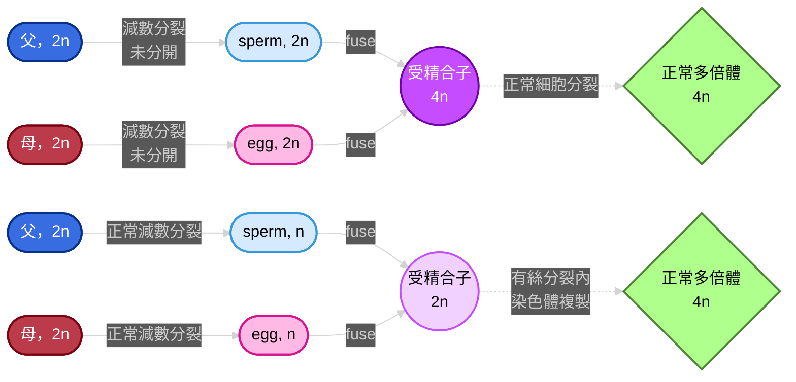
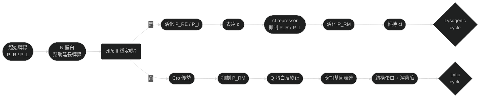
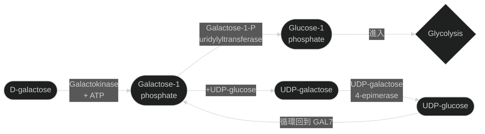

 

# genetic note
## Ch6
### karyotype
- 核型分析，利用中期的染色體進行染色得到
- 利用 "chromosome painting"，可以標記各個染色體，利用的方式是FISH (fluorescent *in situ* hybridization)
- 由於螢光原位雜交會針對類似於探針的序列進行雜交，所以有相似條帶顏色的染色體，基本上就是同源染色體啦 🐱

#### 染色體條帶的產生
- 染色體通常分為幾個部分: 
  - p: 染色體的short arm (p = petite，嬌小可愛的意思 🥺)
  - q: 染色體的long arm (q = p的相反 = not petite)
  - G-bands: Giemsa banding，用Giemsa染色產生的深淺相間條帶，**深色區通常AT-rich，基因密度低；淺色區則是GC-rich，基因密度高**
  - Q-band: 用奎寧染色，條帶在紫外光下會螢光，常用來區分染色體
  - R-band: Reverse banding，和G-bands相反，**AT-rich區顏色變淺；GC-rich區顏色變深**
  - C-bands: 專門染著絲粒 (centromere) 附近的異染色質，幫助辨認染色體的中心位置
- 通常S phase，也就是細胞週期中DNA複製的階段，分成早期、中期、晚期
  - 早期S phase: 基因密度高、活躍的區域 (R-bands, GC-rich) 會先複製
  - 中晚期S phase: 基因密度低、不活躍的區域 (G-bands, AT-rich) 才開始複製

#### 國際分類方式
- 染色體依照大小、著絲粒位置、條帶型態被分成七大群組:

|群組|特色|著絲點位置|備註|
|---|---|---|---|
|**Group A** (1–3號染色體)|最大的染色體|中著絲(metacentric)||
|**Group B** (4–5號染色體)|大型染色體|近端著絲 (submetacentric)||
|**Group C** (6–12號染色體 + X 染色體)|中等大小|近端著絲|**X染色體也放在這組**|
|**Group D** (13–15號染色體)|中等大小|端著絲 (acrocentric)||
|**Group E** (16–18號染色體)|中小型|16 號是中著絲，17–18 號是近端著絲||
|**Group F** (19–20號染色體)|小型|中著絲||
|**Group G** (21–22號染色體 + Y 染色體)|最小的染色體|端著絲|**Y染色體也放在這組**|

> [!Note]
> **Telocentric**: 又稱為端端著絲，染色體的著絲點在最末端，只有一條臂。人類沒有真正的 telocentric 染色體，但在某些動物中存在

#### 異常的著絲粒結構
##### Acentric chromosome
- 無著絲粒染色體，缺少centromere
- 因為沒有著絲粒，這段染色體在細胞分裂時無法被紡錘絲拉動，通常會在分裂過程中丟失

##### Dicentric chromosome
- 雙著絲粒染色體，含有兩個centromere
- 在分裂時可能會被兩邊的紡錘絲同時拉扯，導致染色體斷裂或不穩定
- 如果兩個著絲粒靠很近，它們可能會功能上表現為一個單一的著絲粒，這樣的情況下，它們就會 "一起被紡錘絲拉走"

#### end-to-end fusion
- 在靈長類比較基因組學中，發現人類的**第2號染色體**是由**兩條祖先性的猿類染色體融合**而來
- 在其他類人猿 (黑猩猩、猩猩、大猩猩) 中，對應的是兩條獨立的染色體。也就是說，這兩條染色體**端對端融合**，形成了一條大的染色體

##### 著絲粒的失活
- 原本兩條染色體各有一個 centromere，融合後理論上會變成 dicentric chromosome
- 但在人類第2號染色體中，其中一個centromere失活 (**inactivated**)，只留下另一個作為功能性著絲粒

> [!Note]
> - 在人類第2號染色體中間，可以找到**殘餘的端粒序列** **(telomeric repeats**)，證明它是由端對端融合而來
> - 也能找到第二個**著絲粒的殘跡** (**vestigial centromere**)，但它不再活躍 🐱

### X染色體的劑量補償
- 在XY系統裡面，Y染色體多數為異染色質，基因通常少很多
- 在雄性的果蠅中 (*Drosophila*)，有特定的蛋白質會被招募到X染色體附近，調整染色質的結構，促進histone的H4區域乙醯化 (**acetylation**)
- 這增加了轉錄活性，讓單一X染色體的表現量同等於有兩個X的雌性
- 相反的，雌雄同體 (**hermaphrodites**) 的秀麗隱桿線蟲 (*C. elegans*) 也有特定蛋白質被招募到X染色體附近，但其作用是降低每個X染色體的轉錄活性，使其只有一半的轉錄活性
- 在人類雌性身上，X染色體在體細胞中，會隨機挑一個失活，失活的染色體被高度甲基化，形成**Barr body**

#### X染色體失活的機制
- XIC (X-inactivation center) 位於X染色體的著絲粒附近 (Xq11.2–Xq21.1)，是染色體濃縮失活的目標區域
- XIC包含一個轉錄區域XIST (X-inactivation–specific
transcript)，它不是負責轉譯出什麼蛋白質，而是轉錄成一條很長的RNA，從XIC開始覆蓋整條染色體
- 此外，XIST RNA也招募多種表觀遺傳修飾因子，例如負責**cytosine甲基化、組蛋白去乙醯化、H3K27me3 (三甲基化) 等等**
- 最終被失活的X染色體會高度壓縮，成為細胞核邊緣的Barr body
- 這又被稱為single-active-X principle
(或是叫做Lyon hypothesis)

> [!Note]
> 在有袋類動物中 (marsupial)，X染色體失活並非隨機性，通常是父系的X染色體失活比較多 👀

#### 花斑喵的體毛顏色有差 🐱🐱
- calico cats的毛色基因 (orange vs black) 位於X染色體
  - 雌貓有兩條X，一條可能帶橘色基因，另一條可能帶黑色基因
  - 雄貓只有一條X，毛色通常是單色
  - 如果失活的是帶橘色基因的X，該細胞群表現黑色；如果失活的是帶黑色基因的 X，該細胞群表現橘色
  - 因為這個選擇是**隨機且克隆性維持**，所以不同區塊的細胞會呈現不同顏色
- S基因在體染色體 (autosome)上面，可以調控黑色素細胞 (melanocyte) 在胚胎發育時的遷移與分布
- 如果S基因的表現降低或突變，黑色素細胞無法到達某些皮膚或是毛囊區域，導致這些區域缺乏色素，形成白色斑塊
- 這種因為X隨機失活導致的嵌合體現象 (mosaic) 在人類身上也常常出現，導致有些女生的皮膚汗腺分布不均

> [!Tip]
> 所以一隻貓既有花斑基因型 (X-linked orange/black)，又帶S基因 → **毛色會呈現🟠⚫⚪三色拼圖** 🐱

#### 偽體染色體遺傳
- pseudoautosomal inheritance，這是因為有些沉默的X染色體上面，某些基因並不是失活的
- 人類的X與Y染色體上有一些特殊區域叫做偽常染色體區 (PAR, pseudoautosomal regions)
- 雖然X和Y大部分基因不同，但在端部 (PARp、PARq，位於短臂跟長臂末端) 還保留著一小段同源序列
- 這些區域在減數分裂時能 配對並重組，就像體染色體一樣，甚至更高 (PARp區域每個核甘酸對的重組率比正常的體染色體高20倍)
- 當然，不只是PAR區域，X染色體上面大概有15%的區域會成功逃脫失活的 "詛咒"

#### X染色體沉默小整理

|特點|隨機性|克隆性|不完全沉默|
|---|---|---|---|
|**說明**|在胚胎早期，雌性細胞會隨機選擇一條 X 失活 (母源或父源)|一旦某細胞選定哪條X失活，後代細胞都會維持同樣的選擇|少數基因 (尤其在 pseudoautosomal region, PAR) 仍可表達|

### Y染色體的演化跟基因組成
- XY染色體組最初來自於哺乳動物跟鳥類共同祖先的一對普通的體染色體，而在3到3.5億年前左右，當哺乳動物跟鳥類開始分化時，基因組跟DNA序列才開始出現分化
- Y染色體上念最重要的基因就是位於Yp11.3上面的**SRY基因**，其編碼的蛋白質轉錄因子TDF (testis-determining factor) 誘導未分化的胚胎生殖嵴 (gonad的前身) 發育成睪丸
- Y染色體上在兩個染色體分化的過程中，由於好幾次發生的inversion，導致出現非重組區域 (non-recombining region)
- 沒有重組區域時容易導致突變累積，最終導致基因功能喪失，甚至是直接基因片段不見，染色體縮小，進一步導致兩個染色體分化
- 如果把目前的X跟Y染色體做對照，可以發現短臂上有很多部分都能對應同源序列，只是這些序列通常不在同個loci上面 (因為倒位了 🤣)

> [!Note]
> 總之，就是很倒楣的，某個有SRY的染色體倒位後竟然神奇的苟活下來，然後因為無法重組而漸漸退化，但每次退化都讓他勉強活下來，結果越活越小隻 🙂

- 正是因為Y染色體無法重組的原因，Y染色體上的基因標記基本上完全連鎖

### 基因組染色體的異常
- 15%的妊娠會因為自然流產而結束，而自然流產的原因有一半和胎兒染色體異常有關係
- 染色體的倍體關係，有幾個名詞值得注意一下:
  - euploid: 整倍體，通常動物為diploid，要是生物有額外一套完整的染色體，那就是polyploid，例如triploid、tetraploid
  - aneuploid: 非整倍體，染色體並不是單倍體數目的整數倍
  - trisomy: 非整倍體的一種，代表某個為二倍體的生物多了一條染色體
- 易位 (translocation) 可以分成 "是否平衡"
- 如果是平衡易位，那麼染色體的片對互換，但沒有遺失或是重複基因，那就只是基因改變，表型正常
- 如果染色體片段互換後，某些基因缺失或是重複，那就屬於不平衡易位，通常會造成發育異常或疾病

#### trisomy
- 常見的非整倍體出現原因通常跟環境也有關係，例如酒精、激素類藥物、促排卵藥等。雌激素樣活性的物質 (例如雙酚A) 也會提高非整倍體的機率
- 唐氏症中異常的配子 (也就是產生nondisjunction的配子)，常常主要是卵子
- 由於其問題是trisomy 21，而且21號染色體又小的可憐，交叉 (chiasma) 形成困難，就難以排列在赤道板上面
- 隨著孕婦年齡增加，染色體間的黏著蛋白 (cohesin) 功能下降，導致染色體更容易「跑錯方向」
- trisomy 21發生的機率隨著年齡增加呈現**指數級增加**

> [!Note]
> - 既然有trisomy的出現，那monosomy應該也很常出現，只是流產或是有疾病的個體中幾乎沒有monosomy的案例
> - 這並不是因為monosomy不存在，而是monosomy的卵子基本上不可能著床成功，連懷孕機會都沒有 🙂

- trisomy的患者如果存活下來，由於有一組染色體屬於三體，其未來產生的配子只會有更多問題，
- 通常它們型成的配子可能會有兩種形式:
 
##### Trivalent (三價染色體組合)
- 在減數分裂時，三條同源染色體同時存在。三條染色體會嘗試一起配對，形成三價結構 (trivalent)
- 在重組互換上常常會出現: A跟B交叉，B跟C交叉，產生詭異的Y字形結構

##### Univalent + Bivalent (單價 + 二價組合)
- 三條染色體中，只有兩條成功配對形成二價 (bivalent)，另一條落單成單價 (univalent)
- 二價染色體能正常分離，而單價染色體可能隨機跑到某一邊，或甚至不進入紡錘體
- 重組互換上常常會出現: A跟B互換，落單的C沒有互換

#### 性染色體的非整倍體組合

| 組合 | 染色體數目 | 臨床名稱 | 主要特徵 | 
| --- | --- | --- | --- |
| **XO** | 45 | **Turner syndrome** | 矮小、卵巢發育不全、不孕 (sterile)、頸部蹼狀，99%的受精卵會直接流產 | 
| **XXX** | 47 | **Triple X syndrome** | 多數女性表型正常，可能有輕微學習困難 | 可存活 |
| **XXY** | 47 | **Klinefelter syndrome** | 男性，睾丸萎縮、不孕 (sterile)、第二性徵不足 | 
| **XYY** | 47 | **XYY syndrome** | 男性，通常表型正常，可能偏高、學習困難 | 
| **XXXX / XXXY** | 48 | 極罕見多倍性 | 智力障礙、發育遲緩，症狀較嚴重 | 
| **YO** | 45  | 不存在 | Y缺乏必要基因，胚胎通常無法存活 | 

### deletion & duplication
#### deletion
- 缺失的形成方式主要有兩種，一種是染色體斷裂跟重建導致，另一種是因為重複DNA序列之間發生同源重組時導致缺失 (這又被稱為ectopic recombination)

##### ectopic recombination
- 基因組裡常有很多重複序列 (例如轉座子、衛星 DNA、相似基因家族)，在減數分裂或 DNA 修復時，這些相似序列可能被 "誤認" 為同源序列，於是 DNA 在錯誤的位置進行交叉互換
- 如果兩個相似序列位於同一染色體上，且方向相同，重組會把中間的片段 "剪掉"
- 而中間的片段通常會形成環狀，如果沒有著絲點的話會直接丟失

#### 如何透過試交發現基因缺失
- 在果蠅研究中，*Notch*是一種特定基因的部分缺失，該缺失會導致翅膀邊緣出現缺刻
- 假如說我現在有一個野生型的果蠅，它的兩條染色體上被標記的多個基因理論上都是顯性的，但是我並不知道它的基因有沒有缺失，或是我不知道主要是哪一段缺失
- 這個時候我可以讓這個果蠅，跟一個同型合子的 "隱性果蠅" 做試交，好去看看得到什麼結果
- 理論上，同型的顯性 $AA$ 跟同型的隱性 $aa$ 得到的子代應該是屬於異型合子，表現出顯性的wild type特徵
- 然而，如果我得到的後代裡面有幾個出現隱性的基因特徵 $a$ ，那唯一的理由就是原本親代染色體的 $A$ 消失了

#### deletion mapping
- 果蠅的巨大多線染色體 (polytene chromosomes) 也可以研究染色體缺失，例如，*Notch* 的缺失會導致多線染色體上某些特定條帶不見
- 除此之外，也可以透過觀察哪裡有缺失環 (deletion loop)，如果其中一條染色體有缺失，另一條對應的帶紋就會凸起
- 假如說你有一個果蠅的phenotype，而你知道是什麼基因出問題導致的，但是你不知道基因的具體位置，這時你就可以拿出各種不同的deletion突變果蠅來比較

> [!Tip]
> 例如，假如說你有兩隻果蠅幼蟲，其中一個有白眼 (你知道缺失*zeste*基因會導致白眼)，其中一個是紅眼 (不影響)，而白眼果蠅缺失A段，紅眼果蠅缺失B段，那你就很清楚知道: zeste基因位於A段 ! 🐱

#### duplication
- 重複就是某個特定的基因片段變多，有些基因的重複是會在表型身上看出來的，例如果蠅的*Bar*重複。它屬於串聯重複的一種 (tandem repeat)，該基因串聯重複會導致果蠅的棒眼，所以該棒眼特色又被稱為**Bar eye**

#### 不平衡交叉互換
- 串聯重複出現的原因有可能是因為unequal crossing over (aka "交叉互換的位置對錯了")
  - 如果染色體上有重複序列，配對時可能 "錯位" 。例如你原本的重複序列，兩條染色體都為A1A2，結果一條染色體誤把對方的A2跟自己的A1進行配對，這導致交叉互換發生在不對齊的位置
  - 一條染色體得到額外的拷貝 (duplication) 形成串聯重複；另一條染色體失去該區段，形成缺失

- 紅綠色盲 (**red‑green color blindness**) 就是 unequal crossover 的經典案例之一
  - 紅色視覺基因 (**opsin gene for L cone**) 和綠色視覺基因 (**opsin gene for M cone**) 都**位於X染色體** (Xq28)，而且排列得很近 (不到5分摩根)。還有，這兩個基因序列非常相似，幾乎像 "重複段落"
  - 在減數分裂時，兩條X染色體上的opsin基因可能錯位配對，導致一條染色體可能得到重複的opsin基因 (duplication)，另一條染色體可能失去其中一個opsin基因 (deletion)，如果缺失的是紅或綠opsin，就會導致紅綠色盲
- 除此之外，也可能產生出複合基因 (chimeric gene)，也就是: 錯位交叉時，可能不是整段基因被交換，而是**基因的一部分**，拼接出一個 "前半段來自紅基因、後半段來自綠基因" 的新基因
  - 這種情況下導致的就不一定是色盲，而是色弱

#### copy-number variation
- 有些重複跟缺失依然能讓個體存活，導致不同個體之間的DNA片段有多有少有長有短，這被稱為拷貝數變異 (CNV)
- 這種可以是短重複序列 (例如trinucleotides) 或是大片段的重複或缺失
- 例如，某些特徵的過度表達跟過少表達跟精神疾病有關，舉經典的autism跟schizophrenia為例: 

##### ASD & SZ的共同位點

> [各位可以點進來看看這個喔~](https://doi.org/10.1038/s41467-020-18997-2)

- 鏡像效應 (mirror effect)，也就是缺失與重複在同一基因座上常呈現相反的功能連結改變
- 這兩個疾病有時候像是兩個面向，一個是underdevelop (autism)，一個是overdevelop (SZ)

|disease|Autism spectrum||Schizophrenia||
|---|---|---|---|---|
|CNV region|deletion|duplication|deletion|duplication|
|16p11.2|**14**|5|5|**24**|
|22q11.2|1|**8**|**16**|1|
|22q13.3|**5**|0|0|**4**|

### inversion
- 倒位，就是某個基因的線性排列順序跟正常順序相反
- 例如，如果有一條DNA上面有反向重複序列，它們兩個可能會被當成 "需要交叉互換" 的對象，互換重組時，中間的DNA片段可能就會反轉 (**ectopic recombination**，還是你)
- 通常來說，mitosis時，不會因為有inversion而被影響，但是在meiosis可能會，問題在於同源染色體要聯會 (synapsis) 並且進行交叉互換
- 如果其中一條染色體有inversion，另一條沒有，兩者在聯會時就會出現環狀結構 (inversion loop)

#### paracentric inversion
- 如果倒位的區域不包含著絲點，這被稱為paracentric inversion
- 倒位本身並不一定會造成問題，關鍵在於 "有沒有在倒位區域發生 cross-over"
- 如果沒有 crossing-over，雖然配對有點 "扭曲"，但染色體仍能完整分離。這樣產生的配子仍然是平衡的，不會缺失或重複。所以 "沒有互換" 的情況下，倒位是可以被接受的
- 如果有 crossing-over，在loop內互換會產生缺失/重複片段。這些配子通常不可存活或功能異常
   - 一條染色體片段會同時帶有兩個 centromere → **dicentric chromosome** → 分裂時會被兩邊的紡錘絲拉扯 → **容易斷裂** 😵
   - 另一條片段則完全沒有 centromere → **acentric chromosome** →  無法被拉動 → **在分裂過程中丟失** 🫥

- balancer chromosomes（平衡染色體）就是利用倒位的特性設計出來的，透過在染色體上引入多個倒位，在功能上阻止了重組，保持染色體的基因組合穩定 (因為不互換的配子才有機會存活，互換的都變成dicentric或是acentric了)

#### pericentric inversion
- 如果倒位的區域包含著絲粒時，被稱為pericentric inversion
- 這通常會造成互換的兩條染色體各增加了一個缺失跟一個重複。例如其中一條有兩個a片段，少了d，另一個有兩條d片段，少了a
- 當然，由於倒位導致互換後出現了缺失跟重複，所以配子通常難以生存
- 不過不同於paracentric inversion，pericentric inversion**不會形成dicentric/acentric**

### translocation
- 易位為 "非同源染色體之間產生的交叉互換"
- 通常原因也是一樣，又是因為**ectopic recombination** (怎麼哪裡都有你?)。兩個不同的DNA上面發現了類似的重複序列，所以就錯誤配對在一起了

#### reciprocal translocation
- 如果有兩組同源染色體發生易位 (例如N1、N2是兩條正常的染色體，T1、T2是兩條易位的染色體，1為1號染色體，2為2號染色體)，配對時就會 "四個一起配對"，產生四價體 (quadrivalent)
- 如果是異型合子的互換導致的易位產生，通常一對染色體是正常，另一對出現易位，這時其就有一半的機會產生的配子是有問題的，這又被稱為 "semisterility" (半個不孕)
- 在meiosis I的中期分裂時，可能有三種不同的分裂方式: 
  - **alternate segregation (交替分離)**: 易位染色體分到一邊，正常染色體分到另一邊，產生的配子是平衡的 (沒有缺失或重複)，這是 "理想" 的分離方式，機率是0.5
  - **adjacent-1 segregation**: 相鄰的染色體分到同一邊。產生的配子有部分缺失 + 部分重複 (不平衡)，機率是0.25
  - **adjacent-2 segregation**: 同源染色體分到同一邊 (比較少見)，一樣也會產生不平衡配子，機率是0.25

> [!Tip]
> - **alternate segregation**: $N1 + N2\leftrightarrow T1 + T2$
> - **adjacent-1 segregation**: $N1 + T2\leftrightarrow N2 + T1$
> - **adjacent-2 segregation**: $N1 + T1\leftrightarrow N2 + T2$ 🐱

##### pseudo-linkage
- 某些分離方式 (尤其是 alternate segregation) 會讓易位染色體和正常染色體成對分到同一邊，導致原本是在不同染色體上面的基因竟然一起被傳下去了
- 這種看起來像連鎖，但其實只是因為染色體結構異常造成的" 現象，叫做**假連鎖** 

#### Robertsonian translocation
- 一種特殊的染色體相互易位，發生在**acrocentric chromosomes** (如Ch13、14、15、21、22)
- 通常是兩條acrocentric染色體在著絲粒附近斷裂，導致q arm融合在一起，形成一條新的，長的 "融合染色體"，而p arm由於太小，多數是rRNA基因，被丟棄掉
- 讓我們舉唐氏症為例...
  - 最常見的Robertsonian translocation是 t(14;21)，那麼配子的染色體就有三種形式: ch14、ch21、ch14/21，而我的配子要從這個細胞裡面硬拆成兩個配子
  - 如果是拆成 "ch14 + ch21" 以及 "ch14/21"，那這些配子在基因上還算是正常，F1表型應該是沒什麼問題，**只是 "ch14/21" 這傢伙未來的子代 (F2) 會有問題**
  - 如果是其它的，在配對的時候，F1的基因表型上可能會出現**trisomy 21、trisomy 14、monosomy 21、monosomy 14這四種組合**，都沒有比較好

#### ectopic recombination 的犯案調查 👀

| 結構異常類型 | 機制 | 典型結果 | 
| --- | --- | --- | 
| **缺失 (Deletion)** | 同一染色體上兩個相同序列錯誤配對 → 中間片段變成環狀丟失 | 某序列少了一段 |
| **重複 (Duplication)** | 不同染色體錯位配對互換下來 → 某段被複製到另一條染色體 | 某序列多了一段 |
| **倒位 (Inversion)** | 同一染色體上兩個相同序列錯誤配對 → 交換後中間片段剛好翻轉 | 染色體片段方向顛倒 |
| **易位 (Translocation)** | 不同染色體之間的相同序列錯誤配對 → 片段互換位置 | 染色體互換片段，可能平衡或不平衡 | 

### position-effect variegation (PEV)
- PEV是指基因因為位置改變而被異常沉默，導致表現呈現 "斑駁" 或 "馬賽克" 的現象
- 一般來說，你的基因如果只是在自己的染色體上倒位，那基因並沒有被破壞，理論上應該沒什麼問題。但問題就是，**不同的區域轉錄的活性不一**，例如，你要是讓一個重要基因轉到著絲粒附近，那裏異染色質多，那這基因表達性可能就不足
- 例如果蠅的*white*基因位於X染色體上面，原本就是在染色體中末端區，表達活躍，如果*white*被倒位至異染色質附近，它的眼睛就會變成 "紅白相間 (variegated)" 的樣子

### polyploidy
- 植物通常可以是多倍體 ，人類誘導植物變成多倍體 (例如使用秋水仙素，**colchicine**) 能突破種間雜交障礙，創造新作物品種，而且這些多倍體植物通常果實障的也比較大顆
- 非偶數倍體 (如三倍體香蕉，*Musa acuminata*) 由於不育性，幾乎不會出現種子，而且不育性避免基因組合改變，維持一致的果實品質，當然，這些植物由於不育，所以除非能夠永遠無性生殖，不然就會滅絕
- 當然，植物其實也能monoploid (通常是人工培育出來的)，能夠活，只是通常矮小，還不育

| 類型 | 定義 | 來源 | 特徵 | 
| --- | --- | --- | --- | 
| **Autopolyploidy** | 同一物種的染色體組數目增加 | 來自**同一物種**的染色體加倍 | 染色體組彼此高度同源，減數分裂時容易出現配對問題 → 常導致不育或部分不育 | 
| **Allopolyploidy** | 不同物種的染色體組合在一起 | 來自**不同物種**的染色體融合 (通常雜交後再加倍) | 染色體組彼此差異大，反而能避免錯配 → 常能穩定形成新物種 | 

- Adder’s-tongue fern (*Ophioglossum reticulatum*) 的染色體數可達1,260–1,440條，是目前已知染色體數最多的多細胞生物。這是多次多倍體化的結果，挑戰了 "基因組大小與生物複雜度相關" 的假設 (C-value悖論還要再說一次嗎 🙂)
- 動物幾乎是無法多倍體，也無法單倍體的，都會致命，**唯一還能活的好好的單倍體細胞，就是動物的配子**
- 形成四倍體的方式也有兩種，分別為**sexual polyploidization**跟**asexual polyploidization**
   - sexual polyploidization為 **"父母配子未分開"** 導致的
   - asexual polyploidization為 **"個體細胞內部複製"** 導致的

 
| 名稱 | 定義 | 常見情境 | 舉例 |
| --- | --- | --- | --- |
| **Haploid (n)** | 指一個物種的**配子染色體數目**，也就是 "基本套數" | 在二倍體生物中，配子是haploid | 人類: n = 23 (sperms or eggs) |
| **Monoploid (x)** | 指一個物種的 **基本染色體組 (basic set)**，不管它平常是二倍體、多倍體。 | 在多倍體生物中，monoploid 是「最小單位」。 | 小麥: hexaploid (6x)，但monoploid數目是x = 7。 |

---

## Ch13
- 基因表現的控制點可以透過以下來調控: 
  - 控制起始跟終止
  - 對轉錄出的RNA進行加工
  - 多肽合成的速度跟量的控制
  - mRNA的穩定度
  - 轉譯後修飾
  - DNA的重排
### 原核生物的調控方法
- 通常由轉錄來控制，當需要基因產物時，基因開啟；在其他情況下，轉錄偏向關閉
- 在原核跟真核生物中都有類似的 "開啟-關閉" 機制

> [!Important]
> 關閉基因 $\ne$ 沒有產物，通常是該基因還有作用，而產物維持在一個極低的水平。即使如此，我們依然會說該基因處於關閉狀態 🐱

- 同一個路徑上相關的酵素，細菌要麼都產生，要麼都不產生，但真核生物不存在這種調控機制
  - 在細菌裡，同一路徑上的相關酵素基因常常被排在一起，形成一個 operon，共用一個啟動子 (promoter) 和調控區
  - 在真核生物裡，同一路徑的基因通常分散在不同染色體上，不會像細菌那樣排成一個operon

#### 在負調控機制中
- 在negative regulation中，基因被預設為 "開啟"，會持續高速轉錄
- 負調控系統可以是誘導型，也可以是抑制型的
##### 誘導型 (inducible transcription)
- repressor蛋白質會使轉錄 "關閉"
- 當底物跟repressor結合時，repressor會無法跟DNA結合，使該基因無法被關閉 (aka 開啟)
- 因此此時底物又被稱為inducer (誘導物)
- 許多生物分解途徑屬於這一種，並以降解的東西 (也就是受質) 作為誘導物

> [!Tip]
> - inducer 出現 → repressor蛋白構型改變 → repressor無法結合DNA → 轉錄進行 🐱
> - 底物通常就是誘導物，所以底物出現，該基因才會高速轉錄

##### 抑制型 (repressible transcription)
- repressor在底物沒有出現時，是沒有活性的，這時它也被稱為aporepressor
- 當底物跟repressor結合時，repressor活性才會出現，阻止基因繼續開啟
- 這時的底物又被稱為corepressor (共同抑制物)
- 常見於生物合成，在生物合成時，產物本身就是共同抑制物，會反向抑制自己的生成

> [!Tip]
> - corepressor出現 → repressor蛋白構型改變 → repressor可結合DNA → 轉錄停止 🐱
> - 生成物通常就是共同抑制物，所以生成物出現，該基因才會關閉

#### 在正調控機制中
- 在負調控系統中，轉錄的預設屬於 "開啟" 模式，那正調控系統的轉錄預設模式就是 "關閉"，它需要與調控蛋白結合才可以招募RNA合成酶

> [!Note]
> 負調控常見於原核生物，正調控常見於真核生物 🤔

##### 自調控現象
- autoregulation就是指 "該基因的產物可以反過來調控自己" 
  - 在negative autoregulation中，蛋白質會抑制自己的轉錄，高濃度的蛋白質會減少mRNA的產量
  - 在positive autoregulation中，蛋白質會刺激自己基因的轉錄，並且透過這個方式達到轉錄速度的最大值

#### 隨機噪音的問題
- 首先我們知道，基因的調控是多層的，但是並沒有絕對精準非黑即白的控制，因為在分子層級傳遞訊息，噪音 (noise) 會常常出現
- 簡單來說，即使在相同環境下，細胞之間或同一細胞不同時間，基因表達量會有差異，基因的調控有一定的隨機性

##### 🎚️ 數量少 → 噪音大
- 例如，如果只有5個分子在細胞裡，少掉1個訊號強度就差了20%；而如果有500個，少掉1個只差0.2%
- 這種 "小數量效應" 會導致基因表達呈現 跳動式 (burst-like)，有時候突然開啟、有時候突然關閉

> 這他媽讓我想到話雙倒數曲線時底物濃度太低造成的誤差... 🙂

##### 📉 數量多 → 噪音小
- 當調控分子數量很多時，隨機波動的比例就被平均掉，結果是基因表達比較穩定，細胞之間差異較小

> [!Note]
> 欲降低雜訊水平 $x$ 倍，需要增加調控分子數量至 $x^4$ 倍 🤔

### 操作子
#### 突變體的實驗
- 在E.coli中，乳糖代謝需要用到 $\beta$ -半乳糖甘酶 ( $\beta$ -galactosidase，裂解乳糖雙糖成為單糖)，以及乳糖滲透酶 (lactose permease，使乳糖能進入細胞)
- 前者的編碼基因叫做lacZ，後者的編碼基因叫做lacY
- 而突變體 $lac^-$ 就是指無法利用乳糖的細菌們，這些細菌要麼是lacZ出問題，要麼是lacY出問題
- 從分析mRNA的表現量來看可以發現，在沒有加入乳糖時， $lac$ mRNA濃度幾乎為零，而在加入乳糖時迅速增加
- 同時， $lac$ mRNA濃度增加時，相繼的  $\beta$ -galactosidase跟lactose permease的濃度也一起增加
- 這基本上可以推測，兩個基因lacZ跟lacY是幾乎一起轉錄的

- 同時也可以確定，lac mRNA對應的基因是個誘導型的操作子，而乳糖或是某些乳糖的類似物 (如IPTG，isopropylthiogalactoside) 屬於誘導物

#### 抑制子、啟動子跟促進子
- 以下有幾種不同的突變型，大家可以稍微記一下
  - $lacI^-$ : lacI基因表達出該操作組的repressor， $lacI^-$ 代表該蛋白質無法被轉錄，operon會持續被轉錄，隱性遺傳
  - $lacI^s$ : 有lacI蛋白，但是該蛋白不會在誘導物出現時才失活促進轉譯，而是無法辨識誘導物，導致即使誘導物出現，operon也無法轉錄，顯性遺傳
  - $lacO^c$ : 突變區域是operon的啟動子 (operator)，突變會使抑制子無法結合上來，導致基因一直開啟
 
> [!Note]
> ##### cis-dominant
> - 即使有正常的lacO在另一條DNA上，突變的 $lacO^c$ 還是會主導它所在的operon表達
> - 因為 operator是一個DNA上的結合位點，它的功能只限於 "它旁邊的基因" ，跟其他染色體毫無關係 🤔

| # |基因型 | 產生lacZ⁺ mRNA的壯況 | operon的表現量 |
|----|-----------------------------------|--------------------------|---------------|
| 1  | F' lacOᶜ lacZ⁺ / lacO⁺ lacZ⁺      |  停不下來  | +             |
| 2  | F' lacO⁺ lacZ⁺ / lacOᶜ lacZ⁺      |  停不下來  | +             |
| 3  | F' lacI⁻ lacZ⁺ / lacI⁺ lacZ⁺      |  正常狀況  | +             |
| 4  | F' lacI⁺ lacZ⁺ / lacI⁻ lacZ⁺      |  正常狀況  | +             |
| 5  | F' lacOᶜ lacZ⁻ / lacO⁺ lacZ⁺      | 正常狀況 | +             |
| 6  | F' lacOᶜ lacZ⁺ / lacO⁻ lacZ⁻      |  停不下來  | +             |
| 7  | F' lacIˢ lacZ⁺ / lacI⁺ lacZ⁺      | 無法增加表現  | −             |
| 8  | F' lacI⁺ lacZ⁺ / lacIˢ lacZ⁺      |  無法增加表現   | −             |
| 9  | F' lacP⁻ lacZ⁺ / lacP⁺ lacZ⁺      |  正常狀況  | +             |
| 10 | F' lacP⁺ lacZ⁺ / lacP⁻ lacZ⁺      |  正常狀況  | +             |
| 11 | F' lacP⁻ lacZ⁺ / lacP⁻ lacZ⁺      |  無法增加表現  | −             |
| 12 | F' lacP⁺ lacZ⁺ / lacP⁻ lacZ⁺      | 正常狀況  | +             |

#### lac operon核心介紹

| 元件 | 功能 | 
| --- | --- |
| **lacZ** | 編碼 $\beta$ -galactosidase，把乳糖分解成葡萄糖 + 半乳糖 |
| **lacY** | 編碼**乳糖滲透酶 (permease)**，幫助乳糖進入細胞 | 
| **lacA** | 編碼 **transacetylase**，功能較次要，可能幫助處理副產物 | 
| **lacI** | 編碼 **抑制蛋白 (repressor)**，能結合到 operator 阻止轉錄 | 
| **lacO (operator)** | 抑制蛋白的結合位點，決定 operon 是否被關閉 | 
| **lacP (promoter)** | RNA polymerase 的結合位點，決定是否能開始轉錄 | 
| **CAP site** | cAMP-CAP 複合體的結合位點，增強轉錄 | 

> [!Note]
> 由於repressor是水溶性分子，因此lacI相對於operon的位置**沒有那麼重要** 🐱

#### 噪音的 "好處"
- lac operon 在 "關閉" 狀態時，理論上lacY不應該表達。但因為基因表達本身有隨機性 (noise)，即使operon沒被誘導，還是會有少量 "漏表達"
- 這些少量的 lacY 分子就像偷偷留著的門，讓一點點乳糖有機會進入細胞。一旦乳糖進來，就會轉化成 allolactose，結合抑制蛋白，解除抑制

#### cAMP and glucose
- 在細菌身上，通常:
  - 葡萄糖高 → 抑制 adenylate cyclase → cAMP 減少
  - 葡萄糖低 → adenylate cyclase 活化 → cAMP 增加
- cAMP 會和 CAP (catabolite activator protein) 結合，形成 cAMP–CAP 複合體
- 這個複合體能結合到 lac operon 的 CAP site，幫助 RNA polymerase 更有效率地啟動轉錄
- 如果葡萄糖量很高，CAP-cAMP 不存在，會使operon表達減弱，即使有乳糖也不會全力開啟
- 這又稱為葡萄糖優先效應 (catabolite repression)

> [!Tip]
> 只有葡萄糖缺失 + 乳糖存在，才有開啟lac operon的必要 ! 🐱

##### 註解: repressor的物理阻撓
- acI 抑制蛋白是一個四聚體 (tetramer)，它有兩個DNA結合位點，當它同時抓住兩個位點時，DNA會被 "拉成" 一個loop
- 這個 DNA loop 會讓 RNA polymerase 更難進入 promoter，進一步加強抑制效果

####  Trp operon
- 色氨酸操縱組負責合成tryptophan的一系列酵素。屬於 repressible operon，也就是 "平常開著，除非有足夠的色氨酸才會關掉" 的基因
- 包含trpE、trpD、trpC、trpB、trpA等基因
- trpR基因編碼抑制蛋白，本身是不活化的，需要色氨酸作為 corepressor
- 當細胞內色氨酸濃度高，色氨酸結合抑制蛋白，導致repressor活化，結合 operator，進而阻止轉錄

### 轉錄終止的調節
#### 衰減機制 attenuation
- 在trp operon的leader區域 (trpL)，有一段能形成不同二級結構的mRNA，其中有兩個連續的色氨酸密碼子 (UGG)
- 這個mRNA本身有多個互補序列，能彼此形成 stem-loop 結構: 
   - region 1: 包含兩個Trp密碼子
   - region 2: 能和region 1或region 3配對
   - region 3: 能和region 2或region 4配對
   - region 4: 在後面，能和region 3配對形成 "終止結構"
- 當ribosome開始轉譯leader peptide，會遇到這兩個Trp密碼子，如果色氨酸很多，那 $tRNA^{Trp}$ 很充足，ribosome可以順利快速轉譯過region 1，反之
- 當Trp很多，ribosome跑過去時，region 3與region 4配對，形成terminator hairpin，導致RNA pol卡住，無法繼續轉錄operon
- 這讓細菌能根據色氨酸濃度的不同，微調operon的表達量，而不是單純的 on/off

- 當然，很多其他的氨基酸生合成的操縱子，也都會利用 "leader peptide + 重複的對應氨基酸密碼子" 來做 attenuation，例如His operon (leader peptide裡有七個histidine密碼子)、Leu operon (leader peptide裡有四個leucine密碼子)

##### 備註: TRAP 
- TRAP (tryptophan RNA binding attenuation protein) 是枯草桿菌 (*Bacillus subtilis*) 在調控trp operon時的一個特別機制
- 是一個11個相同次單元 (undecamer) 組成的環狀多聚體，每個次單元都能結合一個色氨酸分子，只有當TRAP結合足夠的Trp後，才會改變構型，具備結合RNA的能力
- 活化的TRAP能結合到leader mRNA上的11個G/U-rich 重複序列，這種結合促使mRNA折疊成terminator hairpin 

#### riboswitch
- riboswitch也是靠 mRNA 自己折疊成 hairpin 來調控的機制。它和attenuation有點像，但它不需要額外的蛋白質或ribosome干預
- 它是一段位於mRNA 5′ UTR的特殊序列。它能直接和小分子代謝物結合，像是氨基酸、核苷酸、維生素衍生物。當代謝物結合後，mRNA 的二級結構會改變
- 例如來自枯草桿菌的*yitJ* gene，負責甲硫胺酸的生物合成。由SAM (S-adenosylmethionine, 甲硫胺酸的衍生物) 的濃度影響
  - 當SAM濃度高，mRNA折疊成terminator hairpin，導致轉錄終止
  - 當SAM濃度低，mRNA折疊成anti-terminator hairpin，轉錄繼續

### 嗜菌體 $\lambda$ 的調節方式
- phage $\lambda$ 有兩個生命週期: lytic cycle和lysogenic cycle

#### 簡介
- lytic cycle
  - 進入宿主: phage $\lambda$ 把DNA注入大腸桿菌
  - 複製: 病毒基因迅速表達，製造大量噬菌體蛋白與DNA
  - 組裝: 新噬菌體顆粒在細胞內組裝完成
  - 裂解: 噬菌體產生溶菌酶，破壞細胞壁，導致細胞破裂、新病毒釋放
- lysogenic cycle: 
  - 進入宿主: phage $\lambda$ 把DNA注入大腸桿菌
  - 整合到宿主染色體: 病毒DNA透過integrase入宿主染色體，成為prophage
  - 潛伏: 病毒基因大多不表達，隨著宿主DNA一起複製
- 當宿主受到壓力 (如 UV、DNA 損傷) 時，prophage會被激活，轉換到lytic cycle 

#### 基因的調控

### 真核生物的調控方法
- 有些基因是屬於管家基因 (housekeeping gene) 在細胞裡持續表達、維持基本生命活動。而其他的可能受到細胞週期調控
- 相對於細菌來說，真核生物的表達跟未表達基因的差距較小。前者的表現量可以差到幾百倍，後者最多只有十倍

#### 酵母的半乳糖代謝途徑
##### GAL1
- 編碼 galactokinase，把 D-galactose變成galactose-1-phosphate，需要 ATP

##### GAL7
- 編碼 galactose-1-phosphate uridylyltransferase，將GA1P跟UDP-glucose結合形成UDP-galactose + G1P (UDP換位置)

##### GAL10
- 編碼 UDP-galactose 4-epimerase，把 UDP-galactose變成UDP-glucose，這樣 UDP-glucose 可以再循環回 GAL7 反應，形成一個代謝迴路

- 不同突變會導致基因的表現樣出現以下狀況: 

##### gal4突變
- GAL4 是轉錄活化因子，負責打開GAL1/7/10的表達
- gal4 突變會使GAL4功能喪失，無法活化基因
##### gal80突變
- GAL80表達repressor，會結合 GAL4，阻止它活化 GAL 基因。只有在有半乳糖時，GAL80 被解除，GAL4 才能活化
- gal80突變會導致其蛋白質失效，GAL4不再被抑制

##### $GAL81^c$ 突變
- 是 GAL4 的一種超活化突變，它能持續活化 GAL 基因，即使沒有半乳糖 (constitutive)

#### 真核生物的轉錄複合體
- 真核生物利用增強子 (enhancer) 加強轉錄時，透過的是DNA的環化 (DNA looping)，而調控的重點就是轉錄複合體 (transcription complex)

##### complex 組成
- 一般轉錄因子 (GTFs)
  - **TFIID**: 含 TBP (TATA-binding protein) + TAFs，負責辨識 TATA box
  - **TFIIB**: 幫助 RNA Pol II 定位在正確的起始點
  - **TFIIF**: 穩定 RNA Pol II 與 DNA 的結合
  - **TFIIE**: 招募 TFIIH
  - **TFIIH**: 有 helicase 活性，打開 DNA 雙股；還有 kinase 活性，磷酸化 Pol II 的 CTD，啟動轉錄
- RNA polymerase II
- activator 與 enhancer

##### 步驟簡介
- 在一段轉錄單位中，TFIID會先辨識promoter上的TATA box
  - 它是第一個接觸 promoter 的因子，負責定位
- activator會先跟enhancer結合，然後DNA折疊成迴圈，讓 enhancer 上的活化蛋白能接觸到 TFIID，同時招募 RNA polymerase II holoenzyme
- TFIID + Pol II + 其他一般轉錄因子，組裝完成起始複合體

> [!Note]
> enhancer 可以在 promoter 很遠的地方，但仍能影響轉錄 🐱 

- 在*Drosophila*的早期胚胎發育裡，Bicoid (BCD)和 Hunchback (HB) 就是典型的activators。Bicoid (BCD) 屬於母體效應基因，決定胚胎前端的頭部結構

- 再剛剛提到的酵母的 GAL 系統裡，GAL4 就是典型的 activator，結合 UAS (upstream activating sequence，相當於 enhancer 的角色)，以及招募TFIID、RNA Pol II等
- GAL80身為repressor，它本身不直接結合DNA，而是結合到 GAL4 的活化區域，阻止GAL4與轉錄複合體互動
- 當細胞裡有galactose時，另一個蛋白 GAL3 會感知和結合半乳糖，並把 GAL80 從 GAL4 上拉走。這樣 GAL4 才能自由招募轉錄複合體 

#### Zinc finger
- 鋅指結構是一種常見的 DNA 結合結構域，通常由一個 $Zn^{2+}$ ，以及4個cysteine殘基 (or 2 cysteine + 2 histidine) 結合組成，該配位讓蛋白質摺疊成一個指狀結構
- 這個「指」能插入 DNA 的major groove，特異性辨識特定序列
- 很多的transcription regulator proteins會有一個或是多個鋅指結構

#### enhancer: a closer look
##### 位置
- 最早發現的enhancer在promoter上游，但其實它可以位於下游、內含子，甚至離基因很遠，不管enhancer的方向如何，它都能發揮作用
- 如果是透過DNA loop，enhancer可以跨越數千bp甚至更遠來影響promoter

##### 對不同分子有反應
- 最常見的當然是蛋白質activator (如剛剛提到的Bicoid、Hunchback、GAL4)，而有些是會結合 "核受體蛋白"，這些蛋白只會在結合激素後，才能活化enhancer，所以這些enhancer又被稱為hormone response elements

#### silencer
- 和 enhancer 一樣，不一定只在基因上游，也可以在下游或內含子中
- 當 repressor 蛋白結合到 silencer 上時，會招募抑制性複合體 (如histone deacetylase)，讓染色質緊縮，降低基因表達
- 舉Polycomb group (PcG) 蛋白為例。PcG會結合到特定silencer區域，並透過修飾組蛋白來抑制基因表達
  - PRC2複合體在H3上加上H3K27me3 (三甲基化)，標記該區域為「沉默」
  - PRC1複合體透過辨識 H3K27me3，進一步壓縮染色質，阻止RNA pol II進入

#### reporter-gene constructs 
- 研究人員會把想測試的DNA序列 (如 enhancer 或 silencer)，接到一個 "容易偵測的基因" 前面，觀察它是否能影響基因表達
- 該reporter gene通常選用一個表達後容易量測的基因，例如lacZ，其產生的 $\beta$ -galactosidase 可以用顏色反應顯示
- 把 "測試序列 + reporter gene" 拼接成一個人工DNA，然後導入細胞或生物體
  - 如果把某段 DNA 接到 reporter gene 前面，結果 reporter 表達量增加 → 那段 DNA 就是 enhancer
  - 如果 reporter gene 本來會表達，但加上某段 DNA 後表達下降 → 那段 DNA 就是 silencer
- 透過可以逐步刪減或突變 DNA 序列，觀察 reporter 表達的變化，精準找出 enhancer/silencer 的核心序列

##### novel regulatory motifs
- 指的是在 DNA 上新發現的、以前沒有被認識過的調控序列模式
- 它們通常是短的核苷酸序列，能夠被特定的蛋白質或其他分子辨識
- 首先，regulatory motifs本身就是一段短而有功能的 DNA 序列 (如TATA box屬於promoter motifs)
- 而novel regulatory motifs通常是新發現的，可能在特定物種或特定基因群中才有，作用於
- 減數分裂、細胞週期、DNA損傷跟修復等等

|酵母菌的 Regulatory motif|在甚麼地方扮演角色|
|---|---|
|AATGTA| DNA損傷跟修復|
|ACATAC| DNA損傷跟修復、應激壓力|
|TTTTCAT |應激壓力|
|TAGAAA| 細胞週期|
|TTCTTTC|  細胞週期|
|ACAAAA|減數分裂|
|CCCTTTT |減數分裂|

#### RNA pol II
- RNA 聚合酶 II 的磷酸化和轉錄的進行有非常密切的關係，主要涉及它的 CTD (C-terminal domain)
- CTD上有許多heptapeptide 序列，其中的絲氨酸殘基會被不同kinase磷酸化，影響其轉錄狀態
- Ser5 磷酸化可以幫助 RNA Pol II 從 promoter 釋放，開始合成 RNA

#### chromatin remodeling complexes (CRCs)
- 染色質重組複合體 (像果蠅的 RSC、NURF、CHRAC 和酵母的 SWI/SNF) 是細胞用來 "打開或重塑染色質結構" 的工具

##### SWI/SNF
- 是最早被發現的染色質重組複合體，利用 ATP 水解能量，把核小體 (nucleosome) 移動或鬆開，讓 DNA 區域暴露出來

##### RSC
- aka "Remodels the Structure of Chromatin"
- 和 SWI/SNF 類似，也是 ATP-dependent，在果蠅胚胎發育中，負責大範圍的染色質結構調整

##### NURF 
- aka "Nucleosome Remodeling Factor"
- 擅長滑動核小體，讓 DNA 上的調控序列暴露，常和特定轉錄因子合作，精細調控基因表達

##### CHRAC
- aka "Chromatin Accessibility Complex"
- 顧名思義，它能在核小體之間插入 DNA，增加可讀性

#### alterative promoter
- 果蠅的alcohol dehydrogenase (Adh) 基因在幼蟲和成蟲階段使用不同的 promoter，這導致了前mRNA的長度差異 (雖然最終修飾過後的mRNA是一樣的)
- 相對來說，成蟲的前mRNA有更長的5' 端前導序列
- 幼蟲和成蟲的代謝需求不同，透過不同 promoter 來調整基因表達，這也讓同一個基因可以在不同環境或生理狀態下被獨立調控

- 甚至，同一個 enhancer 可以被不同的 activator 蛋白結合，結果形成的 DNA loop 會連接到不同的 promoter 或基因，導致不同的轉錄輸出
- 由於enhancer 本身是一段 DNA 序列，可以有多個 binding site。不同的 activator 在不同的細胞型態或發育階段出現，會選擇性地結合到 enhancer

> [!Tip]
> 同一 enhancer → 不同 activator → 不同基因被打開 🐱

- 人的血紅蛋白基因群 (globin gene cluster) 就是一個經典例子。同一個基因座上有多個血紅蛋白基因，透過 不同的 enhancer 與不同的 activator/調控因子，在胚胎、胎兒、成人階段表達的基因不一樣

| 發育階段 | 主要基因 | 血紅蛋白型態 | 組成 | 氧親和力 |
| --- | --- | --- | --- | --- |
| **胚胎期** | $\varepsilon$ -globin  | HbE | $\alpha_2\varepsilon_2$ | 中等 |
| **胎兒期** | $\gamma$ -globin | HbF | $\alpha_2\gamma_2$ | 最高 (方便胎兒從母體血液獲取氧氣) |
| **成人期** | $\beta$ -globin | HbA | $\alpha_2\beta_2$ | 正常 (適合成人組織供氧) |
| 成人少量 | δ-globin | HbA₂ | $\alpha_2\delta_2$ | 與 HbA 類似，比例低 (~2–3%) |

### 表觀遺傳調控
#### 在這之前得先讓你知道一些詞彙... 🤔
| 術語 | 定義 | 例子 |
| --- | --- | --- |
| **Pronuclear microinjection** | 在受精卵的前核 (pronucleus) 中直接注入外源 DNA，常用於製造轉基因動物 | 小鼠胚胎注入人類基因，產生轉基因小鼠 |
| **Position effect** | 同一基因插入不同染色體位置，因染色質環境不同，表達量或模式會改變 | 基因插入異染色質 → 表達被沉默；插入常染色質 → 表達正常 |
| **Penetrance** | 某基因型在群體中實際表現出表型的比例 | 有致病突變但只有 80% 的攜帶者表現症狀 → 穿透率 80% |
| **Expressivity** | 同一基因型在不同個體中表型表現的強弱或變異程度 | 同樣有致病突變，有人症狀輕微，有人症狀嚴重 → 表現度不同 |

#### 定義
- 如果某些改變會遺傳，會影響基因表現，但是跟DNA的改變本身沒有關係，而是別的，這被稱為表觀遺傳

#### 胞嘧啶甲基化
- 在cytosine的五號碳原子上面加上甲基

- 許多哺乳動物的基因上游都有一個 "有hen多CG的區域"，這又被稱為CpG islands
- DNA 複製後，原本的甲基化只會留在舊股，新合成的股是未甲基化的，這形成所謂的 "半甲基化" DNA (hemimethylated DNA)
- 甲基轉移酶能辨認半甲基化的CpG，把甲基加到新股上，恢復成雙股都甲基化
- MspI和HpaII都是辨識CCGG序列的限制酶，但它們在 "是否能切割甲基化 DNA" 上有差異，因此常被用來研究 DNA 甲基化狀態

| 特徵 | **MspI** | **HpaII** |
| --- | --- | --- |
| 辨識序列 | CCGG | CCGG |
| 切割能力 | 不受甲基化影響，無論 CpG 是否甲基化都能切割 | 受甲基化影響，如果內側的 **C (CpG)** 被甲基化，就不能切割 |
| 研究用途 | 作為 "對照酶"，確認序列是否存在 | 作為 "甲基化敏感酶"，用來偵測 CpG 位點是否甲基化 |

- 在人類基因組中，超過 70–80% 的 CpG 位點通常是甲基化的。甲基化跟基因的轉錄減少有關係
- 玉米的Ac (Activator) transposable element屬於轉座子的一種。它被轉錄後會形成轉座酶，觸發自身的位置移動。通常在值物裡面，甲基化抑制 Ac，防止它隨意插入破壞基因
- methylation induced premeiotically，指的是在減數分裂發生之前，基因或 DNA 區域會被加上甲基化標記。這些甲基化標記會被帶入減數分裂，進而影響配子的基因表達

> [!Note]
> MIP的這些甲基化標記可能會影響後代的基因表達，但原因未知 🐱

- azacytidine是一種核苷類似物，在 DNA 複製時會被掺入到 DNA 中，卻無法被正常甲基化，並且會干擾甲基轉移酶的作用 (DNMT在嘗試甲基化對方時會卡住 🙂)

#### genomic imprinting
- 某些基因的表達取決於它是來自父親還是母親的染色體，配子形成時，特定基因會被甲基化或去甲基化，建立 "親本特異性" 的表觀遺傳標記。例如IGF2因只表達父源拷貝，H19基因只表達母源拷貝
- 染色體15q11區域就是基因組印記的經典案例。這個區域的有些基因只在父源拷貝活化，有些則只在母源拷貝活化
   - 如果父源染色體在15q11區域的基因SNRPN、necdin缺失，由於母源拷貝在這個區域通常被甲基化沉默，所以如果父源拷貝缺失，整個區域就沒有活性基因
   - 如果母源染色體在15q11區域的基因UBE3A缺失，由於父源拷貝在這個區域通常被甲基化沉默，所以如果母源拷貝缺失，整個區域也一樣沒有活性基因
- 基因組印記的好處可以用親本衝突理論 (parental conflict theory) 來理解: 
  - 父源基因傾向促進胚胎快速生長，爭取更多母體資源
  - 母源基因傾向限制胚胎過度消耗，保護母體，確保能有多次繁殖機會

> [!Tip]
> - SNRPN、necdin缺失導致小胖威利症，Prader–Willi syndrome
> - UBE3A缺失導致安格曼症，Angelman syndrome 🐱

### 和RNA processing有關的調控
#### alternative splicing
- 在 mRNA 剪接時，某些外顯子會被保留或移除，導致一個基因，多種蛋白質的效果，這又被稱為選擇性剪接
- 例如，肝臟和肌肉雖然使用同一基因，但最後形成的胰島素受體結構略有不同。肝臟insulin receptor的親和力較低，肌肉insulin receptor的親和力較，兩者就差在... 後者切掉了exon 11

##### sex-specific alternative splicing in Drosophila
- 主要涉及四個關鍵基因，負責決定個體最後是雄蠅還是雌蠅

| 基因 | 功能角色 | 雌蠅剪接結果 | 雄蠅剪接結果 |
| --- | --- | --- | --- |
| **Sex-lethal (Sxl)** | 最上游的性別開關基因，感知 X 染色體數目。 | 產生功能性 Sxl 蛋白 → 啟動雌性路徑 | 剪接產生 premature stop → 無功能蛋白 |
| **Transformer (tra)** | 中游的 "剪接調控器"。需要 Sxl 蛋白來正確剪接 | 在 Sxl 幫助下 → 產生功能性 Tra 蛋白 | 沒有 Sxl → 剪接失敗 → 無功能蛋白 |
| **Doublesex (dsx)** | 下游的性別決定因子。Tra 蛋白決定剪接型態 | 剪接成 **female-specific DsxF** → 啟動雌性特徵 | 無Tra剪接 → 啟動雄性特徵 |
| **Fruitless (fru)** | 行為層面的性別程式。Tra 蛋白也影響它的剪接 | 轉錄提前停止 → 無功能蛋白 | 無提前遇到終止密碼子 → 產生功能性 fruitless |

> [!Note]
> - 如果fruitless出現mutation，公果蠅可能會突然... 🤔
>   - 不太會追母果蠅
>   - 求偶流程卡住
>   - 有時甚至改追公果蠅 ( ? )
>   - 或對任何東西亂求偶，包括其他物種、死掉的果蠅屍體、甚至棉花棒 ( ? ? )

#### mRNA的穩定性

| 類型 | 機制 | 特徵 |
| --- | --- | --- |
| **Deadenylation-dependent decay** | 起始於移除 mRNA 3' poly-A 尾巴 → 失去保護 → mRNA 容易被降解 | Poly-A tail 相當於 mRNA 的保護蓋 |
| **Deadenylation-independent decay** | 起始於decapping跟內切酶切割，不需要先去掉 poly-A 尾巴，直接由特定機制降解 | 常見例子: **Nonsense-mediated decay (NMD)**，偵測到 premature stop codon → 直接降解 |

### 非轉錄RNA的用處
#### RNA interference
- 研究者在矮牽牛 (petunia) 裡多加了一個 chalcone synthase (CHS) 基因拷貝，原本預期花色會更深，結果花色變淺，甚至出現白色斑點
- 後來發現是因為當 CHS 基因拷貝太多，細胞會產生大量相似的 mRNA，結果反倒導致了RNA的沉默 (RNA silencing，post-transcriptional gene silencing, PTGS)
- 這導致CHS 的 mRNA 被快速降解，導致整體 CHS 表達量下降

#### 抗病毒的原始功能
- 很多病毒在宿主細胞內會產生雙股 RNA，而細胞往往會把 dsRNA 視為 "外來入侵者" 標記
  - Dicer把長的dsRNA切成小片段，每一段約21~25個核甘酸
  - 其中一股 (guide strand) 會被載入 RISC 複合體，另一股 (passenger strand) 通常被丟掉
  - RISC 複合體利用 guide strand 作為導引，找到相同序列的病毒 RNA
  - 把病毒 RNA 切斷、降解，以此阻止病毒複製

#### siRNA vs miRNA

| 特徵 | **siRNA (small interfering RNA)** | **miRNA (microRNA)** |
| --- | --- | --- |
| **來源** | 外源性dsRNA，例如病毒感染、實驗導入 | 內源性基因編碼，經由 pri-miRNA → pre-miRNA → miRNA 成熟加工 |
| **加工方式** | Dicer 切割外來 dsRNA → siRNA | Drosha (核內) + Dicer (細胞質) → miRNA |
| **結合方式** | 與目標 mRNA 完全互補 | 通常可以與目標 mRNA 部分互補  |
| **作用結果** | 精準切斷目標mRNA，導致完全降解 | 主要抑制翻譯 |
| **主要功能** | 抗病毒、防止外源 RNA 表達 | 調控自身基因表達，參與發育、分化、代謝等 |

- siRNA來自dsRNA，而miRNA來自於pri-miRNA。該RNA有一個stem-loop結構，而經過在細胞核裡被 Drosha 切割，會形成有hairpin結構的pre-miRNA，之後再透過Dicer修事

> [!Important]
> - 部分互補 = 抑制mRNA表達，但不降解mRNA
> - 完全互補 = 切斷mRNA，導致降解

#### lncRNA
- lncRNA (long non-coding RNA) 指的是長度超過200個核苷酸、但不會翻譯成蛋白質的RNA，其分子大的特性可以形成二級結構
- 其功能還在被人類 "開發" 中 (?) ，可能參與染色體表觀遺傳修飾、選擇性剪切或是轉譯控制
- 上一堂課講到的Xist舊式其中一個例子，Xist RNA 會 "披覆" 在其中一條X染色體上，像毯子一樣把它包起來，同時吸引其他蛋白質進行組蛋白修飾以及甲基化DNA，導致X染色體失活
- 同時，Tsix (Xist 的 反義基因，位於同一區域，但方向相反) 由於跟Xist互補，可以抑制Xist的表達

### DNA 重排
#### 暴力擴增 (?)
- 非洲爪蟾 (*Xenopus laevis*)的卵母細胞發育由於需要高量蛋白質合成，因此在細胞發育過程中，會把rRNA的基因擴增4000倍 (雖然人家的基因組裡本來就已經有約600個rRNA基因串聯了 🤣)

#### 抗體多樣性
- 抗體就是B細胞的 "抗原受體" 溶解在體液中的樣子
- 輕鏈跟重鏈都由Ig gene所編碼，基因裡面分為可變段V、連結段J，不變段C。V、J形成可變區
- 多樣段D只存在於重鏈，所以重鏈就是V + D + J重排組合而成，輕鏈就是V + J重排組合而成
- C形成不變區，多樣性是由不同段落的重排產生，而且重鏈區的組合比輕鏈還要多
- 抗體的變化來自B細胞內，Ig基因的直接重組 (反正一種B細胞就是產生一種抗體)
- 重組酶 (**recombinase**) 會隨便配對V跟J片段，產生隨機的可變區樣貌。輕鏈跟重鏈都有這種現象

- DNA重排時，會在基因座中隨機挑選一個 V、一個 D、一個 J。RAG1/2辨識重組訊號序列 (RSS)，把 DNA 切開，再把片段連接起來
- 拼好的 V(D)J 區段會被轉錄成 mRNA，翻譯成抗體的可變區

#### mating-type intercinversion
- 酵母的mating type通常有有兩種型態， $a$ 型和 $\alpha$ 型
- 子代如果僅僅來自於一個haploid細胞，如果僅僅是進行細胞分裂，那按理來說應該永遠不會有有性生殖，因為交配型都一樣
- 但是... 酵母菌其實可以轉換交配型，好成功達成基因重組的目的 ! 通常是在細胞是單倍體時完成轉換
  - 酵母的在染色體上有一個 MAT locus，決定目前的 mating type
  - 同時，該基因的左右分別有 HML (hidden MAT left) 和 HMR (hidden MAT right)，存放 $\alpha$ 型和 $a$ 型的基因拷貝
  - 在轉換前，HO endonuclease會在在 MAT locus 上製造一個雙股斷裂，這時需要利用 HML 或 HMR 的序列來修復斷裂
  - 如果選擇 HML → MAT locus 變成 $\alpha$ 型
  - 如果選擇 HMR → MAT locus 變成 $a$ 型

> [!Tip]
> 交配型的轉換又被稱為 "同宗配合" (homothallism) 🐱

##### 假如說有以下兩種細胞... 🤔
- a 型細胞:
  - 有a1基因，產生a1蛋白
  - 開了 a-specific gene
  - 關了 $\alpha$ -spesific gene
  - 開了 haploid-specific gene
- $\alpha$ 型細胞: 
  - 有 $\alpha$ 1基因跟 $\alpha$ 2基因，產生 $\alpha$ 1蛋白跟 $\alpha$ 2蛋白
  - 關了 a-specific gene ( $\alpha$ 2蛋白負責)
  - 開了 $\alpha$ -spesific gene ( $\alpha$ 1蛋白負責)
  - 開了 haploid-specific gene
- 他倆結合會產生 a/ $\alpha$ 二倍體細胞: 
  - 同時有a1基因、 $\alpha$ 1基因跟 $\alpha$ 2基因
  - 關了 a-specific gene ( $\alpha$ 2蛋白負責)
  - a1蛋白跟$\alpha$ 2蛋白結合成複合體
  - 複合體同時抑制hsg跟 $\alpha$ 1基因表達
  - $\alpha$ 1蛋白沒有出現，無法打開 $\alpha$ -spesific gene 

當老師說要考但我們不想讀 請還是要點這裡喔哭阿🙂

    
#### 核糖體的轉錄偏好性
- 在核糖體轉譯時，如果一段 mRNA 上連續使用 "常見 codon"，核糖體就能一路順暢地跑 (autocorrelated codons)
- 相反，如果 codon 排列混雜，交錯變多，轉錄的整體速度下降 (anticorrelated codons)
- 通常在在 mRNA 的 5′ 端起始區，核糖體通常會比較慢，形成一個 "ramp"，一旦過了 ramp 區域，速度就會加快，翻譯更順暢

#### 基因knock-out的方法
| 方法 | 概念 | 特點 | 
| --- | --- | --- | 
| **Conventional knock-out** | 直接把某個基因整個刪掉或失活 | 全身性、永久性 | 
| **Knock-in / Replacement** | 把基因替換成另一個版本 (例如突變型或報導基因) | 可以精準插入新序列 | 模擬疾病突變、加上 GFP 報導基因 |
| **Tissue-specific knock-out** | 利用 **Cre-LoxP** 系統，只在特定組織或細胞刪掉基因 | 空間上有選擇性 | 
| **Inducible knock-out** | 利用外加刺激 (例如加藥物 tamoxifen 或 tetracycline) 來啟動刪除 | 時間上可控 |

##### Cre-LoxP system
- Cre recombinase是一種來自噬菌體 P1 的酵素，可以辨認特定的 DNA 序列
- 而LoxP site是一段長度 34 bp 的特殊 DNA 序列，Cre 在這裡動手腳
  - 研究員可以在目標基因的上下游插入 LoxP 序列。當細胞裡有 Cre 酵素時，它會認出 LoxP，把中間的 DNA 切掉
  - 如果將 Cre 的活性設計成需要藥物 (例如 tamoxifen) 才能啟動，還能控制時間點 !

- 這東西也有多色標記的效果，假如說我串聯一長串螢光基因 (🔴🟠🟡🟢🔵🟣，隨便 🤣)，轉錄框架放在最前面，而每個顏色基因中間都有 LoxP 可以讓 Cre 切掉，而由於 Cre 可以隨機切，不同的細胞就會是不同的顏色
- 這東西畫腦神經的神經纖維就特別有效

    

---

## Ch15
> 由於本人認為它有需要快速代過的必要，我會直接根據最快的速度把這一章節跑完，該內容跟[biology_1st_midterm_note](https://hackmd.io/aca8rPP8Rd-8yYsyaO9EYA)的第46章節極度相似，所以我就不廢話了喔 🙂🙂

### Early Embryonic Development in Animals
#### cleavage
- 卵裂通常分裂週期裡面直接跳過G1跟G2 phase，細胞沒有增大，只是從一個大細胞變成很多個小細胞 (這些小細胞又被稱為blastomeres)，形成空心的 blastula (囊胚)，囊胚裡面的空心區域被稱為叫做blastocoel

#### 決定跟分化

|特徵|Determination (決定)|Differentiation (分化)|
|---|------|-----|
|定義|細胞命運被鎖定，但外觀尚未改變|細胞在結構、生化與功能上產生特化|
|可逆性|不可逆|不可逆跟穩定|
|分子標誌|特定基因被啟動 (例如：MyoD 轉錄因子)|組織特異性蛋白質 (例如：肌凝蛋白、血紅素)|
|外觀變化|看不出來|顯著改變 |
|實驗判斷|移植到新環境後，仍發育為原定組織|已具備特定生理功能|
|關鍵機制|細胞質決定因子、誘導作用|基因選擇性表達 (Differential gene expression)|

- 每個細胞內的基因組都是一樣的，關鍵差別就在於其決定表達什麼基因，不同基因表達，決定了細胞類性的差異

#### 命運限制種類
##### autonomous specification
- 細胞命運由自己內部的因子決定，通常是母源 mRNA 或蛋白質在卵子裡不均勻分布
- 即使把細胞移到不同位置，它還是會按照原本的命運發育。
- 常見於一些無脊椎動物 (例如線蟲 *C. elegans*)

##### positional information
- 細胞命運由外部環境提供的訊號決定，通常是形態素 (morphogen) 的濃度梯度
- 如果把細胞移到不同位置，細胞會根據自己所在的位置，接收不同的訊號，導致命運改變

### Genetic Analysis of Development in the Nematode
#### C. elegans 的性別種類
- 雌雄同體 (XX)
  - 主要性別型態，佔族群 >99%，能自體受精。前半生產生精子，後半生產生卵子，最後用自己的精子受精 (?) 🙂
  - 也能與雄蟲交配，增加基因多樣性
- 雄性 (XO)
  - 族群中比例較低 (~0.1–0.2%)，主要透過nondisjunction在減數分裂時產生 (自發型產生透納氏症的概念? 🤣)
  - 雄性只能與雌雄同體交配，提供精子

> [!Note]
> btw，C.elegans的精子長的有點像是變形蟲，沒有鞭毛 🤔

- xol-1是性別決定的 "主開關"，在XO的基因條件下，xol-1會活化，發育成雄性，反之
- sdc (sex determination and dosage compensation) 基因群就是在XX個體中強烈抑制xol-1，避免其發育成雄性
- 相對於尾巴只有直腸的雌雄同體，雄蟲尾巴會變成一個展開的扇狀結構，包含mating fan、copulatory bursa、sensory rays (感覺突起)，協助交配的固定

> [!Note]
> btw，雌雄同體的vulva不在尾巴，而是在腹部 🤔

#### P-granule
- 它是germline (生殖細胞系) 專用的 RNA/protein condensate (...一團沒有膜包起來的 RNA 雲? ☁️)
- 核心功能就是保護germline identity(告訴某些細胞 "你他媽是未來要生精子／卵子的")，受精後的胚胎第一次分裂時，P-granules 不會平均分配，而是會故意集中到posterior side (後端)，所以後端就一直是germline progenitor系

#### 細胞圖譜的命名方式
- *C.elegans* 的胚胎最初的 AB、MS、E、C、D、P4 六大幹細胞系，每個字母對應一個特定的胚胎創始細胞
- 每次分裂後，子細胞都會在後面會加上 L/R (left/right)、A/P (anterior/posterior)、D/V (dorsal/ventral) 等標記
- 每次分裂都在名字後加一個字母，直到形成完整 lineage

> [!Note]
> **ABal = AB幹細胞系 → anterior → left** 🐱

#### fate mapping
- 研究人員會標記各個blastomere (囊胚的細胞)，然後透過marker追蹤該blastomere的命運
- 研究人員採用單細胞消融法來確定每個細胞在*C.elegans*身上最終會產生的結構，最後成功確定了線蟲體內體細胞的fate mapping，也因此獲得了[2002年的諾貝爾獎](https://www.nobelprize.org/prizes/medicine/2002/press-release/)
  - hermaphrodite: 959 個 somatic cells 
  - male: 1031 個 somatic cells
> (生物學家真的把每顆 cell 都數完了，有事)

#### vulva的發育學
- 在 C. elegans 裡面，很多帶有lin (lineage) 命名的基因或蛋白，和細胞命運決定、發育調控有關，它們叫做lin protein
- 線蟲腹側有幾個 precursor cells: P3.p、P4.p、P5.p、P6.p、P7.p、P8.p，其中真正重要的是P5.p、P6.p、P7.p，這三顆最後會形成 vulva
- Anchor cell來自 gonad，它會分泌EGF-like signal，也就是LIN-3，附近細胞透過LET-23 receptor 收到訊號後，開始決定命運
- 離 anchor cell 最近的 P6.p 收到最多 LIN-3，於是它變成了primary fate (1° fate)
- P6.p 不只自己變身，它還會對旁邊P5.p跟P7.p發送Notch signaling (在線蟲裡是LIN-12 pathway，由跨膜蛋白LIN-12 protein接收)，於是旁邊兩顆變成secondary fate (2° fate)
- 其它細胞因為收不到足夠signal，P3.p、P4.p、P8.p走向tertiary fate (3° fate)，基本上不參與 vulva 的發育

#### 生殖器官的介紹
- 有左右兩個分支，呈現U型結構。每個卵巢末端有生殖幹細胞區，持續產生卵母細胞
  - 其中，distal tip cel位於卵巢最遠端，一個分支一個DTC。DTC 會分泌訊號 (主要是 Notch pathway 的配體，例如 lag-2)，使鄰近細胞持續未分化
  - 當生殖細胞遠離 DTC 的影響範圍，就會開始進入減數分裂，分化成卵母細胞
  - DTC在幼蟲期還會移動，引導卵巢分支延伸成U型結構
- 受精囊 (Spermatheca) 位於輸卵管與子宮交界處，裡面存放的是幼蟲早期產生的精子

### Genetic Control of Development in Drosophila
#### 胚胎怎麼出現
- 受精後，胚胎進行快速、有節奏的有絲分裂，但最初沒有細胞質分裂 (多核狀態的合胞體胚胎)
- 約第 9–10 次分裂時，細胞核移向卵表面，形成胚胎外層的胚層核
- 在軸向建立時: 
  - Bicoid (Bcd) mRNA → 前端累積，形成濃度梯度，決定頭部結構
  - Oskar (Osk) mRNA → 後端累積，形成極粒 (polar granule)，指定生殖細胞
- 後端的細胞核與極粒結合，分離出一群特殊細胞，也就是pole cells。它們避免進入體細胞的分化路徑，保持totipotency
- 胚胎原腸胚形成時，pole cells開始脫離表層，進入胚胎內部。它們會穿過腸道上皮，進入胚胎內部的體腔
- pole cells 會遷移到胚胎的生殖腺原基 (gonadal primordium)，在那裡停留並分化成原始生殖細胞

#### imaginal discs
- imaginal discs (成蟲盤) 是幼蟲體內的一群 "隱藏的器官原基"，它們在幼蟲期看起來只是扁平的上皮囊，但在蛹期會劇烈增生並外突 (outgrowth)，最後展開成成蟲的外部構造
- imaginal discs 在幼蟲體腔裡，彼此分散，像小囊袋。在蛹化的時候，幼蟲組織大部分解體，但 imaginal discs 保留下來
- disc 裡的細胞快速分裂，並開始折疊、延伸，同時disc 從囊狀結構向外翻出 (outgrowth)
- 不同的 disc 形成不同的成蟲構造：翅、腿、眼、觸角、生殖器等

#### 基因突變現象
- 模式形成基因 (patterning genes) 是最經典的研究題材之一。它們分層次控制胚胎的前後、背腹、體節。
##### 母源效應基因
- 代表基因像是bicoid (bcd)、oskar (osk)、nanos (nos)，在卵子中定位 mRNA，形成濃度梯度
  - bicoid 缺失 → 胚胎前端不形成頭部 (雙尾蠅)
  - nanos 缺失 → 後端腹部結構消失

##### Gap genes
- 代表基因例如hunchback (hb)、krüppel (kr)、knirps (kni)，在胚胎中形成大片區域的分化
  - krüppel 突變 → 中段體節缺失，胚胎像 "前後兩截"
  - hunchback 過度表達 → 前端體節擴張，後端縮小

##### Pair-rule genes
- 代表基因像是even-skipped (eve)、fushi tarazu (ftz)，把胚胎分成交錯的奇數/偶數體節
  - eve 突變 → 奇數體節消失
  - ftz 突變 → 偶數體節消失

##### Homeotic genes (Hox genes)
- Antennapedia (Antp)、Ultrabithorax (Ubx)，決定體節即將的 "身份"
  - Antp 過度表達 → 觸角變成腿
  - Ubx 缺失 → 後胸變成前胸，果蠅長出 "雙對翅"

  
