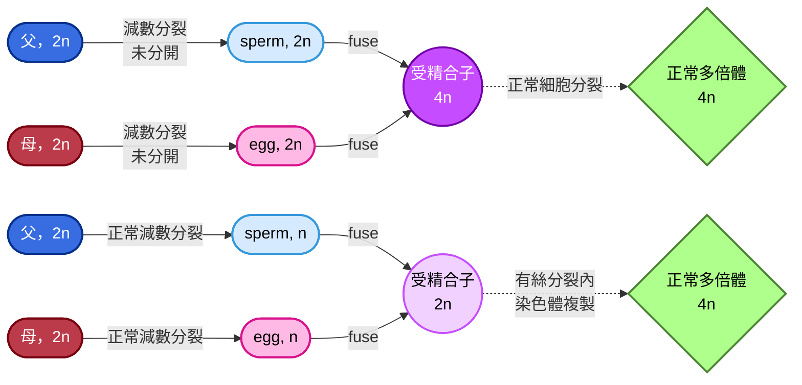

# genetic note
## Ch6
### karyotype
- 核型分析，利用中期的染色體進行染色得到
- 利用 "chromosome painting"，可以標記各個染色體，利用的方式是FISH (fluorescent *in situ* hybridization)
- 由於螢光原位雜交會針對類似於探針的序列進行雜交，所以有相似條帶顏色的染色體，基本上就是同源染色體啦 🐱

#### 染色體條帶的產生
- 染色體通常分為幾個部分: 
  - p: 染色體的short arm (p = petite，嬌小可愛的意思 🥺)
  - q: 染色體的long arm (q = p的相反 = not petite)
  - G-bands: Giemsa banding，用Giemsa染色產生的深淺相間條帶，**深色區通常AT-rich，基因密度低；淺色區則是GC-rich，基因密度高**
  - Q-band: 用奎寧染色，條帶在紫外光下會螢光，常用來區分染色體
  - R-band: Reverse banding，和G-bands相反，**AT-rich區顏色變淺；GC-rich區顏色變深**
  - C-bands: 專門染著絲粒 (centromere) 附近的異染色質，幫助辨認染色體的中心位置
- 通常S phase，也就是細胞週期中DNA複製的階段，分成早期、中期、晚期
  - 早期S phase: 基因密度高、活躍的區域 (R-bands, GC-rich) 會先複製
  - 中晚期S phase: 基因密度低、不活躍的區域 (G-bands, AT-rich) 才開始複製

#### 國際分類方式
- 染色體依照大小、著絲粒位置、條帶型態被分成七大群組:

|群組|特色|著絲點位置|備註|
|---|---|---|---|
|**Group A** (1–3號染色體)|最大的染色體|中著絲(metacentric)||
|**Group B** (4–5號染色體)|大型染色體|近端著絲 (submetacentric)||
|**Group C** (6–12號染色體 + X 染色體)|中等大小|近端著絲|**X染色體也放在這組**|
|**Group D** (13–15號染色體)|中等大小|端著絲 (acrocentric)||
|**Group E** (16–18號染色體)|中小型|16 號是中著絲，17–18 號是近端著絲||
|**Group F** (19–20號染色體)|小型|中著絲||
|**Group G** (21–22號染色體 + Y 染色體)|最小的染色體|端著絲|**Y染色體也放在這組**|

> [!Note]
> **Telocentric**: 又稱為端端著絲，染色體的著絲點在最末端，只有一條臂。人類沒有真正的 telocentric 染色體，但在某些動物中存在

#### 異常的著絲粒結構
##### Acentric chromosome
- 無著絲粒染色體，缺少centromere
- 因為沒有著絲粒，這段染色體在細胞分裂時無法被紡錘絲拉動，通常會在分裂過程中丟失

##### Dicentric chromosome
- 雙著絲粒染色體，含有兩個centromere
- 在分裂時可能會被兩邊的紡錘絲同時拉扯，導致染色體斷裂或不穩定
- 如果兩個著絲粒靠很近，它們可能會功能上表現為一個單一的著絲粒，這樣的情況下，它們就會 "一起被紡錘絲拉走"

#### end-to-end fusion
- 在靈長類比較基因組學中，發現人類的**第2號染色體**是由**兩條祖先性的猿類染色體融合**而來
- 在其他類人猿 (黑猩猩、猩猩、大猩猩) 中，對應的是兩條獨立的染色體。也就是說，這兩條染色體**端對端融合**，形成了一條大的染色體

##### 著絲粒的失活
- 原本兩條染色體各有一個 centromere，融合後理論上會變成 dicentric chromosome
- 但在人類第2號染色體中，其中一個centromere失活 (**inactivated**)，只留下另一個作為功能性著絲粒

> [!Note]
> - 在人類第2號染色體中間，可以找到**殘餘的端粒序列** **(telomeric repeats**)，證明它是由端對端融合而來
> - 也能找到第二個**著絲粒的殘跡** (**vestigial centromere**)，但它不再活躍 🐱

### X染色體的劑量補償
- 在XY系統裡面，Y染色體多數為異染色質，基因通常少很多
- 在雄性的果蠅中 (*Drosophila*)，有特定的蛋白質會被招募到X染色體附近，調整染色質的結構，促進histone的H4區域乙醯化 (**acetylation**)
- 這增加了轉錄活性，讓單一X染色體的表現量同等於有兩個X的雌性
- 相反的，雌雄同體 (**hermaphrodites**) 的秀麗隱桿線蟲 (*C. elegans*) 也有特定蛋白質被招募到X染色體附近，但其作用是降低每個X染色體的轉錄活性，使其只有一半的轉錄活性
- 在人類雌性身上，X染色體在體細胞中，會隨機挑一個失活，失活的染色體被高度甲基化，形成**Barr body**

#### X染色體失活的機制
- XIC (X-inactivation center) 位於X染色體的著絲粒附近 (Xq11.2–Xq21.1)，是染色體濃縮失活的目標區域
- XIC包含一個轉錄區域XIST (X-inactivation–specific
transcript)，它不是負責轉譯出什麼蛋白質，而是轉錄成一條很長的RNA，從XIC開始覆蓋整條染色體
- 此外，XIST RNA也招募多種表觀遺傳修飾因子，例如負責**cytosine甲基化、組蛋白去乙醯化、H3K27me3 (三甲基化) 等等**
- 最終被失活的X染色體會高度壓縮，成為細胞核邊緣的Barr body
- 這又被稱為single-active-X principle
(或是叫做Lyon hypothesis)

> [!Note]
> 在有袋類動物中 (marsupial)，X染色體失活並非隨機性，通常是父系的X染色體失活比較多 👀

#### 花斑喵的體毛顏色有差 🐱🐱
- calico cats的毛色基因 (orange vs black) 位於X染色體
  - 雌貓有兩條X，一條可能帶橘色基因，另一條可能帶黑色基因
  - 雄貓只有一條X，毛色通常是單色
  - 如果失活的是帶橘色基因的X，該細胞群表現黑色；如果失活的是帶黑色基因的 X，該細胞群表現橘色
  - 因為這個選擇是**隨機且克隆性維持**，所以不同區塊的細胞會呈現不同顏色
- S基因在體染色體 (autosome)上面，可以調控黑色素細胞 (melanocyte) 在胚胎發育時的遷移與分布
- 如果S基因的表現降低或突變，黑色素細胞無法到達某些皮膚或是毛囊區域，導致這些區域缺乏色素，形成白色斑塊
- 這種因為X隨機失活導致的嵌合體現象 (mosaic) 在人類身上也常常出現，導致有些女生的皮膚汗腺分布不均

> [!Tip]
> 所以一隻貓既有花斑基因型 (X-linked orange/black)，又帶S基因 → **毛色會呈現🟠⚫⚪三色拼圖** 🐱

#### 偽體染色體遺傳
- pseudoautosomal inheritance，這是因為有些沉默的X染色體上面，某些基因並不是失活的
- 人類的X與Y染色體上有一些特殊區域叫做偽常染色體區 (PAR, pseudoautosomal regions)
- 雖然X和Y大部分基因不同，但在端部 (PARp、PARq，位於短臂跟長臂末端) 還保留著一小段同源序列
- 這些區域在減數分裂時能 配對並重組，就像體染色體一樣，甚至更高 (PARp區域每個核甘酸對的重組率比正常的體染色體高20倍)
- 當然，不只是PAR區域，X染色體上面大概有15%的區域會成功逃脫失活的 "詛咒"

#### X染色體沉默小整理

|特點|隨機性|克隆性|不完全沉默|
|---|---|---|---|
|**說明**|在胚胎早期，雌性細胞會隨機選擇一條 X 失活 (母源或父源)|一旦某細胞選定哪條X失活，後代細胞都會維持同樣的選擇|少數基因 (尤其在 pseudoautosomal region, PAR) 仍可表達|

### Y染色體的演化跟基因組成
- XY染色體組最初來自於哺乳動物跟鳥類共同祖先的一對普通的體染色體，而在3到3.5億年前左右，當哺乳動物跟鳥類開始分化時，基因組跟DNA序列才開始出現分化
- Y染色體上念最重要的基因就是位於Yp11.3上面的**SRY基因**，其編碼的蛋白質轉錄因子TDF (testis-determining factor) 誘導未分化的胚胎生殖嵴 (gonad的前身) 發育成睪丸
- Y染色體上在兩個染色體分化的過程中，由於好幾次發生的inversion，導致出現非重組區域 (non-recombining region)
- 沒有重組區域時容易導致突變累積，最終導致基因功能喪失，甚至是直接基因片段不見，染色體縮小，進一步導致兩個染色體分化
- 如果把目前的X跟Y染色體做對照，可以發現短臂上有很多部分都能對應同源序列，只是這些序列通常不在同個loci上面 (因為倒位了 🤣)

> [!Note]
> 總之，就是很倒楣的，某個有SRY的染色體倒位後竟然神奇的苟活下來，然後因為無法重組而漸漸退化，但每次退化都讓他勉強活下來，結果越活越小隻 🙂

- 正是因為Y染色體無法重組的原因，Y染色體上的基因標記基本上完全連鎖

### 基因組染色體的異常
- 15%的妊娠會因為自然流產而結束，而自然流產的原因有一半和胎兒染色體異常有關係
- 染色體的倍體關係，有幾個名詞值得注意一下:
  - euploid: 整倍體，通常動物為diploid，要是生物有額外一套完整的染色體，那就是polyploid，例如triploid、tetraploid
  - aneuploid: 非整倍體，染色體並不是單倍體數目的整數倍
  - trisomy: 非整倍體的一種，代表某個為二倍體的生物多了一條染色體
- 易位 (translocation) 可以分成 "是否平衡"
- 如果是平衡易位，那麼染色體的片對互換，但沒有遺失或是重複基因，那就只是基因改變，表型正常
- 如果染色體片段互換後，某些基因缺失或是重複，那就屬於不平衡易位，通常會造成發育異常或疾病

#### trisomy
- 常見的非整倍體出現原因通常跟環境也有關係，例如酒精、激素類藥物、促排卵藥等。雌激素樣活性的物質 (例如雙酚A) 也會提高非整倍體的機率
- 唐氏症中異常的配子 (也就是產生nondisjunction的配子)，常常主要是卵子
- 由於其問題是trisomy 21，而且21號染色體又小的可憐，交叉 (chiasma) 形成困難，就難以排列在赤道板上面
- 隨著孕婦年齡增加，染色體間的黏著蛋白 (cohesin) 功能下降，導致染色體更容易「跑錯方向」
- trisomy 21發生的機率隨著年齡增加呈現**指數級增加**

> [!Note]
> - 既然有trisomy的出現，那monosomy應該也很常出現，只是流產或是有疾病的個體中幾乎沒有monosomy的案例
> - 這並不是因為monosomy不存在，而是monosomy的卵子基本上不可能著床成功，連懷孕機會都沒有 🙂

- trisomy的患者如果存活下來，由於有一組染色體屬於三體，其未來產生的配子只會有更多問題，
- 通常它們型成的配子可能會有兩種形式:
 
##### Trivalent (三價染色體組合)
- 在減數分裂時，三條同源染色體同時存在。三條染色體會嘗試一起配對，形成三價結構 (trivalent)
- 在重組互換上常常會出現: A跟B交叉，B跟C交叉，產生詭異的Y字形結構

##### Univalent + Bivalent (單價 + 二價組合)
- 三條染色體中，只有兩條成功配對形成二價 (bivalent)，另一條落單成單價 (univalent)
- 二價染色體能正常分離，而單價染色體可能隨機跑到某一邊，或甚至不進入紡錘體
- 重組互換上常常會出現: A跟B互換，落單的C沒有互換

#### 性染色體的非整倍體組合

| 組合 | 染色體數目 | 臨床名稱 | 主要特徵 | 
| --- | --- | --- | --- |
| **XO** | 45 | **Turner syndrome** | 矮小、卵巢發育不全、不孕 (sterile)、頸部蹼狀，99%的受精卵會直接流產 | 
| **XXX** | 47 | **Triple X syndrome** | 多數女性表型正常，可能有輕微學習困難 | 可存活 |
| **XXY** | 47 | **Klinefelter syndrome** | 男性，睾丸萎縮、不孕 (sterile)、第二性徵不足 | 
| **XYY** | 47 | **XYY syndrome** | 男性，通常表型正常，可能偏高、學習困難 | 
| **XXXX / XXXY** | 48 | 極罕見多倍性 | 智力障礙、發育遲緩，症狀較嚴重 | 
| **YO** | 45  | 不存在 | Y缺乏必要基因，胚胎通常無法存活 | 

### deletion & duplication
#### deletion
- 缺失的形成方式主要有兩種，一種是染色體斷裂跟重建導致，另一種是因為重複DNA序列之間發生同源重組時導致缺失 (這又被稱為ectopic recombination)

##### ectopic recombination
- 基因組裡常有很多重複序列 (例如轉座子、衛星 DNA、相似基因家族)，在減數分裂或 DNA 修復時，這些相似序列可能被 "誤認" 為同源序列，於是 DNA 在錯誤的位置進行交叉互換
- 如果兩個相似序列位於同一染色體上，且方向相同，重組會把中間的片段 "剪掉"
- 而中間的片段通常會形成環狀，如果沒有著絲點的話會直接丟失

#### 如何透過試交發現基因缺失
- 在果蠅研究中，*Notch*是一種特定基因的部分缺失，該缺失會導致翅膀邊緣出現缺刻
- 假如說我現在有一個野生型的果蠅，它的兩條染色體上被標記的多個基因理論上都是顯性的，但是我並不知道它的基因有沒有缺失，或是我不知道主要是哪一段缺失
- 這個時候我可以讓這個果蠅，跟一個同型合子的 "隱性果蠅" 做試交，好去看看得到什麼結果
- 理論上，同型的顯性 $AA$ 跟同型的隱性 $aa$ 得到的子代應該是屬於異型合子，表現出顯性的wild type特徵
- 然而，如果我得到的後代裡面有幾個出現隱性的基因特徵 $a$ ，那唯一的理由就是原本親代染色體的 $A$ 消失了

#### deletion mapping
- 果蠅的巨大多線染色體 (polytene chromosomes) 也可以研究染色體缺失，例如，*Notch* 的缺失會導致多線染色體上某些特定條帶不見
- 除此之外，也可以透過觀察哪裡有缺失環 (deletion loop)，如果其中一條染色體有缺失，另一條對應的帶紋就會凸起
- 假如說你有一個果蠅的phenotype，而你知道是什麼基因出問題導致的，但是你不知道基因的具體位置，這時你就可以拿出各種不同的deletion突變果蠅來比較

> [!Tip]
> 例如，假如說你有兩隻果蠅幼蟲，其中一個有白眼 (你知道缺失*zeste*基因會導致白眼)，其中一個是紅眼 (不影響)，而白眼果蠅缺失A段，紅眼果蠅缺失B段，那你就很清楚知道: zeste基因位於A段 ! 🐱

#### duplication
- 重複就是某個特定的基因片段變多，有些基因的重複是會在表型身上看出來的，例如果蠅的*Bar*重複。它屬於串聯重複的一種 (tandem repeat)，該基因串聯重複會導致果蠅的棒眼，所以該棒眼特色又被稱為**Bar eye**

#### 不平衡交叉互換
- 串聯重複出現的原因有可能是因為unequal crossing over (aka "交叉互換的位置對錯了")
  - 如果染色體上有重複序列，配對時可能 "錯位" 。例如你原本的重複序列，兩條染色體都為A1A2，結果一條染色體誤把對方的A2跟自己的A1進行配對，這導致交叉互換發生在不對齊的位置
  - 一條染色體得到額外的拷貝 (duplication) 形成串聯重複；另一條染色體失去該區段，形成缺失

- 紅綠色盲 (**red‑green color blindness**) 就是 unequal crossover 的經典案例之一
  - 紅色視覺基因 (**opsin gene for L cone**) 和綠色視覺基因 (**opsin gene for M cone**) 都**位於X染色體** (Xq28)，而且排列得很近 (不到5分摩根)。還有，這兩個基因序列非常相似，幾乎像 "重複段落"
  - 在減數分裂時，兩條X染色體上的opsin基因可能錯位配對，導致一條染色體可能得到重複的opsin基因 (duplication)，另一條染色體可能失去其中一個opsin基因 (deletion)，如果缺失的是紅或綠opsin，就會導致紅綠色盲
- 除此之外，也可能產生出複合基因 (chimeric gene)，也就是: 錯位交叉時，可能不是整段基因被交換，而是**基因的一部分**，拼接出一個 "前半段來自紅基因、後半段來自綠基因" 的新基因
  - 這種情況下導致的就不一定是色盲，而是色弱

#### copy-number variation
- 有些重複跟缺失依然能讓個體存活，導致不同個體之間的DNA片段有多有少有長有短，這被稱為拷貝數變異 (CNV)
- 這種可以是短重複序列 (例如trinucleotides) 或是大片段的重複或缺失
- 例如，某些特徵的過度表達跟過少表達跟精神疾病有關，舉經典的autism跟schizophrenia為例: 

##### ASD & SZ的共同位點

> [各位可以點進來看看這個喔~](https://doi.org/10.1038/s41467-020-18997-2)

- 鏡像效應 (mirror effect)，也就是缺失與重複在同一基因座上常呈現相反的功能連結改變
- 這兩個疾病有時候像是兩個面向，一個是underdevelop (autism)，一個是overdevelop (SZ)

|disease|Autism spectrum||Schizophrenia||
|---|---|---|---|---|
|CNV region|deletion|duplication|deletion|duplication|
|16p11.2|**14**|5|5|**24**|
|22q11.2|1|**8**|**16**|1|
|22q13.3|**5**|0|0|**4**|

### inversion
- 倒位，就是某個基因的線性排列順序跟正常順序相反
- 例如，如果有一條DNA上面有反向重複序列，它們兩個可能會被當成 "需要交叉互換" 的對象，互換重組時，中間的DNA片段可能就會反轉 (**ectopic recombination**，還是你)
- 通常來說，mitosis時，不會因為有inversion而被影響，但是在meiosis可能會，問題在於同源染色體要聯會 (synapsis) 並且進行交叉互換
- 如果其中一條染色體有inversion，另一條沒有，兩者在聯會時就會出現環狀結構 (inversion loop)

#### paracentric inversion
- 如果倒位的區域不包含著絲點，這被稱為paracentric inversion
- 倒位本身並不一定會造成問題，關鍵在於 "有沒有在倒位區域發生 cross-over"
- 如果沒有 crossing-over，雖然配對有點 "扭曲"，但染色體仍能完整分離。這樣產生的配子仍然是平衡的，不會缺失或重複。所以 "沒有互換" 的情況下，倒位是可以被接受的
- 如果有 crossing-over，在loop內互換會產生缺失/重複片段。這些配子通常不可存活或功能異常
   - 一條染色體片段會同時帶有兩個 centromere → **dicentric chromosome** → 分裂時會被兩邊的紡錘絲拉扯 → **容易斷裂** 😵
   - 另一條片段則完全沒有 centromere → **acentric chromosome** →  無法被拉動 → **在分裂過程中丟失** 🫥

- balancer chromosomes（平衡染色體）就是利用倒位的特性設計出來的，透過在染色體上引入多個倒位，在功能上阻止了重組，保持染色體的基因組合穩定 (因為不互換的配子才有機會存活，互換的都變成dicentric或是acentric了)

#### pericentric inversion
- 如果倒位的區域包含著絲粒時，被稱為pericentric inversion
- 這通常會造成互換的兩條染色體各增加了一個缺失跟一個重複。例如其中一條有兩個a片段，少了d，另一個有兩條d片段，少了a
- 當然，由於倒位導致互換後出現了缺失跟重複，所以配子通常難以生存
- 不過不同於paracentric inversion，pericentric inversion**不會形成dicentric/acentric**

### translocation
- 易位為 "非同源染色體之間產生的交叉互換"
- 通常原因也是一樣，又是因為**ectopic recombination** (怎麼哪裡都有你?)。兩個不同的DNA上面發現了類似的重複序列，所以就錯誤配對在一起了

#### reciprocal translocation
- 如果有兩組同源染色體發生易位 (例如N1、N2是兩條正常的染色體，T1、T2是兩條易位的染色體，1為1號染色體，2為2號染色體)，配對時就會 "四個一起配對"，產生四價體 (quadrivalent)
- 如果是異型合子的互換導致的易位產生，通常一對染色體是正常，另一對出現易位，這時其就有一半的機會產生的配子是有問題的，這又被稱為 "semisterility" (半個不孕)
- 在meiosis I的中期分裂時，可能有三種不同的分裂方式: 
  - **alternate segregation (交替分離)**: 易位染色體分到一邊，正常染色體分到另一邊，產生的配子是平衡的 (沒有缺失或重複)，這是 "理想" 的分離方式，機率是0.5
  - **adjacent-1 segregation**: 相鄰的染色體分到同一邊。產生的配子有部分缺失 + 部分重複 (不平衡)，機率是0.25
  - **adjacent-2 segregation**: 同源染色體分到同一邊 (比較少見)，一樣也會產生不平衡配子，機率是0.25

> [!Tip]
> - **alternate segregation**: $N1 + N2\leftrightarrow T1 + T2$
> - **adjacent-1 segregation**: $N1 + T2\leftrightarrow N2 + T1$
> - **adjacent-2 segregation**: $N1 + T1\leftrightarrow N2 + T2$ 🐱

##### pseudo-linkage
- 某些分離方式 (尤其是 alternate segregation) 會讓易位染色體和正常染色體成對分到同一邊，導致原本是在不同染色體上面的基因竟然一起被傳下去了
- 這種看起來像連鎖，但其實只是因為染色體結構異常造成的" 現象，叫做**假連鎖** 

#### Robertsonian translocation
- 一種特殊的染色體相互易位，發生在**acrocentric chromosomes** (如Ch13、14、15、21、22)
- 通常是兩條acrocentric染色體在著絲粒附近斷裂，導致q arm融合在一起，形成一條新的，長的 "融合染色體"，而p arm由於太小，多數是rRNA基因，被丟棄掉
- 讓我們舉唐氏症為例...
  - 最常見的Robertsonian translocation是 t(14;21)，那麼配子的染色體就有三種形式: ch14、ch21、ch14/21，而我的配子要從這個細胞裡面硬拆成兩個配子
  - 如果是拆成 "ch14 + ch21" 以及 "ch14/21"，那這些配子在基因上還算是正常，F1表型應該是沒什麼問題，**只是 "ch14/21" 這傢伙未來的子代 (F2) 會有問題**
  - 如果是其它的，在配對的時候，F1的基因表型上可能會出現**trisomy 21、trisomy 14、monosomy 21、monosomy 14這四種組合**，都沒有比較好

#### ectopic recombination 的犯案調查 👀

| 結構異常類型 | 機制 | 典型結果 | 
| --- | --- | --- | 
| **缺失 (Deletion)** | 同一染色體上兩個相同序列錯誤配對 → 中間片段變成環狀丟失 | 某序列少了一段 |
| **重複 (Duplication)** | 不同染色體錯位配對互換下來 → 某段被複製到另一條染色體 | 某序列多了一段 |
| **倒位 (Inversion)** | 同一染色體上兩個相同序列錯誤配對 → 交換後中間片段剛好翻轉 | 染色體片段方向顛倒 |
| **易位 (Translocation)** | 不同染色體之間的相同序列錯誤配對 → 片段互換位置 | 染色體互換片段，可能平衡或不平衡 | 

### position-effect variegation (PEV)
- PEV是指基因因為位置改變而被異常沉默，導致表現呈現 "斑駁" 或 "馬賽克" 的現象
- 一般來說，你的基因如果只是在自己的染色體上倒位，那基因並沒有被破壞，理論上應該沒什麼問題。但問題就是，**不同的區域轉錄的活性不一**，例如，你要是讓一個重要基因轉到著絲粒附近，那裏異染色質多，那這基因表達性可能就不足
- 例如果蠅的*white*基因位於X染色體上面，原本就是在染色體中末端區，表達活躍，如果*white*被倒位至異染色質附近，它的眼睛就會變成 "紅白相間 (variegated)" 的樣子

### polyploidy
- 植物通常可以是多倍體 ，人類誘導植物變成多倍體 (例如使用秋水仙素，**colchicine**) 能突破種間雜交障礙，創造新作物品種，而且這些多倍體植物通常果實障的也比較大顆
- 非偶數倍體 (如三倍體香蕉，*Musa acuminata*) 由於不育性，幾乎不會出現種子，而且不育性避免基因組合改變，維持一致的果實品質，當然，這些植物由於不育，所以除非能夠永遠無性生殖，不然就會滅絕
- 當然，植物其實也能monoploid (通常是人工培育出來的)，能夠活，只是通常矮小，還不育

| 類型 | 定義 | 來源 | 特徵 | 
| --- | --- | --- | --- | 
| **Autopolyploidy** | 同一物種的染色體組數目增加 | 來自**同一物種**的染色體加倍 | 染色體組彼此高度同源，減數分裂時容易出現配對問題 → 常導致不育或部分不育 | 
| **Allopolyploidy** | 不同物種的染色體組合在一起 | 來自**不同物種**的染色體融合 (通常雜交後再加倍) | 染色體組彼此差異大，反而能避免錯配 → 常能穩定形成新物種 | 

- Adder’s-tongue fern (*Ophioglossum reticulatum*) 的染色體數可達1,260–1,440條，是目前已知染色體數最多的多細胞生物。這是多次多倍體化的結果，挑戰了 "基因組大小與生物複雜度相關" 的假設 (C-value悖論還要再說一次嗎 🙂)
- 動物幾乎是無法多倍體，也無法單倍體的，都會致命，**唯一還能活的好好的單倍體細胞，就是動物的配子**
- 形成四倍體的方式也有兩種，分別為**sexual polyploidization**跟**asexual polyploidization**
   - sexual polyploidization為 **"父母配子未分開"** 導致的
   - asexual polyploidization為 **"個體細胞內部複製"** 導致的

 
| 名稱 | 定義 | 常見情境 | 舉例 |
| --- | --- | --- | --- |
| **Haploid (n)** | 指一個物種的**配子染色體數目**，也就是 "基本套數" | 在二倍體生物中，配子是haploid | 人類: n = 23 (sperms or eggs) |
| **Monoploid (x)** | 指一個物種的 **基本染色體組 (basic set)**，不管它平常是二倍體、多倍體。 | 在多倍體生物中，monoploid 是「最小單位」。 | 小麥: hexaploid (6x)，但monoploid數目是x = 7。 |

