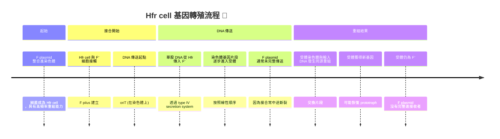
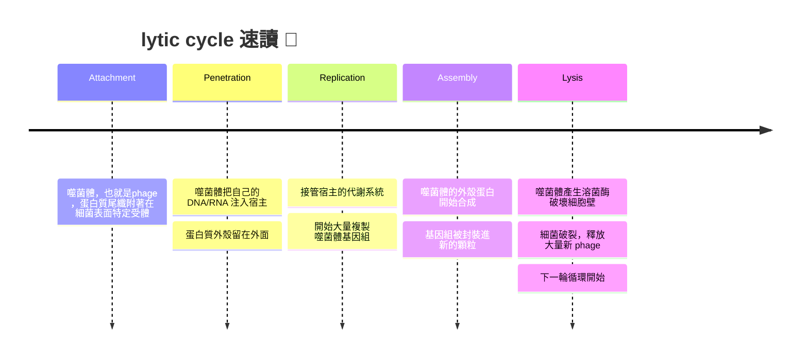
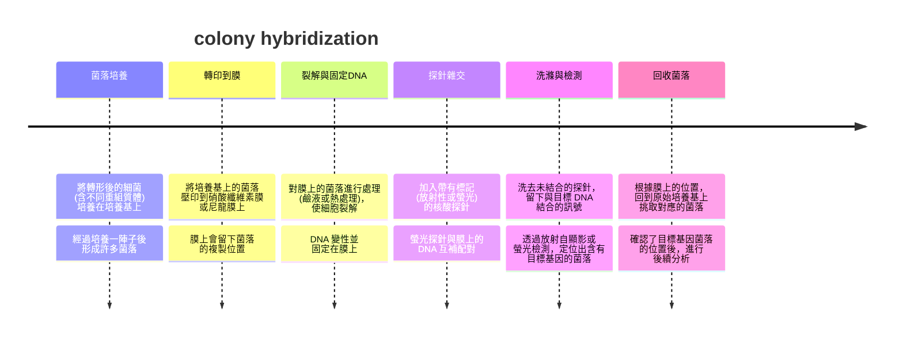
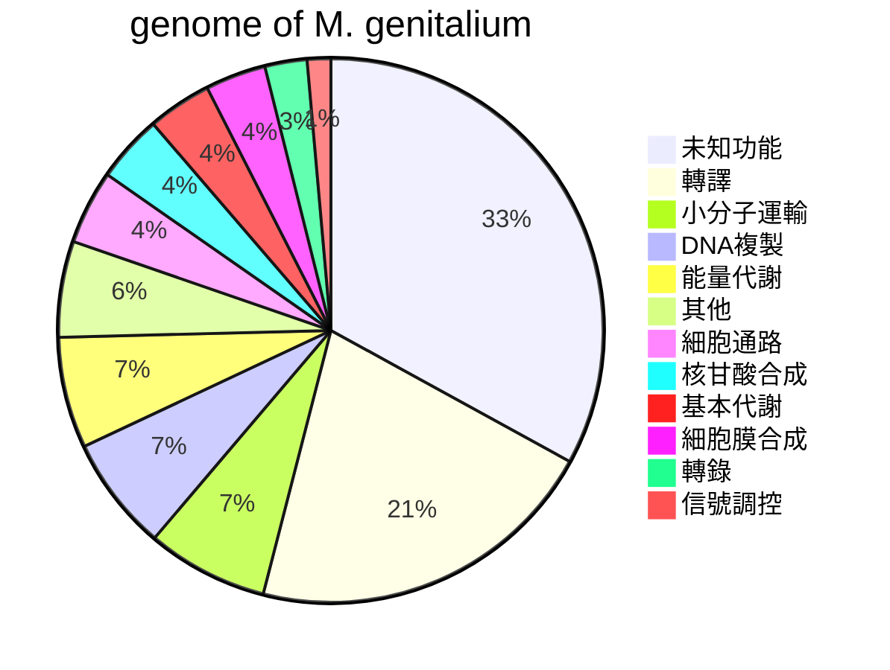
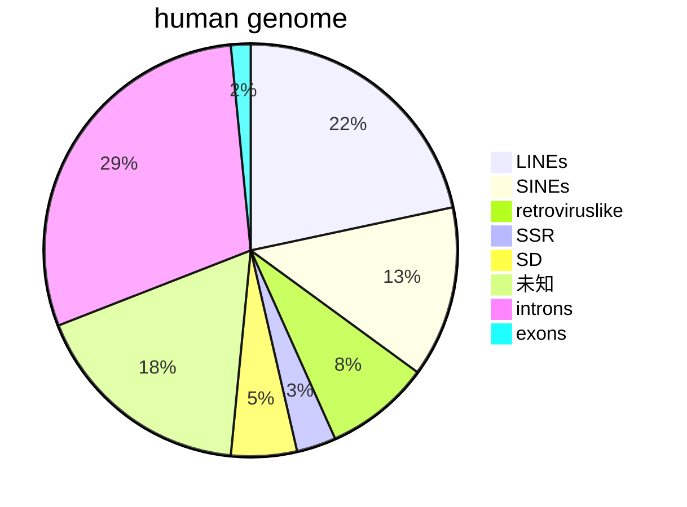
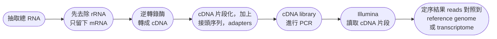
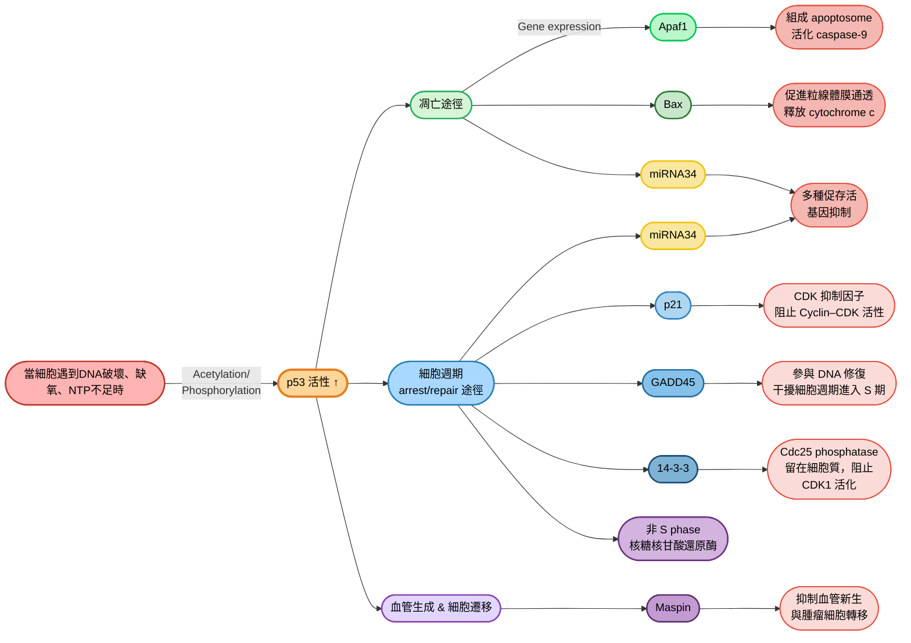

# genetic note
## ch8
- 病毒跟病毒的天敵 (phage) 有很特殊的生殖系統跟基因交換方式
- 有些DNA是可以移動的 (mobile DNA)，在細菌間轉移，例如抗抗生素基因
  - tet-r: 四環素抗性的基因 
  - Str-r: 鏈黴素抗性的基因
### Plasmids and Genetic Exchange
- 大腸桿菌的基因組屬於環狀的DNA，細胞中通常也含有質體，質體並不屬於必須DNA分子，也不屬於染色體的一部份，但他們可以被複製
- 許多質體是環狀的，也有線性的，他們可以在細胞內被copy多次，copy的次數取決於基因的複製調控機制
- 質體通常從電子顯微性下可以看出，或是利用DNA的gel electrophoresis進行物理檢測 (aka 有多大，是否為超螺旋等等)


- 如果是高copy數質體，複製會在細菌的一次生命週期中多次啟動，相反，低copy的細菌就只會複製一次
- 由於所有質體中都有一種序列，可以促進複製的兩個質體往子細胞移動，因此質體的丟失並不常見

#### F 質體
- F factor是一種大型質體，其名稱來自於 "fertility" 這個字
- 含有F factor的細菌叫做 $F^+$ ，沒有F factor的細菌叫做 $F^-$
- 此質體可以在細菌跟細菌個體間轉移，利用的叫做pilus
- 細菌細胞們轉移基因的方式叫做 "conjugation" (接合)，能夠轉移的質體叫做 "conjugative plasmids"
- 因此，F 質體賦予宿主細菌進行接合的能力
- 大多數小型質體並無法轉移，他們會在複製後移到子細胞裡面，但不會透過pilus轉過去
- F plasmid很大 (100 kb) ，但數量不多，一個細胞裡面可能只有一到兩個copy

#### conjugation
- 接合起始於供體跟受體個體的 "物理接觸"，由一種多個subunit的蛋白質介導
- F質體上有20個基因，作為菌毛的建造跟DNA傳輸功能
- F 菌毛 (F pilus) 由 F 質體編碼的蛋白質組成的細長管狀附屬物，專門用來連接受體細菌並傳送 DNA

#### 步驟介紹
##### 接觸與橋樑建立
- $F^+$ 表面的 F pilus 伸出並接觸到 $F^-$
- 菌毛收縮，把兩個細胞拉近，形成穩定的接合橋

##### DNA 切割 (Nick)
- 在 F 質體的 oriT (origin of transfer) 區域，TraI 蛋白會切開一股 DNA 的單股
- 這股 DNA 被標記為 "要傳送的單股"

##### ssDNA傳送
- 切割後的ssDNA經由 type IV secretion system (T4SS)，通過接合橋傳送到受體細胞
- 同時，捐贈者細胞內的另一股 DNA 作為模板，進行滾環複製法 (rolling circle replication)，補回缺失的部分

##### 受體細胞複製
- 受體細胞接收到的單股 DNA 會再合成互補股，形成完整的雙股 F 質體。
- 受體細胞因此變成新的 $F^+$ 細菌，也具備製造 F pilus 的能力


> [!Note]
> ##### 結果如下: 
> - Donor保持 $F^+$
> - Recipient從 $F^-$ 變成 $F^+$
> - 此次接合只有 F plasmid 轉運 🐱

### Bacterial Genetics
- 在研究基因組的時候，我們需要所謂的 "突變種" (mutants)
- 這些突變種通常包含: 

|mutant|definition|
|------|----------|
|**抗抗生素基因的細菌**|如trt-r跟str-r等|
|**營養性的突變**|• wild type通常在簡易型培養基 (minimal medium) 上長得好，屬於prototroph<br>• 營養型缺陷的菌株 (auxotroph)，需要特殊的培養基才能生長|
|**碳原性的突變**| $Lac^-$ 突變種無法利用乳糖|

- 舉個栗子 🌰
   - $His^-$ auxotroph：缺乏合成組氨酸的能力 → 培養基必須加組氨酸才能生長
   - $Trp^-$ auxotroph：不能合成色氨酸 → 需要外加色氨酸
   - $Leu^-$ auxotroph：不能合成亮氨酸 → 需要外加亮氨酸

> [!Note]
> - 在基因跟表現型上面我們寫的會有不同，通常來說，對於一個亮胺酸合成基因缺陷的物種: 
>   - phenotype: **Leu⁻**
>   - genotype: *leu⁻*  🐱

- 培養基對於這些突變株也有所選擇性，例如: 
  - **nonselective medium**: 所有細胞皆可生長
  - **selective medium**: 只有一種細胞可以生長 (可能是野生型，或是可能是突變株)

#### Replica plating
- 複製平板法是微生物遺傳學裡的一種經典技術，用來 同時測試同一群菌落在不同培養基上的生長能力

> [!Tip]
> 核心概念: 把原始平板上的菌落 "複製" 到多個平板上，然後比較哪些菌落能在特定條件下生長，哪些不能 😲

##### 🧬 操作流程
- **母板 (master plate) 準備**
  - 先在一個培養基上長出許多菌落
- **複製轉移**
  - 用一塊絨布或濾紙 (velvet pad) 輕輕壓在母板上，讓菌落黏附在絨布上
  - 再把絨布依序壓到其他培養基平板上，菌落就會以相同的相對位置 "複製" 到新平板 (蓋印章 !!)
- **比較生長**
  - 在不同培養基上觀察菌落是否能生長
  - 例如在含抗生素的平板上，只有抗藥性菌落能長
  - 在缺乏某種胺基酸的平板上，只有能合成該胺基酸的菌落能長


#### 水平基因移轉方式
- 包含以下幾種: 

|method|definition|note|
|---|---|---|
|**Transformation (轉形)**|細菌直接從環境中吸收 "裸露的 DNA" 並整合到自己的基因組|• 需要細胞處於 "competent" 狀態 (此時細胞有能力吸收 DNA)<br>• 常見於 *Streptococcus pneumoniae*、*Bacillus subtilis*|
|**Conjugation (接合)**|透過 F plasmid 或其他 conjugative plasmid，細菌之間建立 F pilus，將 DNA 單股傳送到受體|• 需要捐贈者 $F^+$ 與接收者 $F^-$ 的物理接觸<br>• 常用於抗藥性基因的快速傳播|
|Transduction (轉導)|噬菌體 (bacteriophage) 在感染過程中，意外把宿主 DNA 包進病毒顆粒，再帶到另一個細菌|• 分為 generalized transduction (隨機 DNA 片段) 與 specialized transduction (特定基因區域)<br>• 在細菌與病毒的交互作用中非常常見|


> 等下我們會再詳細介紹 🐱

### DNA-Mediated Transformation
#### transformation and cotransformation
##### 轉型頻率
- 通常來說，轉型的機率比較低
- 轉型的DNA會透過重組被嵌入宿主基因組
- 在大多數細菌中，如果受體細胞狀態合適、外源 DNA 足夠，大約每 10 個細胞就有 1 個能成功被轉形
- transformation 雖然不是百分之百，但頻率足夠高，可以用來做基因分析

##### 共轉型機率
- 假設有兩個基因 a 和 b，如果它們在供體染色體上相距很遠，幾乎不可能同時出現在同一段 DNA 片段裡
- 此時，受體同時獲得 a 和 b 的機率 $\approx$ 各自獲得的機率相乘，例如: 

$$P(a)=0.1 \cap P(b) = 0.05\rightarrow P(a+b)=0.005$$

##### 基因距離的推斷
- 如果觀察到 cotransformation 頻率遠高於相乘值，代表 a 和 b 很可能在染色體上 彼此靠近，常常一起被同一段 DNA 攜帶
- 所以透過機率值，可以用 transformation 來做基因定位 (mapping) 

> [!Tip]
> - 想像染色體是一長繩子，DNA 片段就像 "剪下來的一段繩子" 
>   - 兩個基因在繩子上距離很遠 → 幾乎不可能同時被剪到 → 同時轉形的機率 = 各自機率相乘
>   - 兩個基因在繩子上很近 → 常常一起被剪到 → 同時轉形的機率比相乘值大很多 😲

#### 原理介紹
- 轉型的時候，這些轉型基因可能來自於其他細菌的染色體
- DNA 被切成平均大小的片段，每個片段可能包含不同組合的基因
  - 例如你的環狀DNA上面有 $a^+$ 、 $b^+$ 、 $c^+$ 三個基因
  - 你的片段上面就可能有 $a^+$ 、 $b^+$ 、 $c^+$ 、 $a^+ b^+$ $b^ +c^+$ 、 $a^- b^- c^-$ 六種
  - 不會有 $a^+ c^+$ 或是 $a^+ b^+ c^+$ ，因為 a 與 c 距離太遠，不會同時落在同一片 DNA 片段裡
- 假如說接收基因碎片的細菌並沒有 $a^+$ 、 $b^+$ 或是 $c^+$ 基因，它就可以在自己的locus上面把基因替換成外來的
- Cotransformation 頻率反映基因距離...
   - 如果兩個基因常常一起被轉移 → 代表它們在染色體上很近
   - 如果幾乎不會一起被轉移 → 代表它們距離很遠


### Genetic Exchange and Conjugation
- Joshua Lederberg 和 Edward Tatum 做了一項實驗
- 它們將兩個auxotroph的細菌混在一起，進行交互作用...
  - **Strain 1**: 屬於 $thr^-$ 、 $leu^-$ 、 $thi^-$ ，缺乏合成酵素，不能在 minimal medium 生長
  - **Strain 2**: $bio^-$ 、 $met^-$ ，同樣缺乏其他基因，也不能獨立生長
- 但是他們混合培養後卻長出了菌株 !! 
- 這暗示有基因交換，產生了能合成所有必需物質的重組株 (recombinant)
- 它們發現，每 $10^7$ 個細胞裡面，就有1個是prototrophic
- 在基因上面，這些基因在環上面排成一直線，推測是其中兩個基因之間 ( $thi$ 跟 $bio$ ) 發生交叉，產生一個新的染色體


#### U-tube 實驗

> 你都說了兩株 auxotroph 混合後能在 minimal medium 上生長，但要怎麼確定這不是單純transformation (撿環境 DNA 碎片)，而是真正的基因交換呢？ 🧐

- Lederberg 的學生 Bernard Davis 用 "U-tube' 做了關鍵驗證
- 他用兩個auxotroph菌株: $thr^-\ leu^-\ thi^-$ 跟 $met^-$ 來做實驗
  - U-tube 中間有玻璃濾膜，允許液體和小分子 (包括 DNA) 通過，但阻止細胞接觸
  - 把兩株 auxotroph分別放在兩邊，持續流動培養液
  - 結果最後發現沒有任何 prototroph 出現

> [!Important]
>  這證明必須要有細胞接觸，排除 transformation 的可能性 !! 😲


#### 到底染色體是不是重組?
- 一開始大家以為是 "染色體交叉重組" (甚至連Lederberg等人的腦袋裡都還有細菌型有性生殖的畫面... 可能吧)
- 直到 Hayes 發現 Hfr cell，才知道染色體基因的傳送其實是因為 F plasmid 整合進染色體，在接合時把染色體片段一起拉過去

> [!Note]
> Lederberg & Tatum 的結果，今天我們會解釋成 Hfr-mediated conjugation 🐱

- 在Hfr cell中，細菌染色體還是環狀的，只是因為整合了F plasmid，增加2%的長度
- 當F factor透過接合轉移時，它轉移的不只是F factor，還包含一部份染色體




#### F plus vs Hfr cell conjugation
- 通常來說，傳一個F plasmid只需要兩分鐘，但是如果你想要毫無阻攔的傳過整個染色體，需要100分鐘
  - 原因: 染色體很長很多，F factor只有100 kb，E.coli染色體4700 kb
- 傳送染色體需要太長時間，因此常常會再傳送完成前就先被打斷
- 也因此，接收者無法獲得完整F質體，基因傳送完之後依然是 $F^-$ 😏
- 這些被移轉的基因會被整合到接收者染色體中，其餘的部分被降解

| 特徵 | F plasmid  | Hfr cell  |
| --- | --- | --- |
| **DNA 傳送起點** | oriT 在 F plasmid 上 | oriT 在整合進染色體的 F plasmid 上 |
| **傳送內容** | 單股 F plasmid DNA | 單股染色體 DNA (線性順序) |
| **受體結果** | 受體獲得完整 F plasmid，變成 $F^+$ | 受體獲得染色體片段，經同源重組整合新基因，但通常仍是 $F^-$ |
| **F plasmid 傳送完整性** | 完整傳送 | 常常中途斷裂，F plasmid 無法完整進入 |
| **主要用途** | 水平傳播質體，傳播抗藥性基因 | 染色體基因定位、重組研究 |

#### 轉殖實驗的篩選工具
##### 🧬 Selected marker
- 通常是研究者刻意挑選的一個基因 (或性狀)，作為 "篩選條件"
- 只有獲得這個基因的受體細胞才能在特定培養基上生長
- 舉栗 🌰: 
   - 把抗生素抗性基因當作 selected marker → 只有獲得抗性基因的受體能在含抗生素的培養基上存活
   - 把營養合成基因 (如 $leu^+$ ) 當作 selected marker → 只有獲得該基因的 auxotroph 能在 minimal medium 上生長

##### 🧬 Counterselected marker
- 用來 "排除" 或 "抑制" 某些細胞的基因或性狀
- 確保只有真正發生基因交換的細胞能留下來，而原始供體或假陽性會被排除
- 舉栗 🌰: 
   - 如果供體帶有抗生素敏感性基因 (susceptibility)，而受體是抗性 → 在含抗生素的培養基上，供體會死掉，只有受體重組株能活
   - 在 $Hfr\times F^-$ 的實驗裡，常用 F plasmid 無法完整傳送這一點作為 counterselection → 受體雖然獲得染色體基因，但仍保持 $F^-$ ，避免供體繼續傳送

> [!Tip]
> 一個幫忙**挑出**，一個幫忙**排除** 🐱

#### time-of-entry mapping
- Hfr cell 在接合時，DNA 是 從 oriT 起點開始，線性依序傳送染色體基因
- 所以，不同基因進入受體的 "時間先後" 就能反映它們在染色體上的距離

##### 原理解析
- 傳送時的 DNA 從 oriT 開始，依序傳入染色體基因
- 因此，靠近 oriT 的基因會先進入受體，遠離 oriT 的基因會晚一點才進入
- 但是我們剛剛也有提到，接合常常在 DNA 尚未完全傳送時就斷裂，所以常常只有靠近 oriT 的基因比較常被傳送成功
- 研究者就透過在不同時間點中斷接合，檢測接收者細菌獲得了哪些基因

##### 栗子解析 🌰
- 假如說研究者去做分析，做以下的菌株雜交: 

$$[Hfr\ leu^+Str-s] \times [F^- leu^- str-r]$$

- 然後我做了一個結果呈現如下: 

|菌株混合n分鐘後|每100個Hfr中有多少混合型的細胞 |
|---|---|
|0|0|
|3|0|
|6|6|
|9|15|
|12|24|
|15|33|
|18|42|
|21|43|
|24|43|
|27|43|

- 最後就會繪出一條曲線，這就是time-of-entry mapping


- 通常包含幾個特色: 
  - mating時間越長，重組細胞越多
  - 每個標記都有一個 "進入時間"，在這時間之前，偵測到的重組細胞皆為0，這個進入時間就是**曲線與 x 軸的交點**
  - 每條曲線會有一個線性區域，可以外推到時間軸，從而定義每個標記或是基因進入的時間
  - 這些曲線往往會達到最大值
- 不同 Hfr strain 的 oriT 整合位置不同，會導致傳送順序不同。
- 每個 strain 都能給出一段 "基因排列順序"
- 把不同 Hfr strain 的線性片段拼起來，就能得到完整的環狀 E. coli 染色體地圖 😏


- 在分子生物學還沒有 DNA 定序技術的年代，人類就是靠 Hfr cell 的 time‑of‑entry mapping 這種 "基因進入時間" 的實驗，一步一步拼湊出 E. coli 的染色體地圖
- 由於利用mating需要100分鐘完成整個染色體的轉移，因此，總體的map length就是100分鐘 (真的啦單位就是這樣寫的)


#### Hfr cell中的質體跳出
- 我們知道Hfr cell = F plasmid 整合進染色體，這是透過同源重組在 insertion sequence (IS element) 之間完成的
- 因此，F plasmid 有可能再透過同源重組 "跳出" 染色體，恢復成一個獨立的 F plasmid

##### 特殊事件發生
- 有時候 F plasmid 在 "跳出" 時並不精確，會帶走一段染色體基因，這樣的質體叫做 F′ plasmid
  - 例如，如果跳出時把 lac operon 一起帶走，就形成 **F′ lac**
- 這種 F′ plasmid 可以在接合時把染色體基因 "額外拷貝" 傳給受體 
- 這形成部分二倍體 (merodiploid)，也被稱為partial diploids

> [!Note]
> ##### 結果如下: 
> - Donor保持 $F\text{'}$
> - Recipient從 $F^-$ 變成 $F\text{'}$
> - Recipient形成部分二倍體 🐱

### Transduction
#### lytic cycle
- 這裡我們來超速複習...



> 複習完畢，yes 🙂

#### generalized transduction
- 指噬菌體在 lytic cycle 中，誤把宿主染色體的任意片段封裝進病毒顆粒
- 這些 "錯誤包裹的 phage" 雖然不能繁殖新病毒，但能把前一個宿主的 DNA 傳送到下一個細菌

##### 步驟介紹
- 噬菌體感染宿主 → 進入 lytic cycle
- 宿主染色體被切碎 → 產生許多 DNA 片段
- 有些 phage 顆粒把宿主 DNA 而不是病毒 DNA 裝進去，形成錯誤封裝
- 感染下一個細菌 → 把這段宿主 DNA注入受體
- 受體染色體與注入 DNA 發生重組，受體因此獲得新的基因，這又被稱為同源重組

|特性|說明|
|---|---|
|隨機性|任何宿主基因都有可能被轉移|
|不傳 phage 基因|這些顆粒通常缺乏完整病毒基因組，不能再進行 lytic cycle|
|用途|常用於基因定位、基因交換研究|


##### 研究基因連鎖
- 噬菌體在 lytic cycle 中封裝宿主 DNA 時，片段大小通常只有 50~100 kb 左右
- 所以只有 "彼此靠近" 的基因才有可能同時被封裝進同一顆 phage 顆粒
   - 如果兩個基因在染色體上距離很遠 → 幾乎不可能同時被封裝 → 同時轉移的機率 $\approx$ 各自獨立機率相乘
   - 如果兩個基因距離很近 → 常常一起被封裝 → 同時轉移的機率會顯著高於乘積值
- 住就是所謂的**cotransduction**:
   - 高 cotransduction 頻率 → 基因相鄰
   - 低 cotransduction 頻率 → 基因距離遠

> [!Note]
> 所以這個其實理論上也可以做mapping 🐱

### Bacteriophage Genetics
- 通常來說，嗜菌體的子代應該跟親代基因型一致
- 但是如果有兩個嗜菌體感染同一個細胞，那麼就有可能透過基因重組產生新的基因型
- 當噬菌體感染細胞時，可能有多份病毒 DNA 同時存在於同一宿主細胞。在某些細胞裡，只有 2 條 DNA 分子參與重組；在另外一些細胞裡，可能有 5 條甚至更多
 > [!Tip]
 > 重組事件的複雜度會因細胞而異 → 有的細胞只產生少量重組型，有的細胞則產生很多 🧐

- 理論上，如果兩條 DNA 分子交叉重組，應該會產生互為對偶的重組型 (reciprocal recombinants)，數量應該差不多
- 但實際上常常會
- 看到某一種重組型比較多，另一種比較少，因為: 
   - DNA 片段長度不同
   - 交叉點位置不對稱
   - 噬菌體封裝偏好
   - 宿主修復機制影響

#### 突變體 and 斑塊測定法
- 一種檢測病毒感染的方式是透過plaque assay
- 首先會在在培養基上鋪滿細菌，形成均勻的 "草皮"，這被稱為bacterial lawn
- 接下來加入噬菌體，一顆噬菌體感染一個細菌，產生lytic cycle
- 感染的細菌破裂，釋放新噬菌體 → 周圍的細菌再被感染，這樣一圈圈擴散形成 "透明區域"
- 在菌草上出現一個清晰的圓形空洞，就是噬菌體感染的痕跡，每一個斑塊就是一個病毒
- 從計算斑塊數量，可以用來計算噬菌體濃度 (PFU, plaque-forming units)


- 同時，不同基因型也會導致斑塊的長像有所不同...

|基因|代表意義|
|---|---|
| $r^+$ |小斑塊 (slow lysis)|
| $r^-$ |大斑塊 (rapid lysis)|
| $h^+$ |渾濁斑塊 (host range 限制，部分細菌存活)|
| $h^-$ |清晰斑塊 (host range 擴大，幾乎所有細菌被裂解)|

- 這些性狀是由噬菌體基因決定的
- 當兩種不同基因型的噬菌體同時感染同一細菌時，它們的 DNA 可以發生重組，產生新的組合型

##### mixed infection
- 兩種不同基因型的 phage 同時進入同一宿主，它們的 DNA 在宿主內可能交叉重組
- 例如，如果一邊是 $r^+h^+$ ，另一邊是 $r^-h^-$ ，重組後可能出現 $r^+h^-$ 或 $r^-h^+$
- 這些新型態會在斑塊形態上顯示出來，研究者透過觀察斑塊大小與透明度，就能判斷噬菌體是否發生基因重組

##### 舉個栗子 🌰
- 假如說你現在透過 "斑塊狀態"，加入的親代屬於 "大的混濁斑塊 $\times$ 小的清晰斑塊" ，培養一陣子後，發現斑塊數量對應的基因型如下: 

|基因型| $r^-h^+$ | $r^+h^-$ | $r^-h^-$ | $r^+h^+$ |
|---|---|---|---|---|
|斑塊數量|513|577|96|99|

- 此時的重組率為: 

$$\frac{96+99}{513+577+96+99}\times 100 = 15.2\%$$

#### rII region
##### T4 bacteriophage 👾
- rII gene 出現在 T4，是一種感染 E. coli 的噬菌體，而 rII mutants 是某些 "rapid lysis" 突變株
-  相比於正常 T4，rII mutant會提早裂解宿主，所以產生的plaque會變大
- 科學家**Seymour Benzer** (這傢伙是普渡大學物理學博士... 怎麼連物理學家都要參一咖??) 在實驗中製造大量 rII mutants，讓不同 mutant 互相 recombine，看哪些 mutation 能互相補救，以此分析重組頻率

##### cistron
- 他定義了**cistron**，也就是 "可以互相互補的功能單位"
- rll gene分為兩個區域: rIIA跟rIIB 的 cistron，在 rII 區域內，要是一個壞rIIA，一個壞rIIB，他們可以互補出完整的rII gene
- 甚至，rII 區域內有些位置特別容易發生突變。這些 "熱點" 幫助研究者理解 DNA 序列中某些區域更容易出錯或被改變

> [!Important]
> 總之，gene 不是不可分割的抽象單位，但是在那個大家還沒概念的19XX年代 (當時Watson還沒發一頁論文呢)，被一個物理學家挖出來了 🤣


### Lysogeny and Specialized Transduction
#### $\lambda$ phage 👾
- 以溶原循環的 $\lambda$ 病毒不會亂插自己的基因，他是有固定位置的，通常在gal 跟 bio operon之間，這兩個操作組間的 attB 就是 bacterial attachment site
- 通常來說，當環境壓力出現 (UV、DNA damage、SOS response) ， $\lambda$ 會把自己從染色體切出去，重新進入lytic cycle，但問題是，他常常切歪
- 例如切成 "lambda DNA + gal gene" 或是 "lambda DNA + bio gene" 的組合
- 通常這對病毒自己來說十分不利，因為病毒能帶走的DNA有限，他偷了別人家的，就常常忘了帶自己家的，導致複製的時候總是比別人遜很多
- 如果這個帶著 gal gene 的 phage，去感染原本沒有 gal gene 的細菌，那他就會重獲代謝乳糖的能力
- 也由於 $\lambda$ gene 只有插在特定位置，所以能偷的基因大概也就只有gal跟bio operon


#### 更進一步看怎麼切
- attP (phage attachment site)
  - $\lambda$ phage DNA 上的 POP′ 核心序列 (15 bp)，旁邊有較長的側翼序列 (~105 bp)
- attB (bacterial attachment site)
  - *E. coli* 染色體上的 BOB′ 核心序列 (同樣 15 bp)，側翼只有 4 bp
- 在 POP′ 與 BOB′ 的特定位置，整合酶 (Int) 與輔助因子 (IHF, Xis) 會切開 DNA
- POP′ 與 BOB′ 透過 site-specific recombination 互換，形成兩個新的混合位點，形成: 
  - BOP′ (在宿主染色體上)
  - POB′ (在 λ DNA 上)


> [!Note]
> 某些 bacterial toxin (霍亂、白喉毒素) 其實是嗜菌體裝上去的，沒有 phage 前，細菌可能沒那麼可怕，病毒等於替細菌裝了外掛。 🦠📦

##### phage repressor protein
- 其實就是指 $\lambda$ phage 的 cI repressor，結合 $O_L$ 跟 $O_R$ (operator)，阻止聚合酶去啟動 $P_R$ 跟 $P_L$ (promoter)，這樣可以抑制lytic cycle 基因轉錄
- 同時活化 $P_{RM}$ ，表達更多的cI，穩定 lysogenic 狀態

##### cro
- Cro protein抑制 $P_{RM}$ ，阻止 cI 表達，推動 lytic cycle


|特徵	|Generalized|Specialized|
|---|---|---|
|DNA來源|隨機細菌DNA|特定鄰近基因|
|發生時機|lytic packaging error|prophage excision error|
|是否需要lysogeny|不一定|必須|
|典型phage|P1| $\lambda$| 
|DNA裝載|隨機|特定區域|

---

## ch14
### Site-Specific DNA Cleavage and Cloning Vectors
- 遺傳相關的學科還可以分成以下三種: 

|subjucts|definition|
|--------|----------|
|genomics|研究基因組的DNA序列、結構、功能、演化|
|transcriptomis|對特定基因組產生的RNA進行定量分析|
|proteomics|鑑定細胞或是生物體中的所有蛋白質，這包含任何轉譯後修飾的形式|

#### gene engineering
- 又稱為gene clonine，具體作法是: 


- 這些進行過基因編輯的生物被稱為**基因改造生物** (genetically modified organism, GMO)
- 該應用可以用於: 
   - 新基因導入目標生物的基因組中 (如抗殺蟲劑的植物)
   - 透過同源重組或是引入miRNAs進行基因敲除 (knockout，功能完全喪失)
   - 利用限制酶進行基因編輯 (包含CRISPR-Cas9)

#### PCR和內切酶
- 目前獲取特定DNA樣本的最好方式就是PCR，但是其限制就例如: 
   - 你要有設計好的primer
   - 擴增的基因片段不可以超過幾千個bp
- 因此重組DNA就成為一個不可或缺的手段，這個動作需要restriction enzymes，把DNA經過限制酶切割後，切割片段跟載體分子 (vector) 連接起來。vector通常為環狀DNA

#### 製備特定end的DNA片段
- 序列特異性，可以識別並切割短的序列，通常4 bp或是6 bp
- 由於這些序列通常是回文序列 (palindromes)，所以通常互補
- 可以分成sticky end或是blunt end
   - sticky end: 產生單股突出端 (可能突出的是5'或是3')，例如*Eco*RI (5'單股突出端): 

```text
GAATTC              G           AATTC
||||||  → 切割後 →   |       +       |
CTTAAG              CTTAA           G
```
   - blunt end: 在短序列DNA的中心切割，無單股突出，例如*Bal*I酵素: 

```text
TGGCCA              TGG           CCA
||||||  → 切割後 →   |||     +     |||
ACCGGT              ACC           GGT
```
- 如果DNA片段由同一種限制酶產生，那該生物體中獲取的片段和另一個生物體中得到的片段end形式相同


- 我們來做個小小數學: 
  - 假如說四種鹼基都是隨機出現的，而有一種回文序列對應於切割的限制酶，那平均來說: 

$$4^6 = 4096$$ 
  
  - 也就是說，平均4096個鹼基對裡面就有一個切點，這樣一來，以人類的基因組來說 ( $3\times 10^9$ )，會被切成約100萬個片段

#### 重組的DNA分子
##### 複製
- **cloned** = 一段目標基因編輯入基因組，而且能夠跟著個體一起複製
- 載體通常需要有三個特性: 
   - 載體DNA相對容易導入宿主細胞
   - 載體上含有的基因都會被複製下來，不會被sliced掉
   - 可以簡單識別含有載體的細胞 (例如抗生素抗性基因)
- 常見的例子包含phage $\lambda$ 跟M13的衍伸物

.png)

##### DNA分子導入
- 可以利用氯化鈣溶液，讓細胞能夠吸收環境中的游離DNA (**transformation procedure**)
- 也可以使用電穿孔法 (**electroporation**，利用電脈衝在細胞上瞬間打洞，通透性增加，賭DNA分子會在洞消失前進入細胞)


#### vector種類
##### 🧬 plasmid
- 屬於細菌天然存在的小型環狀 DNA，通常可攜帶 1–20 kb 的外源 DNA
- 有複製起點 (origin of replication)、選殖標記 (如抗生素抗性基因)
- 屬於最常見的 cloning vector

##### 🧬 phage $\lambda$ vector
- 天然 $\lambda$ phage 基因組大約 48.5 kb
- 其中有些區域 (例如不會影響溶解循環的區域) 可以被刪除，騰出空間來插入外源 DNA
- 這些基因會在節後輸入成熟的嗜菌體身上，去感染細菌
- 可以多攜帶 10–20 kb 的外源 DNA，同時感染效率高、能處理比 plasmid 更大的 DNA 片段

##### 🧬 cosmid vector
- 結合了 plasmid 元件 和 $\lambda$ phage cos site，可攜帶 35–45 kb 的 DNA
- 該質體的sticky end可以長達12 bp，也被稱為cohesive ends
- 利用 $\lambda$ phage 的封裝系統，但在宿主內以 plasmid 方式複製

##### 🧬 BAC (bacterial artificial chromosome)
- 基於 E. coli F plasmid ，可攜帶 100–300 kb 的 DNA
- 低拷貝數，穩定性高，適合維持超大 DNA 片段

#### 總結比較

| Vector | 插入容量 | 特徵 | 常見用途 |
| --- | --- | --- | --- |
| plasmid | 1–20 kb | 小型、易操作 | 基因表達、蛋白質生產 |
| $\lambda$ phage | 10–20 kb | 利用 phage 顆粒感染 E. coli | 基因庫建立 |
| cosmid | 35–45 kb | plasmid + cos site | 大型 DNA 片段克隆 |
| BAC | 100–300 kb | 基於 F plasmid，低拷貝數 | 基因組計畫 |


### Cloning Strategies
#### 如何連接DNA片段
- 當供體片段跟線性化的質體在一起時，它們互補的單鏈末段之間透過鹼基配對形成了重組的分子
- 這個重組並連接的過程由DNA ligase來幫忙
- 透過這種鹼基配對方式，通常來說會產生多種重組質體，多數屬於無效的
- 例如假如說是A、B、C、D片段，並且在片段和片段間以限制酶切開，就會形成不同種形式排列的分子，例如ACBD、ACCD、ABBD等等


- 為了避免這個問題，通常會希望使用僅有一個限制切割位點的載體

#### 特定DNA cloning
- 最簡單篩選細菌的方式就是以其含有的目標基因原本功能下手，例如如果我們希望可以大量複製leucine基因，那麼就是在 $leu^-$ 菌株中進行基因編輯，然後把它們丟到缺乏leucine的培養基裡面生長
- 然而，如果目標基因十分的稀少且難以檢測，那我們需要有純化DNA的技術，把其它的雜碎 (?) 處理掉。常見的方法有以下幾種: 
   - PCR: 全部都一起擴增跟變多，小的訊號也會變大 (粗暴有效)
   - electrophoresis: 透過凝膠電泳把需要的片段大小蒐集起來，再來把它取下來連接到載體上面
- 當然，還有一個問題，就是如果我們只是要一小段基因，然而如果該基因來自於真核生物，除了真核生物的基因組實在是太大 (用以上兩個方式放大機音訊號簡直是大海撈針)，而且還有剪切的問題 (細菌又不怎麼做轉錄後修飾)
- 然而，RNA的大小通常就很剛好，而且修飾過的mRNA還沒有intron的問題，因此，我們可以透過逆轉錄的方式，把RNA變成DNA

#### cDNA and RT-PCR
- 在真核細胞中，mRNA的 "豐度水平" 可以分為以下三種: 
   - 大大部分的來自小小部分的基因: **1%** 的表達基因，在一個細胞中，有數百到數千個它的mRNA
   - 中等部分的來自中等部分的基因: **10%** 的表達基因，在一個細胞中，有數十到數百個它的mRNA
   - 少少部分的來自大大部分的基因: **90%** 的表達基因，在一個細胞中，僅有少於十個它的mRNA
- 以mRNA進行基因克隆需要逆轉錄酶 (reverse transcriptase)，它會以RNA為模板合成一條互補的DNA鏈，最初是從RNA腫瘤病毒中發現的
- 它會將自己的基因組 (與RNA分子) 逆轉錄形成一條dsDNA後，整合到宿主的DNA中，宿主在細胞分裂時也會將該DNA片段傳給子細胞
- 通常在在基因克隆中，進行該DNA形成時的引子，是一段poly-T (因為mRNA的 3' 是poly-A tail)

#### hairpin自行形成
- 以前在進行cDNA cloning時，發現有些DNA的末端有回文序列，例如: 

```text
5' - G C A T T G .... C A A T G C - 3'
```

- 這個時候，假如說逆轉錄酶從poly-T primer複製出一條單股的DNA之後，DNA末段 (就是其3'，對應RNA的 5') 會自行折起來，形成hairpin結構
- 由於DNA polymerase 它需要primer 和 3' OH 才能開始延伸，hairpin 剛好提供了這個結構，充當DNA複製時的primer角色
- 當完成了雙股的逆轉錄後，最末端還留著一個髮夾，不能直接拿去 clone。所以接下來會用 S1 nuclease，或其他 nuclease 把 hairpin loop 切掉
- 甚至有些病毒不需要DNA pol的幫助，其逆轉錄酶本身就可以一次合成兩股，例如HIV


- RNA分子的DNA互補序列叫做互補DNA (complementary DNA, cDNA)
- cDNA因為模板的mRNA並未有intron，因此跟基因組的DNA序列不一樣，但是它如果是只為了 "鑑定編碼序列" ，或是 "單純合成蛋白質"，那cDNA會好用很多
- 如果RNA很稀有，那cDNA也一樣稀有，但是這合成PCR後效率較高 (前提是你能為其設計出好的引子)
- 而cDNA的擴增被稱為reverse transcriptase PCR (RT-PCR)


### Detection of Recombinant Molecules

> 如何同時確認 "載體有插入DNA片段" 以及 "DNA片段是目標DNA" ?? 🧐

#### 載體分子的基因失活
- 利用transformation時，最常用的就是抗生素，把有質體的細菌挑出來
- 這些質體都有抗生素抗性的標記，並在含有抗生素的培養基上繁殖，其中，那些有抗藥性抗性的，才能形成肉眼可見的菌落

##### pBluescript plasmid
- 共2961 bp，不同區域有不同功能: 
   - **origin of replication**: 來自大腸桿菌的質體*ColE*1，是一個高拷貝數質體 (讓細胞裡面可以有超多質體)
   - **ampicillin**抗性基因
   - **多克隆位點 (MCS)**: 此區域有多個限制酶切位點，108 bp，共23個切點
   - **lacz基因區域**: MCS也座落在這裡，如果DNA嵌入到這裡，lacz的基因失效，該基因產生的 $\beta$ -galactosidase 可以切斷培養基中的X-gal，使其變成藍色，如果植入質體會變白色
   - **phage複製起點**: 讓有質體的細菌在被嗜菌體攻擊時，其質體上的基因會傳給下一代的嗜菌體


> [!Tip] 
> 好的cloned vector需要有**好的ori，至少一個插入DNA的限制酶位點，以及第二個基因** (被插入時會失活產生不同表型) 🐱

#### 特定重組體的篩選
- colony hybridization是一種 DNA 篩選方法，利用核酸探針 (DNA 或 RNA) 與菌落中的目標 DNA 互補配對
- 主要用途就是在基因庫 (genomic library) 或 cDNA library 中，找出含有特定基因的菌落
- 通常比逐一測試菌落快很多，能一次篩選大量 clone




### Genomics
- 在1985年的時候就已經提出了基因組定序的想法，於1990年正式啟動 (**The Human Genome Project**)
- 2003年提早收工，到人類基因體定序完成的當年，一鹼基對的定序成本已經降至1美分 (比摩爾定律還要快 🌚) [^1]


- 無論是平均的鹼基對，還是整個基因體的定序成本都高速下降


- 除了對人類的genome有興趣，科學家還對其它模式生物的基因組有興趣並進行定序
- 包含但不限...😏

|organism|aka|定序完成於|
|-----|-----|-----|
|*Haemophilus influenzae*|流感嗜血桿菌 🦠|1995 [^2]|
|*Saccharomyces cerevisiae*|釀酒酵母 👾|1996 [^3]|
|*Caenorhabditis elegans*|秀麗隱桿線蟲 🪱|1998[^4]|
|*Drosophila melanogaster*|黑腹果蠅 🪰|2000 [^5]|
|*Arabidopsis thaliana*|阿拉伯芥 🌿|2000 [^6]|
|*Mus musculus*|實驗室小鼠 🐁|2002 [^7]|

#### genomic sequencing
- 最早定序的其實是那些病毒and細菌們，畢竟它們的基因組很小
- 第一個被定序的生物是一類寄生細菌 (*Mycoplasma genitalium*，屬於支原體門，在呼吸道跟生殖道的纖毛上皮過日子，無細胞壁)
- 該生物的一部份基因組合成DNA和RNA以及蛋白質，另一部份和細胞信號以及能量有關，還有一大部分合成用來運輸物質的蛋白質 (果然寄生)
- 它還可以逃避宿主的免疫系統


> [!Note]
> 當你發現有很大一部份的基因組為 "未知功能" 時，恭喜你，**非常正常**，就連人的genome也有一半以上不知道啥功能 🤣

- 對於這種小型生物的基因組，可以用shotgun sequence的方式定序，具體來說...

> [!Note]
> ##### 回憶一下... 🧐 [上學期的遺傳學筆記](https://hackmd.io/ZLZ_w-3OSr-qXhXkQA0GUw)
> - 還記得哈利波特找金句方法嗎?
> - 你把全基因組切碎後，不是拿去裝在vector裡面，而是做定序，做出一大堆短的，彼此重疊的序列。(當然你也可以從提取特定vector來定序)
> - 然後叫電腦利用找重疊區 (**contig**) 的方式把碎片拼成完整的哈利波特


- 這種方式: 粗暴、簡單、有效，但是對於很大基因組的生物，這方式顯然不行，幾個原因: 

##### 重複序列
- 假設基因組長這樣：

```text
AAA BBB CCC DDD
AAA BBB EEE FFF
```

- 其中 BBB 完全一樣。你把它打碎後...

```text
AAA BBB
BBB CCC   🧐
BBB EEE
```

- 組裝軟體看到 `BBB` 就開始懷疑人生 🤣
- 但是人類約 50% 都是重複序列，包括: 
   - LINE
   - SINE
   - Alu
   - satellite DNA
   - segmental duplications

> [!Tip]
> - genome: `AAAAAAAAAAAAAAA` 🙂
> - 研究員: 靠腰我是要怎麼讀啦 💀

##### 雙套染色體
- 假設某位置父系為 `ATCGA` ，母系為 `ATCCA` ，只差一個鹼基。當初在 assembly 時軟體很容易出現以下現象...

```text
ATCGA
  +      →   ATC?A 🙂
ATCCA
```

- 甚至有時，如果父系為 `ABCDE` ，母系為 `ABXYZE` ，儀器可能讀成...

```text
ABCDE
  +      →   ABCDXYZE 🤣
ABXYZE
```

##### centromere 跟 telomere
- 人類某些 centromere其實會變成...
```text
171 bp repeat
171 bp repeat
171 bp repeat
171 bp repeat
...
```
- 這種repeat會重複數百萬次，對於早期 Sanger read 來說，全部長得一樣 💀

> [!Tip]
> - 記者: 請問您對於人生最討厭的是什麼 ? 🧐
> - 學者: **Fucking repeats, no cap.** 🙂
> - 記者: ???

##### 解決辦法
- 所以在人類基因組計畫初期，很多人認為Whole genome shotgun 不可靠。那他們怎麼做？Human Genome Project 採取hierarchical shotgun sequencing strategy (又叫做BAC-by-BAC sequencing)

> [!Tip]
> 相當於... 你不是把整本《哈利波特》撕碎。而是先分成第一章、第二章、第三章，然後再各自撕碎


#### genome annotation
- 光是基因組序列本身並無法說明什麼，而genome annotation就是告訴你 "這段基因是幹嘛用的"，這包含內含子、外顯子、enhancer、silencer，以及編碼功能性RNA的序列 (如tRNA、rRNA、microRNA)
- 對於我們這種大型生物來說，外顯子可能較小 (甚至比內含子小)，負責做詮釋的基因體學，又被稱為**computational genomics**

##### expressed sequence tags (ESTs)
- EST 是由 cDNA 序列的一小段片段 (約200–800 bp) 所組成。它代表了某個基因在特定組織或特定時間點的表達片段
- 先將 mRNA 逆轉錄成 cDNA，再進行部分測序，就得到 EST
- 根據EST，人的身體雖然有20,000–25,000個轉譯蛋白質的基因，但是由於RNA剪切，可能實際上的情形超過十萬種


- 由於外顯子是主要編碼蛋白質的區域，因此還有一種方法就是 "全外顯子定序" (whole exome
sequencing)，就是cDNA來捕獲含有同源序列的基因組片段

##### WES 實驗流程
- **Shotgun library**
  - 先把基因組 DNA 打碎成許多隨機片段，建立一個 "shotgun library"
- **Hybridization** 
  - 將這些 DNA 片段與事先準備好的 biotin 標記 cDNA 進行雜交
  - cDNA 代表的是基因表達的部分 (來自 mRNA)，所以能挑出與表達基因對應的 DNA
- **去除未配對片段**
  - 沒有配對上的 DNA 片段會被洗掉，只留下與 cDNA 雜交成功的片段
- **streptavidin-coated beads**
  - cDNA 上有 biotin，可以用 streptavidin-coated beads 把它們牢牢抓住
  - 這樣就能把目標 DNA 片段固定下來
- **定序跟建立圖譜**
  - 對這些捕捉到的 DNA 片段進行定序
  - 最後將序列對照到 reference genome，確認它們的位置與功能


#### comparative genomics
- 透過識別和其他物種中具有相似序列的基因，可以獲得有用的信息
- 方法之一就是比較具有不同分化時間的近原物種的基因組序列
- 這被稱為**比較基因組學**
- 相似的物種在演化時可能會因為基因的倒位而導致其跟別的物種分開
- 這些 "功能元件" 在不同相似物種間的差異，就是演化在基因上的一個展現
   - 通常，**noncoding區域**突變狀況即使很多，依然不影響，因此偶有出現大範圍，非3個密碼子的突變
   - 而**exon區域**，突變偶有存在，但是多數為同義突變，就算是框移突變基本上就是一次少3個核甘酸，這樣對蛋白質的構造影響也較低
   - 在基因調控的區域 (**regulatory motif**)，有些序列基本上位置即使變化了一點，序列依然不變 (如 `TTATATATTA` 之類的區域)，很多 enhancer 就是這樣被找到的，即使不用做實驗，看到所有生物都有一塊特殊序列，就一定有鬼
   - **RNA的hairpin**，保守的部分不是看序列保守，而是看結構保守。例如原本的 `G-C` ，後來演化變 `A-U`。序列變了，但結構還在
   - **miRNA**如果直接拿 "microRNA的前驅體" 比較，會發現中間成熟 miRNA 區域超保守，完全一模一樣

| 類型              | 演化訊號    |
| --------------- | ------- |
| Noncoding DNA   | 亂變      |
| Coding exon     | 偏好保持蛋白質 |
| TF binding site | motif保守 |
| RNA structure   | 結構保守    |
| miRNA           | 極度保守    |


### Functional Genomics
- 主要專注於基因組內基因表現模式、以及表現之間的協調機制。例如一個基因表現量下降，另一個基因表現量可能上升，但原因是什麼?
- 這個時候，我們可以去看其mRNA的一些特徵，例如: 什麼基因的mRNA出現，結構長怎樣 (可能經過剪切)，以及轉錄了多少

#### DNA microarray
- 這個研究可以利用DNA microarray (chip) 來解決
   - 在玻片或晶片上固定大量已知基因的 DNA 探針
   - 將樣本的 mRNA 轉成 cDNA，並加上螢光標記，讓它與晶片上的探針雜交
   - 不同位置的螢光強度代表該基因的表達量
   - 根據基因的強度，建立基因之間的表達關聯，並推測調控路徑
- 此技術也可以檢驗癌細胞，因為癌細胞的基因表達跟正常細胞有非常大的差別


- 這種技術的最大限制就是，它只能針對已經有參考基因組序列的生物體，而且如果相關的序列之間的雜交會導致噪音上升
- 還有，雜交也有飽和的問題，一旦表現超過某個特定的量，呈現出來的螢光強度就已經達到上限值，訊號強度跟基因表現強度不在呈現正比

#### RNA sequencing
- RNA-seq 能直接定序所有轉錄本，靈敏度高，相對於chip，能偵測低表達基因
- 而且RNA-seq 不需要先驗知識，能發現新基因、剪接變異、融合基因 (不需要事先知道基因序列)
- 也能提供 read counts，可直接用統計方法做定量分析 (沒有背景噪音的問題)
- 至於RNA sequencing的過程，就是cDNA在PCR之後做定序，也就是: 



#### volcano plot
- 把統計顯著性和表達倍數變化同時呈現出來，讓你一眼就能看出哪些基因 "最值得注意"
- 每一個點都是一個基因或是mRNA，因為大部分基因差異不大，只有少數基因顯著上/下調，所以圖形看起來像火山
- 通常來說分析方式如下: 

##### $\log_2$ fold change
- 位於 X 軸，表示基因表達量的**變化倍數**
   - 左邊: **下調 (down-regulated)** 基因
   - 右邊: **上調 (up-regulated)** 基因

##### $–\log_{10}$ p-value
- 表示統計顯著性
   - 上方: 顯著性高
   - 下方: 顯著性低


|位置|代表意義|
|---|---|
|**中間區域 (log2 fold change ≈ 0)**|基因表達差異不大|
|左右兩側 (log2 fold change ↑)|表達量有顯著上升或下降|
|頂端 (–log10 p-value ↑)|統計顯著性強，可信度高|

#### heat map
- 不是用點圖，而是用顏色代表基因表達量的高低。甚至可以把表達模式相似的基因或樣本分組，揭示潛在的調控網路。通常來說: 

##### 顏色
- 代表表達量
   - 紅色/黃色: 高表達
   - 藍色/綠色: 低表達
   - 中間色: 中等或無顯著差異

##### 橫軸 vs 縱軸
- 橫軸: 不同樣本或條件
- 縱軸: 不同基因。

##### 群集樹 (dendrogram)
- 常附在 heat map 上，顯示基因或樣本的相似性
- 越靠近的分支代表表達模式越相似


#### quantitative PCR
- 如果我的DNA用螢光訊號標記，每一次PCR都會翻倍，螢光訊號也會隨時間增加到最大值 (通常呈現出S型曲線)
- Ct值 = Cycle Threshold，有點類似於 "該DNA達到某個特定螢光值時，其被複製的次數": 

$$N = N_0 \times 2^n$$

- 因此可以回推出原本樣本中含有的數量: 
   - Ct小 = 起始RNA多
   - Ct大 = 起始RNA少
- 在 qPCR 的 Amplification Plot 裡，域值以下的亂線通常代表: 
   - 基線雜訊 (Baseline Noise): 在循環數還很低 (比如 Cycle 5-15) 的時候，螢幕訊號還沒強過背景雜訊，所以儀器會在那邊亂跳
   - 引子二聚體 (Primer Dimers) 或非特異性產物: 這些小東西會在早期循環中產生微弱螢光，但不是你真的想測的那個目標基因
   - 偵測極限以下的波動: 就是雜訊，儀器自己也搞不清楚自己在讀什麼 🤣


#### chromatin immunoprecipitation
- ChIP，染色質免疫沉澱主要用來研究蛋白質和 DNA 在染色質中的結合位置
- 利用抗體抓取與 DNA 結合的蛋白質，然後分析這些蛋白質所附著的 DNA 片段，通常步驟為: 
   - **Crosslinking**: 用甲醛等試劑把蛋白質和 DNA 在細胞裡面 "固定" 起來
   - **Chromatin shearing**: 超音波或酶切，將染色質打碎成小片段
   - **Immunoprecipitation**: 用特異性抗體抓取目標蛋白質，抗體會把蛋白質和它結合的 DNA 一起拉下來
   - **Reverse crosslinking**: 去除交聯，釋放出 DNA
   - **DNA 分析**: ChIP-seq，利用高通量定序分析全基因組的結合位置


#### Yeast Two-Hybrid, Y2H
- 主要利用酵母的 GAL4 轉錄因子偵測**蛋白質–蛋白質交互作用**
- GAL4 轉錄因子有兩個功能區域: 
   - DNA-binding domain (BD): 能結合到 DNA 上的 promoter region
   - activation domain (AD): 能招募轉錄複合體，啟動基因表達
- 如果把這兩個區域分開，單獨存在時都不能啟動轉錄
- 但如果 BD 與 AD 被兩個互相結合的蛋白質拉到一起，就能重新組合成完整的 GAL4 功能，基因表達啟動。通常來說: 
   - 科學家先構建融合蛋白: 亞基包含 **"蛋白質 X + BD"** ，以及 **"蛋白質 Y + AD"**
   - 把這兩個融合基因轉入酵母細胞，如果 X 與 Y 本身在生物體內就是 partner，那麼在 Y2H 系統中它們也會自然結合
   - X 和 Y的交互作用可以促進原本分很開的 BD 和 AD 結合在一起
   - 沒有 X–Y 的結合，GAL4 的 BD 和 AD 永遠不會 "自動合體"


### Transgenic Organisms
#### P element and 生殖系轉殖
- 首先在了解該基因編輯的概念之前，需要知道幾個重要詞彙: 

| 概念             | 問題              |
| -------------- | --------------- |
| Transformation | 怎麼把 DNA 送進細胞？   |
| Transgenesis   | 怎麼讓 DNA 留在生物體裡？ |
| Genome editing | 怎麼修改特定位置？       |

- 進行DNA送細胞的過程中，細菌簡單，你可以用 $CaCl_2$ 、heat shock或 electroporation，打個洞就行
- 但是線蟲、果蠅、小鼠怎麼辦? 你沒辦法把整隻果蠅丟進電穿孔機 (至少老師不會允許 🌚)
- 後來有人發現了transposon，也就是jumping genes (Barbara McClintock 當年發現的那群東西)
- 而P element 是果蠅的 transposon，長這樣: `ITR ---transposase gene --- ITR`
- ITR又叫做Inverted Terminal Repeat，是 transposase 認得的標記。transposase會從這裡剪下、複製，貼上 🔪📦
- 因此有人想到把P-element中間的transposase gene挖掉，插入別的基因。Transposase 看到 ITR，以為老朋友來了，於是把該基因整段送進基因組，這就變成生殖系轉殖


#### embryonic stem cells

- 早期的 transgenic mouse 常常會先得到 Chimera mouse，因為他們不是從受精卵直接注入DNA，而是將基因改造的胚胎幹細胞匯入囊胚中，導致為改造的ESC跟改造的ESC混在一起
- 研究人員真正想要的是germline transmission，如果基改過的 ES cell 最後形成sperm或是oocyte，那麼修改過的基因就能傳給下一代
- 幹細胞對應的毛色會被利用確認是否轉殖成功，blastocyst = 白色品系 (Albino) ，ES cell = 黑色品系 (C57BL/6)，研究人員根本不用做 PCR。看毛色就知道 ES cell 是否有參與發育


#### gene targeting
- 假如說一個生物的基因組為

```text
A A A A A
GENE-X
B B B B B
```

- 我設計一段 DNA，左右兩邊故意跟基因組一模一樣 (Homology Arms): 

```text
A A A A A
NeoR
B B B B B
```

- 細胞看到這個基因兩邊的緒很像，於是進行重組。導致中間的GENE-X被替換掉了。這其實就是Knockout Mouse最經典的原理
- 但是有個大問題，細胞其實很懶。你提供Targeting vector，細胞可能根本不鳥你，甚至直接隨便插進基因組某個地方。成功發生正確 HR 的機率可能低於0.001


#### 植物的基因編輯技術
- 植物比動物或是細菌都有更大問題: 
   - 細菌: 熱休克，搞定
   - 動物細胞: 注射ESC，搞定
   - 植物: 老子有細胞壁 🌚
- 後來發現一種植物癌症，*Agrobacterium tumefaciens* 是一種土壤細菌，它會感染植物傷口 (樹皮破洞時跑進去)，導致植物長瘤
- 研究人員後來發現，這細菌居然會把自己的DNA送進植物細胞，並發現了腫瘤誘導質體 (Ti plasmid)，裡面有一塊Transfer DNA (T-DNA)
- 感染時，細菌會把T-DNA剪下來，送進植物細胞，最後甚至整合進植物染色體
- 原本的T-DNA其實有包含auxin synthesis genes以及cytokinin synthesis genes (植物細胞表示: 我可以24/7生到high起來)
- 因此可能會把腫瘤基因刪掉，避免植物染病


#### 人類如何 ~~累死其它生物~~ 獲得超能力 🙂

|特性|before|after|
|---|---|---|
|transposon|轉座子本來會跳|拿來做 P element|
|virus|病毒本來會感染|拿來做 viral vector|
|crossover|同源重組本來會修 DNA|拿來做 knockout mouse|
|Ti plasmid|讓植物長癌|做植物基因編輯|
|CRISPR|CRISPR 本來是細菌的免疫系統|拿來做基因編輯|

#### transformation rescue
- 其實就是一個概念: 原本是突變的生物體，在我插入基因後，表型恢復 🤣
- 但是重點是: 這同時證明**真正出問題的就是這個基因**，假如說你knockout一個基因 X，產生翅膀缺陷，你不能確定 X 就是控制翅膀形狀的，因為插入位置效應或其他突變，也可能造成問題
- 如果再做 gene X+ 補回去，發現翅膀恢復，那就很有力地證明，真的是 gene X 的問題 🥳

#### forward and reverse genetics
##### 🔹 Forward Genetics
- 從表型 (phenotype) 開始找
- 先觀察到某個突變或特殊表型。再去追蹤、定位是哪個基因造成這個表型

> [!Tip]
> - 例如，植物中看到花色突變 → 透過遺傳定位找到控制花色的基因
> - 看到症狀 → 找病因 🐱

##### 🔹 Reverse Genetics
- 從基因 (genotype) 開始找
- 先選定一個基因 (通常已知序列)，再透過基因敲除、RNAi、CRISPR 等方法改變它。然後觀察改變後的表型

> [!Tip]
> - 敲掉某個疑似與免疫相關的基因 → 看細胞是否失去免疫反應
> - 知道病因 → 看會不會出現症狀 🐱

| 特性 | Forward Genetics | Reverse Genetics |
| --- | --- | --- |
| 出發點 | 表型 (phenotype) | 基因 (genotype) |
| 目標 | 找出造成表型的基因 | 驗證基因的功能 |
| 常用技術 | 突變篩選、連鎖分析 | 基因敲除、RNAi、CRISPR |
| 優勢 | 發現未知基因 | 精準測試已知基因 |
| 比喻 | 看症狀找病因 | 改病因看症狀 |

#### RNA 干擾
- *Notch* 是 Cell-cell signaling pathway，也就是細胞間訊號傳遞系統
- 所以 Notch 缺陷時，神經系統、翅膀、眼睛、體節都可能影響，該名字取自於 "翅膀會缺刻" 的表型命名而來
- 當時一研究並不是透過將*Notch* 整個丟掉形成該突變，而是透過降低mRNA表現量達成 (基因還在)

> [!Important]
> - Knockout = 完全停電
> - Knockdown = 調暗燈光 😲


- 為什麼 *Notch* 不能整個敲除，而要用 RNAi? 因為有些基因根本不能 knockout
- *Notch* 如果完全敲掉，很多時候胚胎會直接死給你看 (死掉的胚胎你是要看什麼表型?)
- 所以改用 RNAi，讓 Notch 剩 20% 或 10% 的表現量，動物還活著，但會出現表型


### Gene Editing
- 有一天 CRISPR 出現了，打亂原還的生活，因為該內切酶會導致DNA雙股斷裂 (細胞嚇死)，終於不再需要用機率可憐的recombination做基因編輯了。因為細胞開啟DNA Repair幾乎是一定的，增加了成功率
- 狀況可能包含: 
   - **NHEJ (Non-Homologous End Joining)**: 也就是 "斷掉隨便接"，通常造成deletion或是insertion (indel)，導致frameshift (基因直接knockout)
   - **HDR (Homology Directed Repair)** : 也就是 "斷掉找模板來修" 如果研究者是先提供修復模板，細胞就可能照模板抄


- 當然，通常來說，NHEJ比HDR簡單，因為細胞其實超愛 NHEJ。細胞偏好趕快接好比較重要，而不是 "花兩小時仔細閱讀維修手冊" 
- 事實上就算你在Cas9切斷DNA後丟 donor template 給細胞，也不代表它一定用

> [!Tip]
> Cas9 → DSB → 細胞看見模板了 → 細胞還是用NHEJ 💀

---
## ch16
### The Cell Cycle
- 有絲分裂兩個目的: 
   - 確保DNA複製一次而且只有一次
   - 確保複製後的兩個DNA (sister chromatids) 可以被分配到兩個子細胞
- 四期分成 $G_1$ (Gap 1)、 $S$ (DNA synthesis)、 $G_2$ (Gap 2)、 $M$ (mitosis) phase


#### in Saccharomyces cervisiae
- 釀酒酵母 (**Saccharomyces cerevisiae**) 在分裂時屬於 "閉合型有絲分裂"
- 細胞核膜不會像哺乳動物細胞那樣解體，而是保持完整，紡錘體直接在核內組裝並完成染色體分離

##### 特點
- 核膜完整
   - 在整個細胞週期中，**核膜不會解體或重新組裝**。這與哺乳動物細胞的 "開放型有絲分裂" 不同
- 紡錘體形成
   - 紡錘**微管由 spindle pole bodies (SPB) 發出**，SPB 嵌在核膜上，相當於酵母的 "中心體"

> [!Tip]
> ##### 換句話說
> - 酵母的 spindle apparatus 是在 nucleus 內部工作的，不像動物細胞那樣先把屋頂炸掉再施工 
> - Spindle Pole Body 是嵌在核膜上的 😏

- 核孔複合體 (NPC)
   - 核膜上的**NPC 數量會隨細胞週期增加**，並在 $S$ 期和早期有絲分裂時形成聚集區，方便核質間的物質交換
- 染色體分離
   - 染色體**在核內完成排列與分離**，核膜維持封閉狀態
   - 同時，核像橡皮氣球一樣被拉長，形成細長管狀結構
   - 當芽體跟母細胞一，才會真正分裂
   - 最後在中間收縮，核被分成兩個，核膜始終存在


#### heat map
- 在細胞分裂時的基因表達可以用heat map呈現
- 每一欄代表一個基因，每一列代表一個時間點，可以發現一個基因會在不同的細胞週期表現不一樣。紅色代表表現很多，綠色代表表現不足
- 把多個基因排在一起，並依據其表現量排列，就會發現呈現出週期性的波
- 通常做出來的方式如下: 
   - Step 1，先把酵母同步化 (synchronize) 例如全部卡在G1
   - Step 2，一起放出來，讓整群細胞同步跑
   - Step 3，每隔幾分鐘抽樣，例如0 min、10 min、20 min、30 min...
   - Step 4，量所有基因表現量，以前用DNA microarray，現在用RNA-seq


### Genetic Analysis of the Cell Cycle
#### yeast的特點
- 其生長快速、芽的大小反映了其所在的細胞週期、也很容易做出突變體
   - 在允許溫度 (permissive temperature, 通常是 23–25°C) 下，這些突變株的細胞週期蛋白仍能部分發揮功能，細胞可以正常分裂
   - 在限制溫度 (restrictive temperature, 通常是 36–37°C) 下，突變蛋白失去功能，細胞週期停滯在特定階段
- 通常來說在23度時...
   - 細胞分布較分散: 多數是單個或成對的細胞，顯示它們能正常進行出芽分裂
   - 細胞週期正常進行: ts mutant 在低溫下蛋白質仍能維持功能，細胞能順利完成 DNA 複製、核分裂與細胞質分裂
   - 看起來比較均勻，沒有明顯的聚集或停滯
- 而在36度時...
   - 細胞聚集成團: 顯示分裂過程卡住，子細胞無法順利分離
   - 細胞週期停滯: ts mutant 的蛋白質在高溫下失去功能，導致細胞停在某個特定階段 (例如 $G_1$ 、 $S$ 或 $M$ )
   - 出芽可能停在半途，或核分裂完成但細胞質分裂失敗，造成多核或聚集的樣子


- 透過流式細胞術 (FACS)，也可以比較不同溫度下的 DNA 含量分布，觀察細胞週期的進展
- 在 25°C: 
   - WT: 有明顯的 1C 與 2C 峰，顯示細胞能正常進行 DNA 複製與分裂
   - mob1-77: 分布與 WT 類似，表示突變蛋白在低溫下仍能維持功能
- 在 36°C: 
   - WT: 依然有 1C 與 2C 峰，細胞週期正常
   - mob1-77: **DNA 含量偏向 2C，顯示細胞在高溫下無法完成有絲分裂**，停滯在 G2/M 期

_cells.png)

### Progression Through the Cell Cycle
#### CDK
- 細胞的週期主要由CDK (cyclin-dependent protein kinase) 調控，其可以跟cyclin結合並活化
- CDK 本身是 "不活化的引擎"，活性位點被掩蓋，Cyclin 結合後，會改變 CDK 的構型，打開活性位點
- ATP 會結合在 CDK 的活性位點，作為磷酸供體。不同 Cyclin 在不同細胞週期階段合成與降解，決定 CDK 在何時活化

#### 選擇性
- 單一的 CDK 會因為結合不同的 Cyclin 而展現出不同的功能

| Organism        | $G_1$ phase                  | CDK    | $S$ phase       | CDK    | $G_2/M$ phase     | CDK    |
|-----------------|---------------------------|--------|---------------|--------|----------------|--------|
| 出芽酵母   | Cln1, Cln2, Cln3          | Cdc28  | Clb5, Clb6    | Cdc28  | Clb2           | Cdc28  |
| 裂殖酵母  | Cig1                      | Cdc2   | Cig2          | Cdc2   | Cig13          | Cdc2   |
| 高等真核生物 | Cyclin D1, D2, D3       | Cdk4, Cdk6 | Cyclin A   | Cdk2   | Cyclin B       | Cdc2 (Cdk1) |
|                 | Cyclin E                  | Cdk2   |               |        | Cyclin B3      |        |

> [!Tip]
> 口訣: DEAB，46222 🐱


- 這些CDK功能在進化過程中高度保守，例如人類的CDK2跟酵母的CDK28基本上可以互相取代，把人類的CDK2轉入酵母裡面，他們還能正常mating 😏
- 這些CDK磷酸化目標酵素可能會使其活化或是抑制
- phosphotase可以 "去磷酸化" 酵素，使週期得以持續

#### RB–E2F 路徑
- RB (Retinoblastoma protein) 活化狀態
   - 在 $G_1$ 初期，RB 結合並抑制轉錄因子 E2F，E2F 處於 "休眠" 狀態
   - 此時 DNA 複製相關基因無法表達
- Cyclin–CDK 磷酸化 RB
   - Cyclin D–Cdk4/6 與 Cyclin E–Cdk2 逐步磷酸化 RB
   - RB 被磷酸化後失去抑制功能 → E2F 被釋放
- E2F 活化
   - 活化的 E2F 啟動一系列基因表達
   - DNA 合成所需的酵素與蛋白質
   - Cyclin E、Cyclin A、Cdk2增加轉錄，本身形成正回饋迴路

> [!Tip]
> 這一步就是 $G_1$ 限制點 (restriction point)，一旦通過，細胞就承諾進入 S 期 🐱


#### DNA 複製起始
- 組裝 pre-RC (pre-replication complex)
   - 在 DNA 複製起始點 (origin of replication)，CDC6 與其他複製蛋白組裝成 pre-RC
   - 這是 "準備階段"，但尚未開始複製。
- Cyclin E–Cdk2 與 Cyclin A–Cdk2 的磷酸化
   - 這些複合體磷酸化 pre-RC，啟動 DNA 複製
   - 其中 CDC6 在複製開始後會離開細胞核，避免重複複製
- DNA 合成開始
   - 複製複合體正式啟動，細胞進入 $S$ 期

#### MPF function
- MPF (Maturation-Promoting Factor，也就是 Cyclin B–Cdc2/CDK1 複合體) ，專門負責推動細胞從 $G_2$ 期進入 $M$ 期
- 其功能包含:
   - 磷酸化 histone H1 與其他染色質相關蛋白，染色體變得緊密，方便分離 
   - 磷酸化核膜蛋白 (lamins) ，核膜崩解，讓紡錘體能接觸染色體 (酵母例外，但MPF可以調控紡錘體)
   - 磷酸化微管相關蛋白，促進微管動態，組裝出紡錘體
- MPF 活性必須達到一定閾值，細胞才能進入 $M$ 期
- 若 DNA 損傷或複製未完成，MPF 活化會被抑制，使細胞停留在 $G_2$

#### APC/C
- anaphase-promoting complex主要功能是透過泛素化 (ubiquitination) 來標記特定蛋白
- 這會讓它們被降解，從而推動染色體分離與有絲分裂進程
- APC/C 的活化受到 spindle checkpoint 控制
- 只有當所有染色體正確附著在紡錘體上，APC/C 才能啟動

##### 染色體分離
- APC/C 與 Cdc20 結合，這會泛素化 securin
- securin被降解後，separase 活化，切斷 cohesin 複合體
- 這導致姐妹染色體分離，進入 anaphase

##### 降解 Cyclin B
- APC/C 也會泛素化 Cyclin B，使MPF活性下降
- 細胞退出 $M$ 期、進入末期 


### Checkpoints in the Cell Cycle
- 在檢查點檢查出現失誤，會導致aneuploidy (非整倍體)、polyploidy (多倍體)，或是 mutation的產生
- 共有三個檢查點: 

| 檢查點 | 正常功能 | 出現問題時的後果 |
| --- | --- | --- |
|Restriction point| 確認 DNA 沒有損傷、細胞大小與營養足夠， $G_1/S$ | 損傷或不完整的 DNA 仍被複製，導致突變累積，引發腫瘤 |
| Centrosome checkpoint | 確認 DNA 已完整複製沒有錯誤，進入有絲分裂， $G_2/M$ | 未完成或錯誤的 DNA 進入分裂，造成染色體斷裂或多倍體** |
| Spindle checkpoint | 確認染色體附著在紡錘體上，才能進入 anaphase | 染色體分離錯誤，產生非整倍體 (aneuploidy) |

> [!Note]
> - Nick (單股斷裂)，在 $G_1/S$ 被檢查
> - 複製叉移動被 blocked，在 $G2_/M$ 被檢查
> - 雙股斷裂 (DSB)，在 $G_2/M$ 被檢查 🧐


#### the DNA damage checkpoint
- 對於DNA檢查，有一個很重要的蛋白質就是p53
- 平常的時候，p53會因為MDM2介導的泛素化而被蛋白酶體降解，這使得p53的濃度很低
- 一旦DNA出現異常，ATM跟Chk2會磷酸化p53，被磷酸化的p53會抑制MDM2泛素化p53的可能
- 這個時候p53的濃度會大幅增加，磷酸化的p53二聚化後會促進p21的表達，這導致了Cdk2/cyclin E複合物的抑制，或是Cdk2/cyclin A複合物的抑制，這都會導致細胞週期的停止



> [!Note]
> 癌細胞的基因裡面常常會出現p53的突變，導致其活性或是數量降低，難以進行細胞週期的暫停 🐱

<div style="display: flex; gap: 20px">
    
</div>
### Cancer Cells
- 六大特點包含: 
   - 逃脫細胞凋亡
   - 自產自銷生長信號
   - 血管持續增生
   - 複製潛力無窮
   - 組織的侵襲跟轉移
   - 對抑制生長訊號不敏感
- 多種癌症對於細胞週期調控異常，尤其是 $G_1/S$ 的檢查點
- 這些改變往往跟p53的相互作用有關
- 癌症的標靶基因分為兩種: 原癌基因跟腫瘤抑制基因

#### proto-oncogene and tumor supressor gene
##### 🔬 Proto-oncogene
- 正常情況下促進細胞生長、分裂或存活的基因
- 通常可以編碼生長因子、受體、訊號傳導分子或轉錄因子
- 異常時突變或過度表達，變成 oncogene (致癌基因)，導致細胞不受控制地增殖
- 如RAS、MYC、EGFR、FGFR、telomerase、Mdm2等等

##### 🔬 Tumor suppressor gene
- 負責抑制細胞生長、促進 DNA 修復或誘導凋亡的基因
- 平常維持基因組穩定性，防止細胞過度分裂
- 異常時失去功能，細胞失去 "剎車" 控制，容易累積突變並形成腫瘤
- 如RB、p53、APC、Bax、p21等等

#### 遺傳的癌症問題
- 多數癌症屬於體細胞問題 (99%)，不會遺傳給下一代，只有約1%的癌症會因為生殖細胞的突變傳遞

##### Li-Fraumeni syndrome and p53
- Li-Fraumeni syndrome是一種罕見的體染色體顯性遺傳性疾病。患有此症的人更容易患上癌症
- LFS 是由 TP53 腫瘤抑制基因中的遺傳變異所引起的。而 TP53 基因就是負責編碼轉錄因子 p53
- 一般人群中大約每 5000 人中就有 1 人患有 LFS


- p53 蛋白本身有幾個功能區域，包括 DNA 結合域、轉錄活化域、四聚體化域
- 透過四聚體化域，兩個 p53 先形成二聚體
- 兩個二聚體再組合成四聚體，這是能有效結合 DNA 並活化轉錄的形式
- 所以說，如果你是屬於異型合子，而每一個單體都有一半的機會會突變，基本上，16個p53活化體裡面，15個功能會喪失

#### Loss of heterozygosity (LOH)
- 在一個二倍體細胞裡，原本某個基因有兩個不同的等位基因 (heterozygous)
- 但其中一個等位基因因為突變、缺失或染色體異常而喪失，結果只剩下另一個等位基因
- 正常來說，一個基因有兩份拷貝，即使其中一份突變，另一份還能維持功能
- 但LOH是正常基因丟失，通常是因為染色體缺失、非整倍體、重組錯誤、基因轉位等等

##### two-hit hypothesis
- RB1 是腫瘤抑制基因，必須兩個等位基因都失效，細胞才會失去控制
- 如果一份 RB1 基因突變 (可能是遺傳或後天)，另一份 RB1 基因因 LOH 而喪失，兩份 RB1 都失效
- 這被稱為 "兩擊假說"


#### 遺傳性癌症小整理

| 症候群 | 主要腫瘤 |  染色體位置 | 基因 | 基因功能 |
| :--- | :--- | :--- | :--- | :--- |
| **Li-Fraumeni 症候群** | 肉瘤、乳癌 |  17p13 | `p53` | 轉錄因子（腫瘤抑制） |
| **家族性視網膜母細胞瘤** | 視網膜母細胞瘤 | 13q14 | `RB1` | 細胞週期調控 |
| **家族性黑色素瘤** | 黑色素瘤 |  9p21 | `p16` | CDK4/CDK6 抑制因子 |
| **遺傳性非息肉性大腸直腸癌 (HNPCC)** | 大腸直腸癌 | 2p22<br>3p21<br>2q32<br>7p22 | `MSH2`<br>`MLH1`<br>`PMS1`<br>`PMS2` | DNA 錯配修復 |
| **家族性乳癌** | 乳癌 |  17q21 | `BRCA1` | DNA 雙股斷裂修復 |
| **家族性大腸息肉症 (FAP)** | 大腸直腸癌 | 5q21 | `APC` | 調控 β-catenin（Wnt 路徑） |
| **著色性乾皮症 (XP)** | 皮膚癌 | 多個互補分組 | `XPB`, `XPD`, `XPA` 等 | DNA 修復解旋酶，參與核苷酸切除修復 |


### Genetics of the Acute Leukemias
- 屬於白血球祖細胞 (progenitors) 不受控增值導致
- **並無家族遺傳性，也不是因為週期調控or檢查點出問題引起**
- 這跟染色體translocation有關係，而這些易位涉及不少編碼轉錄因子的基因
- 這些基因在造血 (hematopoiesis) 中發揮重要作用

#### translocation 類型
##### promoter fusion
- 一個基因的coding region被易位到另一個基因的promoter下游 (或是相反，promoter移到基因上游)，導致該基因的表達受異常啟動子調控
- 蛋白質結構不變，但表達量異常增加 (通常是過度表達)
- 啟動子通常來自一個經常活躍的基因 (如免疫球蛋白基因或管家基因)，使原癌基因在不該表現的細胞或時間點被大量轉錄
- 經典例子例如伯基特淋巴瘤 (Burkitt lymphoma)

##### gene fusion
- 兩個不同基因的編碼區被易位 拼接在一起，產生一個嵌合蛋白(chimeric protein)
- 蛋白質結構改變，通常獲得新功能或持續活化的功能(例如不受調控的激酶活性)
- 融合蛋白中的一個夥伴提供二聚化結構域，使另一個夥伴 (通常是激酶或轉錄因子) 持續活化
- 經典例子例如慢性骨髓性白血病 (CML)


#### chronic myeloid leukemia
- 核心機制就是著名的費城染色體 (Philadelphia chromosome)，它是由染色體易位造成的
- 染色體易位 t(9;22)(q34;q11)，第 9 號染色體上的 ABL1 基因 (酪氨酸激酶) and 第 22 號染色體上的 BCR 基因
- 它們兩者融合，形成 BCR-ABL 融合基因
- 這種混合基因持續活化的酪氨酸激酶，不需要正常的調控訊號就能驅動細胞增殖，促進粒線體代謝、DNA 合成、抗凋亡
- 這導致骨髓造血幹細胞不斷分裂，骨髓產生大量顆粒性白血球，血液中出現未成熟的粒細胞
- 隨時間可能進展到急性期 (blast crisis)，類似急性白血病


---


### 資料來源 🐱

[^1]: https://www.genome.gov/about-genomics/fact-sheets/DNA-Sequencing-Costs-Data

[^2]: https://www.science.org/doi/10.1126/science.7542800

[^3]: https://www.science.org/doi/10.1126/science.274.5287.546

[^4]: https://www.science.org/doi/10.1126/science.282.5396.2012

[^5]: https://www.science.org/doi/10.1126/science.287.5461.2185

[^6]: https://www.nature.com/articles/35048692

[^7]: https://www.nature.com/articles/nature01262

